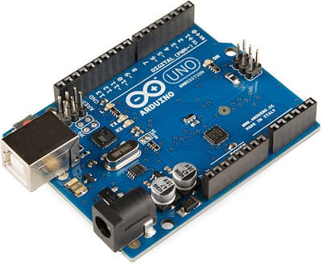
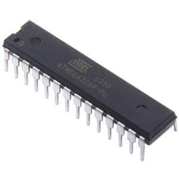
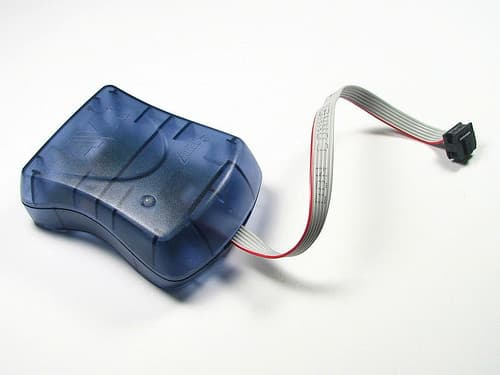
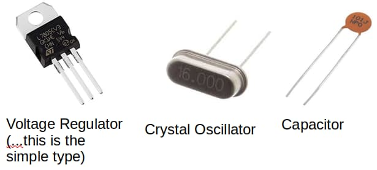
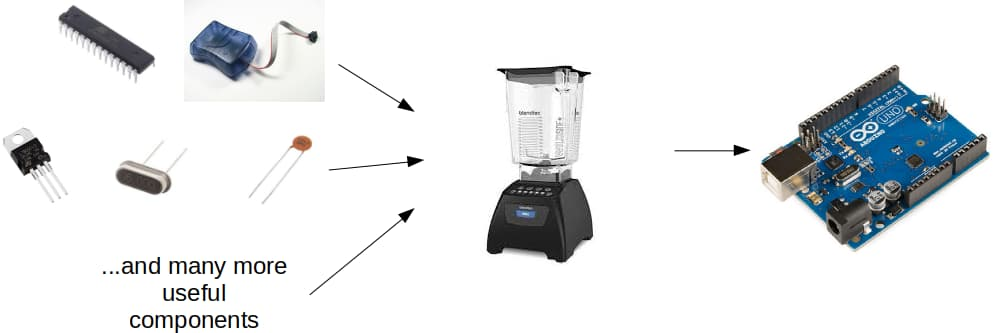
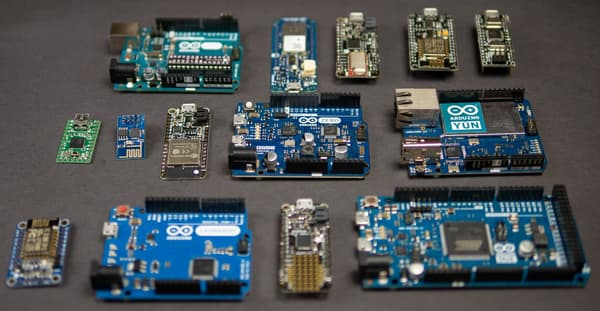
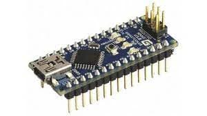
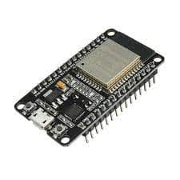

# Introductions

In this program, you will learn what is an Arduino and as well as the basics of C++.
This course is designed for people with no coding experience, and there are no prerequisite skills for this course.

You will need either a PC (Windows, Mac, or Linux) and an Arduino for the program.
There are many different models of Arduino that can be used, and most of what is covered here is identical across all models, but we will be using an Arduino UNO for our examples and you may find that it is easiest to follow along if you have the same.

## What is an Arduino?

*Short answer: This is an Arduino*

First we’ll need to know what is a “micro-controller”...

### Micro-controllers are...

Like a miniature computers...

* Contains processor, RAM, storage, and more
* Can be programmed like a computer

Unlike a computer...

* Provides direct electrical connection to external devices
* Can’t run Minecraft or Fortnite...

### Micro-controllers can be a pain…

They usually require a special device to program...

Require external parts to work (eg. voltage regulator, crystal oscillator, decoupling capacitors)...

### So what is an Arduino?

Combines a micro-controller with all the other components into a single device

## Different Types of Arduino

There are many different types of Arduino, and they differ in size and capabilities.
You can find Arduinos with...

* Internet capabilities through WiFi or ethernet
* Built-in Bluetooth
* Faster or slower processor
* More or less memory
* More pins (...connect more components) or less pins (...smaller size)

Popular models includes...

### Arduino UNO.
The first Arduino.
It's one of the most basic Arduino, but it remains one of the most popular and commonly used model.

### Arduino Nano
Pretty much the same as the UNO, just smaller.

### ESP32
Technically not an Arduino, but it can be programmed the same way using the Arduino software.
The ESP32 has a much faster processor, more memory, and built-in WiFi and Bluetooth.
It is also a 3.3V device (...the UNO and Nano are 5V); this matters when connecting to external components as some components are designed for 3.3V while others are designed for 5V.

