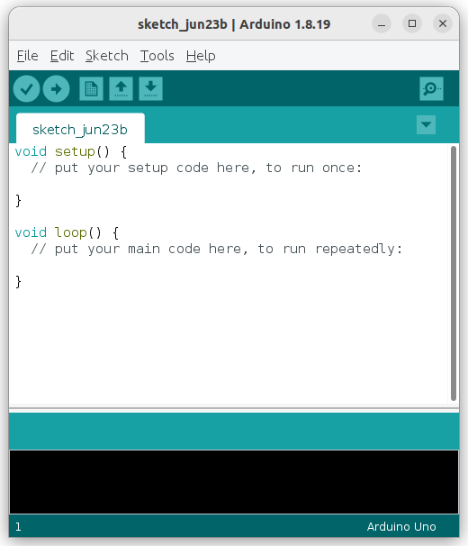
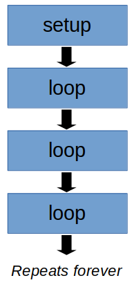
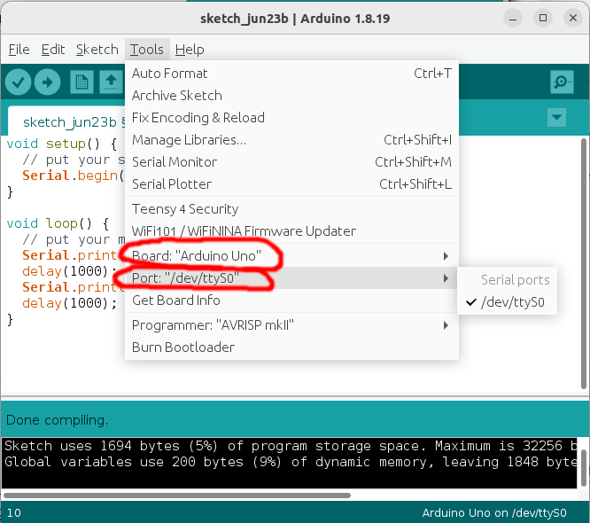
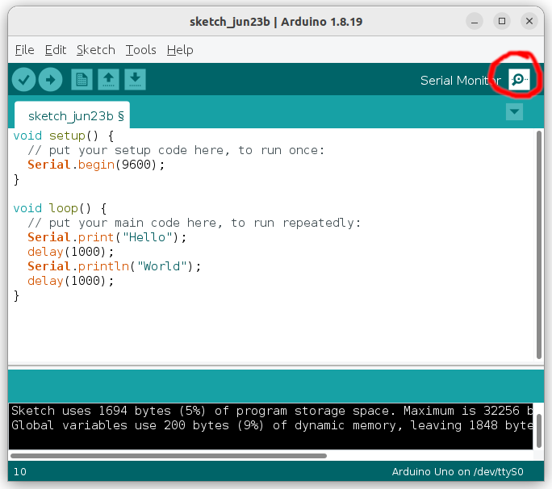

# Intro to C++

Before C++, there was the C programming language.
C was developed in 1972 by Dennis Ritchie and compared to the alternatives at the time, it provided many benefits such as portability (...the same code can run on different CPU) and efficiency.

C++ was developed by Bjarne Stroustrup in 1979 to add new features to C, most notably support for object oriented programming.
As for what an "object" is, well, that's something we'll leave for much later.

Today, while more modern programming languages such as Python and Javascript may lead in popularity, C and C++ remains the most common programming language when performance and control is needed.
Most operating systems are written in C/C++, and micro-controllers are mostly programmed in the same.

## Arduino App

First, find the Arduino app on your computer and start it up...


The Arduino app is an open-sourced platform for programming micro-controllers.
You should now see a window with the following template code in it.
If you see some other code, click on "File -> New" to start a new sketch.



## Setup and Loop

In the default template, you will see two special functions; **setup** and **loop**.

When an Arduino starts up (...or resets), it'll run the **setup** function **one time**.
After that, it'll run the **loop** function **repeatedly forever**.



Right now, both of these functions are empty.
The lines with the **//** infront of them are comments; they do nothing.

This is what each component in the code means...

```C
void setup() {
    // put your setup code here, to run once:
}
```

**void** : The **void** infront of **setup** means that the **setup** functions does not return any values.

**setup()** : The **()** at the end of **setup** tells the Arduino compiler that **setup** is a function.

**{}** : The curly brackets (...also call "braces") demarcates the content of the **setup** function.

**//** : The double slashes indicates that everything after it is a comment. The compiler will ignore it.

## Our First Program

Modify the code to the following (new and modified lines are highlighted)...

```c hl_lines="8 9 10 11"
void setup() {
  // put your setup code here, to run once:
  Serial.begin(9600);
}

void loop() {
  // put your main code here, to run repeatedly:
  Serial.print("Hello");
  delay(1000);
  Serial.println("World");
  delay(1000);
}
```

Here is what the code mean...

**Serial.begin(9600);** : This initializes the serial port at a baudrate of 9600. When the Arduino is plugged into the computer, it provides a serial connection that you can use to communicate with the Arduino. We'll be using it later in the code to send messages to the computer.

Notice the semi-colon at the end of the line? Every statement in C++ must end with a **;**, it indicates to the compiler that the statement has ended.

**Serial.print("Hello");** : This sends the message "Hello" to the computer. Note that the double quotes **""** indicate that "Hello" is a string. Strings are used to represents words, sentences, and paragraphs.

**delay(1000);** : This creates a 1000ms (...1 second) delay. Basically, the Arduino will do nothing for 1 second before moving on to the next instruction.

**Serial.println("World");** : Notice that this is a little different from the previous **Serial.print**? When using **Serial.println**, the Arduino will add a newline at the end; that means that the next print will start on the next line.

## Running and Monitoring

Before continuing, connect your Arduino to your computer. Then make sure you set the board and port correctly...



Your port may be different from mine, but the board should be the same "Arduino UNO" (...unless you are using something else).

### Compile

Click the "Verify" button...


It will ask you to save the file if you haven't yet. You can call it whatever you want...

If there are no errors, proceed. If there are errors, read the error message and try to fix them.

### Upload

Click the "Upload" button...


It'll take a few seconds to upload the program to the Arduino and you should get a success message at the end.

### Monitor

Click on the serial monitor button.



It should open up a new serial monitor window.
If you have programmed your Arduino correctly, you should see the message "HelloWorld" appear on screen, with a 1 second delay between each word.

## Serial Monitor

The serial monitor is a useful feature that can help immensely in debugging. Make liberal use of the Serial.print statements to keep track of what your program is doing.