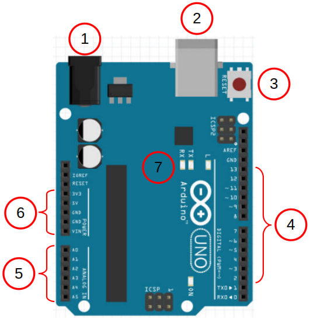
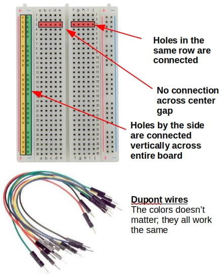

# Pins and Wirings

## Arduino

| \#   | Description |
| --- | --- |
| 1 | Barrel plug for powering the Arduino. If you supply power through here, the supply voltage needs to be between 7V to 12V. |
| 2 | USB socket. Use this to connect the Arduino to the computer. You can also supply power to the Arduino through here (5V only). |
| 3 | Reset button. Press this to reset the Arduino; it'll run **setup** again before running **loop**. |
| 4 | These are the GPIO pins 2 to 13.   Pins 0 and 1 are also GPIO pins, but they are normally used for Serial.   Pins with a tilde **~** next to them can be used as PWM outputs (...using analogWrite) |
| 5 | These 6 pins are capable of analog inputs. This means that they can read a voltage from 0V to 5V. They can also be used as normal GPIO pins. |
| 6 | **Vin** You can supply power to the Arduino through this pin (7V to 12V). If powered through other means, this pin will be at the same voltage as the power supply.   **5V** This pin provides 5V; useful for powering external components.   **3V3** This pin provides 3.3V; some external components will need to be powered by this.   **GND** This is the Ground pin. It's like the negative pole on a battery. There is one more Ground pin on the other side of the board next to pin 13. |
| 7 | These are the TX, RX, and L LEDs. The TX and RX LEDs will light up when the Arduino is transmitting or receiving data over Serial. The L LED is connected to pin 13. |

## Breadboard

Breadboards and dupont wires provides and easy way to connect components to your Arduino.

Pay attention to how the holes in the breadboard are connected to each other.