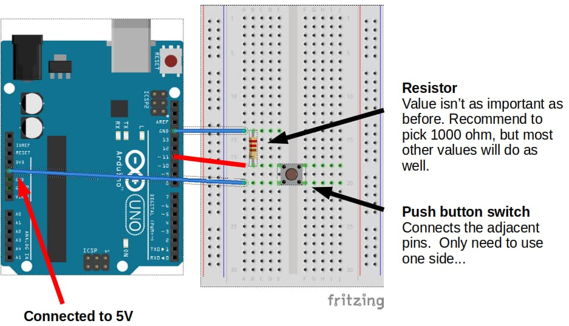

# Digital Input

## Button

Connect a button to your Arduino as follows...



...then try the following code.

```c hl_lines="2 6 7 8 9 10"
void setup() {
  pinMode(13, OUTPUT);
}

void loop() {
  if (digitalRead(11) == HIGH) {
    digitalWrite(13, HIGH);
  } else {
    digitalWrite(13, LOW);
  }
}
```

**pinMode(13, OUTPUT)** : Set pin 13 (built-in LED) to **OUTPUT** mode.
We are using pin 11 (button) in **INPUT** mode, and since that is the default, we don't need to do anything for pin 11.

**if (digitalRead(11) == HIGH)** : This checks if pin 11 is **HIGH**.
If the button is pressed, pin 11 will be connected directly to **5V** (HIGH).
If the button is not pressed, pin 11 will be connected to **GND** (LOW) through the resistor.

Upload your code. If your wiring and code is correct, the built-in LED should turn on when the button is pressed, and off when it is released.

## Button Toggle

To toggle the LED, we'll need to keep track of whether it is off or on using a variable.
Whenever the button is pressed, we'll check if the LED is on; if it is on, we'll turn it off, and if it is off, we'll turn it on.

We'll also need to add a short delay, so that the LED won't keep switching between on and off.

```c hl_lines="1 8 9 10 11 12 13 14 15 16 17"
bool ledOn = false;

void setup() {
  pinMode(13, OUTPUT);
}

void loop() {
  if (digitalRead(11) == HIGH) {
    if (ledOn) {
      digitalWrite(13, LOW);
      ledOn = false;
    } else {
      digitalWrite(13, HIGH);
      ledOn = true;
    }
    delay(500);
  }
}
```

Upload your code. If your wiring and code is correct, the built-in LED should switch between off and on when the button is pressed.
Try holding the button down and see what happens. Experiment with changing the delay duration.

## Exercise

Write a program that makes the built-in LED toggle between blinking and off when the button is pressed.