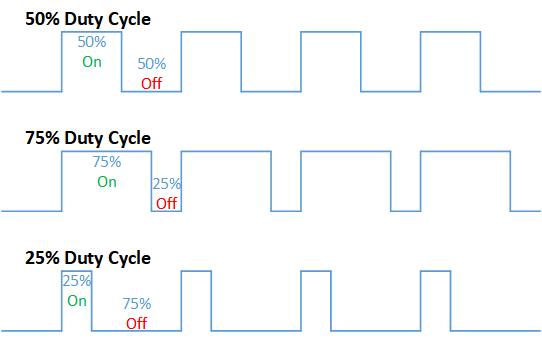
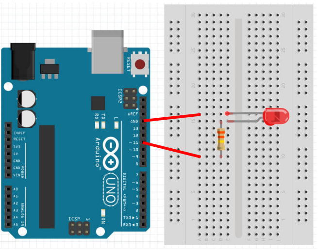

# Analog Output

## PWM

Most micro-controllers can only output full voltage (5V or 3.3V depending on the model) or zero volts.
They are usually not capable of outputing any voltages inbetween these (eg. 2.5V).

But we often need to control power (eg. brightness of a LED, speed of a motor).
To do so, we rely on a technique call Pulse Width Modulation (PWM).

PWM is really simple...



...if we can't supply half the voltage, we'll simply supply **full** voltage, but for half the time.
By changing the ratio between the on time and the off time, we can achieve any power level that we want.

## Pins on the Arduino

On the Arduino, only the pins marked with a tilde **~** are capable of PWM output.
These are pins 3, 5, 6, 9, 10, 11.

## analogWrite

The **analogWrite** command can be used to set the PWM power level of the specified pin.
Here are a few examples...

```cpp
analogWrite(11, 0);   // Set the power on pin 11 to zero (off)
analogWrite(11, 255); // Set the power on pin 11 to 255 (max)
analogWrite(11, 127); // Set the power on pin 11 to 127 (around 50%)
```

## Brightness control

Connect an external LED to your Arduino as follows (...same wiring as in the **Digital Output** section)...



...then try the following code.

```cpp hl_lines="6 7 8 9"
void setup() {
  pinMode(11, OUTPUT);
}

void loop() {
  for (int a=0; a<256; a++) {
    analogWrite(11, a);
    delay(10);
  }
}
```

**analogWrite(11, a)** : The **for** loop will write a power of 0 to 255 to pin 11.
There is a short delay of 10ms, else the entire loop will complete in a short fraction of a second (...too fast to see).

Upload your code. If your wiring and code is correct, the external LED should gradually change from dimly lit to max brightness.

<div class="info">
<strong>analogWrite</strong> is useful for controlling motor speed. Without this, you'll only be able to run your motors at full speed.
</div>

## Exercise

In the above example, the brightness goes gradually from zero to max.
But once it reaches max brightness, it abruptly changes back to zero brightness.
Modify the program so that it will gradually change back from max to zero.
