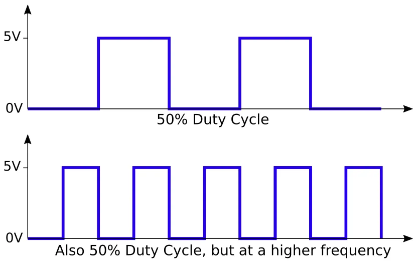

# Analog Output (Frequency)

## PWM Frequency

We already know from the **Analog Output** section that **analogWrite** uses **Pulse Width Modulation** to generate an output.
By setting the output value from **0** to **255** we can vary the output from 0% (always off) to 50% (on for half the time) to 100% (always on) or any values in-between; this percentage is call the duty cycle.

Besides the duty cycle, there is another property of PWM; the frequency.
This controls how rapidly the output switches between on and off.



## Default Frequency

For the Arduino UNO, the default frequencies are...

| Timer | Pins | Frequency |
| --- | --- | ---- |
| 0 | 5,6 | 976.56 Hz |
| 1 | 9,10 | 490.20 Hz |
| 2 | 3,11 | 490.20 Hz |

There are 3 timers, and each timer is used by 2 pins.
This means that you if you change the frequency for timer 1, both pins 9 and 10 will be affected.

Timer 0 is a little special as it is also used by the **millis()** and **delay()** functions.
If you change the frequency for timer 0, it'll affect these functions and they'll no longer give the correct timing or delay.
Note that even if you are not using these functions directly in your program, they may be used by the libraries you used.

## Why Change?

### High Frequency

High frequencies are good for reducing motor noise (...by setting a frequency above the human hearing threshold).
It's also useful when you need a stable analog output (eg. in voltage regulators which often runs over 100 kHz).

### Low Frequency

With high frequency, you may find that the motor will not turn at low duty cycle.
This is because the motor is an inductor, and when the voltage is applied, it'll take some time for the current flow to reach its max.
With a high frequency, the voltage may switch off before the current flow is sufficient to turn the motor.

Using a lower frequency like 30 Hz to 100 Hz can improve motor control at low speed.

## Changing Frequency

To change the timer frequency, you'll need to modify the corresponding timer registers.
You can think of registers as special variables.

<div class="important">
These only work on the Arduino UNO, Arduino NANO, and other boards using the ATmega 8, 168 or 328 microcontroller.
If you are using a different board (eg. ESP32), you'll need a different way of changing the frequency.
</div>

Use these statements to modify the registers...

```
//---------------- Timer 0 (D5 & D6) -------------------------------
//NOTE: Changing this timer 0 affects millis() and delay!
TCCR0B = TCCR0B & B11111000 | B00000001;   // 62500.00 Hz
TCCR0B = TCCR0B & B11111000 | B00000010;   //  7812.50 Hz
TCCR0B = TCCR0B & B11111000 | B00000011;   //   976.56 Hz (DEFAULT)
TCCR0B = TCCR0B & B11111000 | B00000100;   //   244.14 Hz
TCCR0B = TCCR0B & B11111000 | B00000101;   //    61.04 Hz

//---------------- Timer 1 (D9 & D10) ------------------------------
TCCR1B = TCCR1B & B11111000 | B00000001;   // 31372.55 Hz
TCCR1B = TCCR1B & B11111000 | B00000010;   //  3921.16 Hz
TCCR1B = TCCR1B & B11111000 | B00000011;   //   490.20 Hz (DEFAULT)
TCCR1B = TCCR1B & B11111000 | B00000100;   //   122.55 Hz
TCCR1B = TCCR1B & B11111000 | B00000101;   //    30.64 Hz

//---------------- Timer 2 (D3 & D11) ------------------------------
TCCR2B = TCCR2B & B11111000 | B00000001;   // 31372.55 Hz
TCCR2B = TCCR2B & B11111000 | B00000010;   //  3921.16 Hz
TCCR2B = TCCR2B & B11111000 | B00000011;   //   980.39 Hz
TCCR2B = TCCR2B & B11111000 | B00000100;   //   490.20 Hz (DEFAULT)
TCCR2B = TCCR2B & B11111000 | B00000101;   //   245.10 Hz
TCCR2B = TCCR2B & B11111000 | B00000110;   //   122.55 Hz
TCCR2B = TCCR2B & B11111000 | B00000111;   //    30.64 Hz
```
<br>
<div class="info">
    <p>
        The value starting with a <strong>B</strong> is a binary number.
        So <strong>B11111000</strong> would mean a value where the first 5 bits are 1 and the last 3 bits are 0.
    </p>
    <p>
        The <strong>&amp;</strong> is an <strong>AND</strong> operator.
        We use it to clear bits (...change a bit to zero).
        Any bits that we want to clear is set to zero, and any bits that should be left unchanged set to one.
        Example...
    </p>
    <pre>
TCCR0B = TCCR0B & B11111000;
// Change the last 3 bits of TCCR0B to zero (...leaving the rest unchanged),
// and put the result back into TCCR0B.</pre>
    <p>
        The <strong>|</strong> is an <strong>OR</strong> operator.
        We use it to set bits (...change a bit to one).
        Any bits that we want to set is set to one, and any bits that should be left unchanged set to zero.
        Example...
    </p>
    <pre>
TCCR0B = TCCR0B | B00000001;
// Change the last bit of TCCR0B to one (...leaving the rest unchanged),
// and put the result back into TCCR0B.</pre>
</div>
