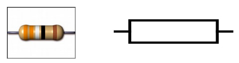
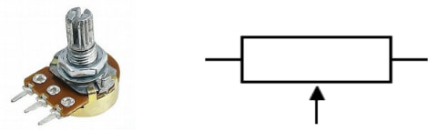
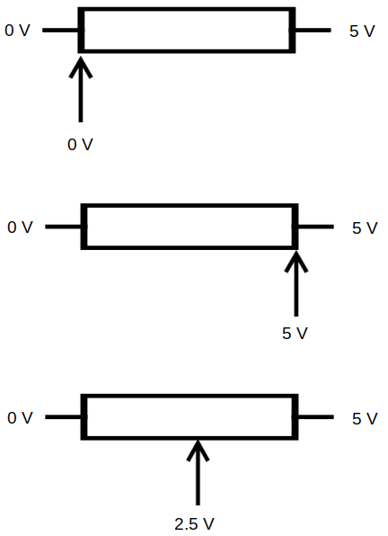
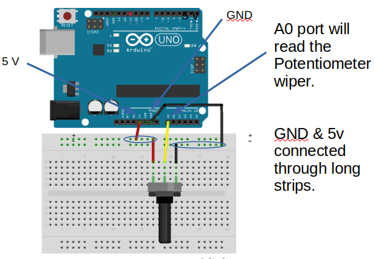

# Analog Input

## Pins on the Arduino

On the Arduino, only the pins starting with **A** are capable of analogInput.
These are pins A0 to A5.

## Fixed and Variable Resistors

Fixed resistors have a fixed resistance. They only have two connection points.



Variable resistors have a variable resistance.
They have three connection points, one on each end, and a moveable third connection point in the middle.



Depending on where the moveable middle connection point is placed, the voltage in the middle can range from 0V to 5V and any values inbetween.



## Wiring

Connect your potentiometer as follows...



Depending on the type of your potentiometer, your wiring may look a little different.
What's important is that one end of the potentiometer is connected to 0V, the other end to 5V, and the middle is connected to **A0** (...or any of the **A** pins).

## analogRead

The **analogRead** command will provide you with a reading that ranges from 0 (0V) to 1023 (5V).
The following code demonstrates how to use it...

```cpp hl_lines="6"
void setup() {
  Serial.begin(9600);
}

void loop() {
  Serial.println(analogRead(A0));
  delay(200);
}
```

**analogRead(A0)** : This reads from pin A0 and returns a value that ranges from 0 to 1023.

Upload your code then open up the serial monitor. If your wiring and code is correct, you should see the value in the serial monitor change depending on the position of the potentiometer.

## LED Brightness Control

Add an LED to your circuit as follows...


Change the code to...

```cpp hl_lines="6 7"
void setup() {
  pinMode(11, OUTPUT)
}

void loop() {
  int a0 = analogRead(A0);
  int power = map(a0, 0, 1023, 0, 255);
  analogWrite(11, power);
}
```

**a0 = analogRead(A0)** : This reads from pin A0 and returns a value that ranges from 0 to 1023.

**power = map(a0, 0, 1023, 0, 255)** : The value from **analogRead** ranges from 0 to 1023, but when doing a **analogWrite**, we need a value that ranges from 0 to 255.
To convert one range into another, we'll use the **map** function (...see [documentation](https://www.arduino.cc/reference/en/language/functions/math/map/) for details)

<div class="info">
<strong>analogRead</strong> is useful for building remote controls. You can use it to steer a robot or control its speed.
</div>

## Exercise

Using the **LED Brightness Control** circuit, modify the code so that instead of controlling the brightness of the LED, it will control how fast it blinks.
When the potentiometer is turned to zero, the LED should blink once every 2 seconds.
When the potentiometer is turned to max, the LED should blink once every 0.1 seconds.