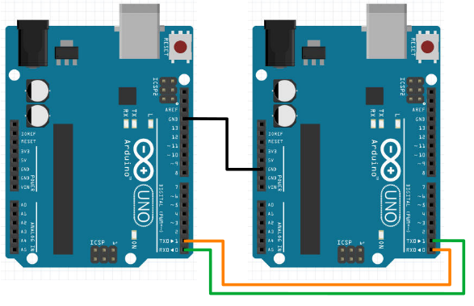

# Serial

Serial communication can allow the Arduino to send or receive data from another device, such as a computer, a Raspberry PI, some types of sensors (...most of the Lego EV3 sensors as well as many GPS modules uses serial), as well as another Arduino.

We have already seen how to use **Serial.print** to display messages on the Arduino serial console, and in this section, we'll look at both sending and receiving serial data in details.

## Serial Wiring (To Computer)

To achieve a serial connection between a computer and an Arduino, you simply need to connect them using the USB cable.
A special chip on the Arduino allows the USB connection to act as a serial port.

## Serial Wiring (To Other Devices)

To achieve a serial connection between an Arduino and a device without a USB port, it requires a bit of wiring.
Here is an example of two Arduinos connected together via serial...



The **TX** (transmit pin, aka pin 0) on one Arduino needs to be connected to the **RX** (receive pin, aka pin 1) on the other Arduino and vice versa.
The **Gnd** pins on the two Arduinos must be connected together (...there are many **Gnd** pins, but they are all the same; you can connect any two of them).
Finally, both Arduinos needs to be powered.

<div class="tip">
Other than a few special cases, <strong>Gnd</strong> pin on different devices should usually be connected together.
</div>

## Baudrate

When starting the serial connection, you may have seen this code in **setup()**...

```cpp
Serial.begin(9600);
```

This starts the serial connection with a baudrate of **9600 bits per second**, which is also the default used by the Arduino serial monitor.

You can use a different baudrate, but you'll need to watch out for the following...

* Both devices **MUST** use the same baudrate.
* Higher baudrate may give faster communication speed, but it'll also make it more prone to errors.

So unless you need the higher speed, it's usually a good idea to just leave it at 9600.

## Sending Data

To send data, we have the following options...

* Serial.print
* Serial.println
* Serial.write

### Serial.print and Serial.println

**Serial.print** and **Serial.println** will send the provided data as **text**.
Example...

```cpp
int a = 123;
Serial.println(a);
```

In the above example, the serial monitor will receive...

```
123
```

...which is **3 characters** (ie. a "1" character, a "2" character, and a "3" character).

The difference between **Serial.print** and **Serial.println** is that **Serial.println** will add a newline at the end; that means that the next print will start on the next line.

### Serial.write

**Serial.write** will write the data as a single byte binary value.

```cpp
int a = 123;
Serial.write(a);
```

In the above example, the **Serial.write** will send a **single byte** with the value 123.
In the serial monitor, you will see a single **"{"** character, as that is the character represented by the value 123.
Not all values have a displayable character, so depending on the value sent, you may not see anything meaningful or anything at all.

**Serial.write** is a bit more efficient than **Serial.print**, but it's harder to debug as the output is often undisplayable.
For beginners, I would recommend sticking to **Serial.print**.

## Receiving Data

Reading from serial can be a little more tricky.
For example, an Arduino may be connected to a servo motor and an LED, and it may need to receive two different commands; one for turning the servo to an angle, and another for setting the LED brightness.

To handle this, one way is to add a command character to the start of every message.
Something like this...

```
# Command for setting servo angle to 40.7 degrees
S 40.7
```

```
# Command for setting the third LED to a brightness of 200
L 3 200
```

The character at the start of the message (...the **S** and **L**) helps to indicate what type of message this is.

When reading the message, we'll first check for a valid command character, then read the numeric data that follows...

```cpp
while (Serial.available() > 0) {
  char command = Serial.read();
  if (command == 'S') {
    float servoAngle = Serial.parseFloat();
    Serial.print("Setting servo to ");
    Serial.println(servoAngle);
    // Replace this comment with code for moving the servo

  } else if (command == 'L') {
    // For LED, we'll read twice, the first is the LED number, while the second is the brightness
    int ledNumber = Serial.parseInt();
    int brightness = Serial.parseInt();
    Serial.print("Setting LED ");
    Serial.print(ledNumber);
    Serial.print(" to brightness level ");
    Serial.println(brightness);
    // Replace this comment with code for setting LED brightness
  }
}
```

**Serial.available()** : This tells us how many characters are available to read.
We'll use the **while** loop to keep reading repeatedly, as long as the number of available characters is greater than zero.

**Serial.read()** : This reads and returns a single character.

**Serial.parseFloat()** : This reads a floating point number.
It returns a **float**.

**Serial.parseInt()** : This reads an integer.
It returns a **long** (...in this example, we are assigning it to an **int**, and that's fine as long as the sent value is within the size limits of an **int**).