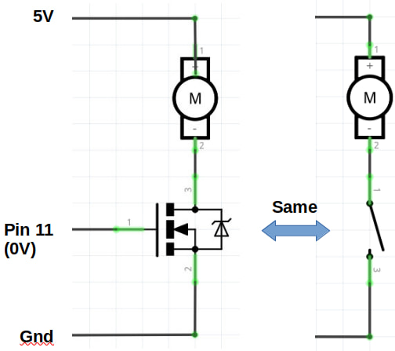
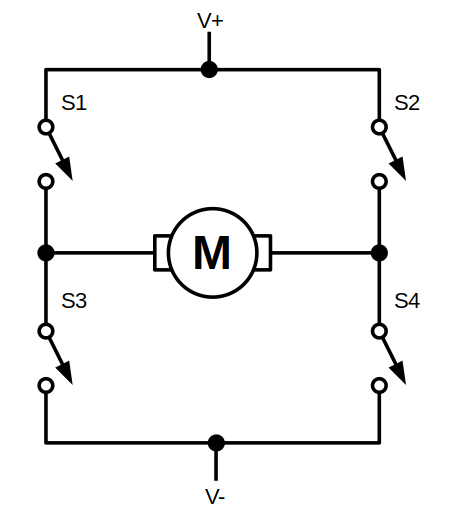
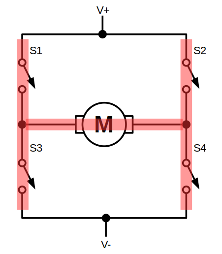
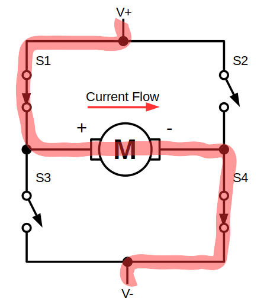
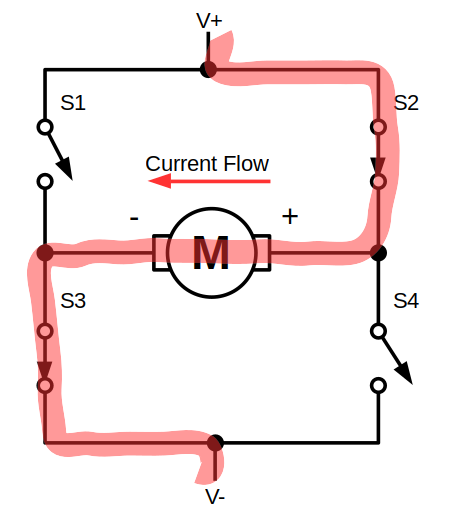

# Intro to H-Bridge

The pins on the Arduino can turn an LED on and off, but motors requires much more current than an LED.
A motor about the power of the Lego EV3 large motor will draw around 1.5A of current, while the Arduino pin can only supply 20mA.
Also, many motors runs at voltages higher than 5V (...12V is probably the most common).

## Transistors

To control a device that requires higher voltage and current than what an Arduino can supply, we can use a transistor.
A transistor acts like a switch; when supply with a voltage signal from the Arduino, the transistor can turn on or off.

A single transistor works well if you just need to turn something on or off, but motors often needs to be reversed as well.

## H-Bridge

To solve this, we can use a H-Bridge...

...which looks kinda like the letter "H"...

### Forward

By controlling which transistor is on or off, we can control the direction that the current flows through the motor.
In this example, we turn on S1 and S4, causing the current to flow from left to right.

### Reverse

By switching S2 and S3 on instead, we can cause the current to flow from right to left.
This changes the direction of the motor rotation.

## H-Bridge Driver Boards

While we can build our own H-Bridge using 4 transistors and a few other components, it usually easier to just use a H-Bridge driver board.
These are examples of some common H-Bridge driver boards.

These models differs mainly in the voltage and current that they can support, so it's important to choose one that is suitable for the motor that you are using.

Popular models of H-Bridges includes...

| Model | Voltage | Current |
| --- | --- | --- |
| MX1508 | 2 - 10V | 1.5A |
| L9110 | 2.5 - 12V | 0.8A |
| TB6612 | 4.5 - 13.5V | 1.2A |
| L293 | 4.5 - 36V | 1A |
| TA6586 | 3 - 14V | 5A |
| L298 | 7.5 - 46V | 3A |
