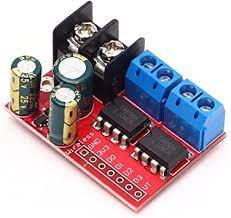
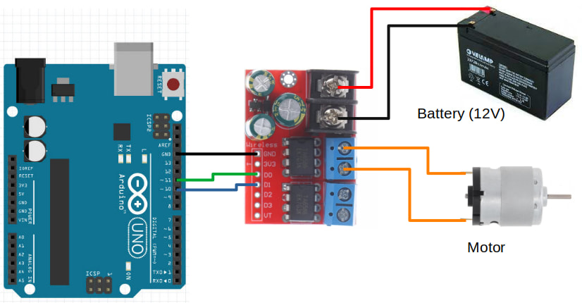

# Controlling a H-Bridge Motor Driver

We will be using the TA6586 motor driver for this part of the course.



This motor driver board contains two H-Bridges, making it suitable for controlling **two motors** with just one board.
It support voltages of **3 to 14V** and up to **5A** of current.

## Pins

| Pin | Description |
| --- | --- |
| Black Screw Terminals | Power supply for the board. Polarity (+/-) is printed on the bottom of the board. Must not be reversed. |
| Blue Screw Terminals x 2 | Connection for the motors. There are two pairs of terminals for two separate motors. |
| Gnd | Ground pin. This should be connected to the **GND** pin on the Arduino. |
| 3V3 | This provides a 3.3V supply that can be used for powering external components such as the micro-controller. If you don't require 3.3V, you can just leave this unconnected. |
| D0 & D1 | Controls the first motor. Motor will turn if one pin is high and the other is low. If both are high or both are low, the motor will not turn. |
| D2 & D3 | Controls the second motor. Motor will turn if one pin is high and the other is low. If both are high or both are low, the motor will not turn. |
| VT | Not used. Ignore. |

## Two Pins or Three Pins

Most H-Bridge motor driver boards uses either **2 pins or 3 pins** to control each motor.
**For the TA6586, it uses 2 pins per motor.**
If you have a different motor driver board that also uses 2 pins, you can use the same code and it should work fine, but if you have a motor driver board that requires 3 pins per motor, you'll need a different set of code.

## Wiring

Connect your battery, motor driver board, and motor as follows.



<div class="important">
In the diagram above, the battery is only supplying power to the motor driver board, not the Arduino.
The Arduino needs to be supplied with power to work.
If the Arduino is connected to your computer via the USB cable, that will provide it with power.
Else, you can connect the 12V battery to the barrel plug of the Arduino, or to the <strong>VIN</strong> pin.
</div>

<div class="info">
In the diagram above, we are using pin 10 and 11 to control the motor driver.
You can use any of the PWM pins (...pins with a tilde ~ next to their number), but pins 5 and 6 behaves a little differently and while they are usable, it's best to avoid them.
You can read the <a href="https://www.arduino.cc/reference/en/language/functions/analog-io/analogwrite/">analogWrite documentations</a> for more details.
</div>

## Code

We'll be programming the H-Bridge to operate in [Sign Magnitude Drive](https://www.modularcircuits.com/blog/articles/h-bridge-secrets/sign-magnitude-drive/) mode.
What that means is pretty complicated, and you can read the linked article if you're interested to understand more.

Try the following code...

```cpp hl_lines="2 3 5 6"
void setup() {
  pinMode(10, OUTPUT);
  pinMode(11, OUTPUT);

  analogWrite(10, 127);
  digitalWrite(11, HIGH);
}

void loop() {
}
```

**pinMode** : We set both pin 10 and pin 11 to **OUTPUT** mode.

**analogWrite(10, 127)** : We set pin 10 to a power of 127 (...around 50%).

**digitalWrite(11, HIGH)** : We are not controlling pin 11, so we set it to **HIGH**.
Note that at any point in time, we should only control the power of one pin with **analogWrite**, and the other pin should be set to **HIGH** using **digitalWrite**.

Upload your code. If your wiring and code is correct, the motor should start turning at 50% speed.

## Speed Control

Try changing the power from 127 to 64 (...around 25%). Did the motor turn faster or slower? Try 191 (...around 75%). What did you observe?

By now you should have noticed that the relationship between power and speed are reversed.
The higher the power, the lower the speed.
That's a result of how Sign Magnitude Drive works.

## Direction Control

Change the order of the pins...

```cpp hl_lines="5 6"
void setup() {
  pinMode(10, OUTPUT);
  pinMode(11, OUTPUT);

  analogWrite(11, 127);
  digitalWrite(10, HIGH);
}

void loop() {
}
```

You should see the motor turning in the opposite direction from before.

## Motor Control Function

It's useful to build a function to control the motor. Try the following code.

```cpp hl_lines="1 2 3 4 5 6 7 8 9"
void left_motor(int power) {
  if (power > 0) {
    analogWrite(10, 255 - power);
    digitalWrite(11, HIGH);
  } else {
    analogWrite(11, 255 + power);
    digitalWrite(10, HIGH);
  }
}

void setup() {
  pinMode(10, OUTPUT);
  pinMode(11, OUTPUT);

  left_motor(64);  // 25% speed
  delay(5000);
  left_motor(127); // 50% speed
  delay(5000);
  left_motor(0);   // Stop
  delay(2000);
  left_motor(-64); // Reverse
}

void loop() {
}
```

**void left_motor(int power)** : The **left_motor** function accepts a single **power** parameter, which can range from -255 to 255.

**if (power > 0)** : If **power** is a positive value, it'll set the power to pin 10, else it'll set power to pin 11.

**analogWrite(10, 255 - power)** : Remember that the relationship between power and motor speed is reversed? The **255 - power** reverses it again, so that setting a high power will give us a high speed and a low power will give us a low speed.

**analogWrite(11, 255 + power)** : If **power** is negative, we'll add instead (...adding a negative number is the same a doing a subtraction).

## Exercise 1

Wire up the second motor and write a function to control the second motor.

## Exercise 2

Add a potentiometer and use it to control the motor speed.

## Exercise 3

If you have done the **Serial** section of this course, combine what you have learned there with this section.
Write a program that reads a command from serial and set the motor speed for the left and right motors.
This means that if I type **L 100** in the serial terminal, the left motor should be set to **100** power, and if I type **R -50**, the right motor should be set to **-50** power.