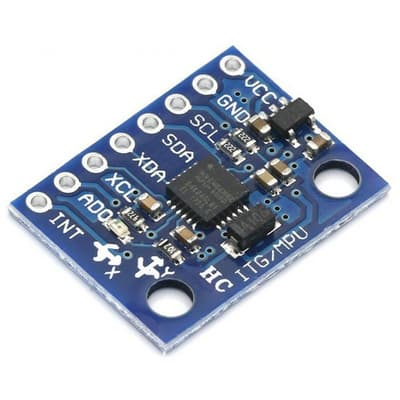
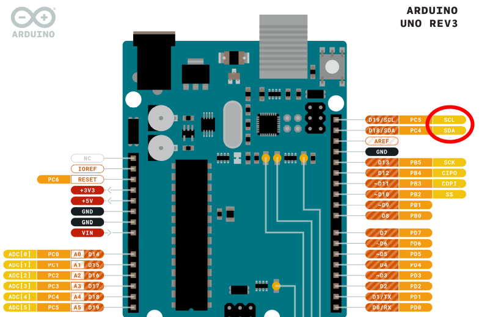
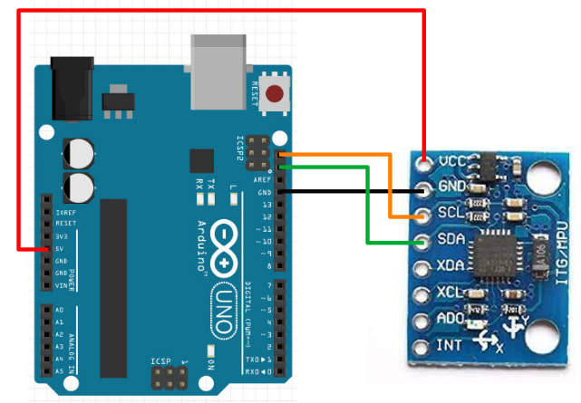
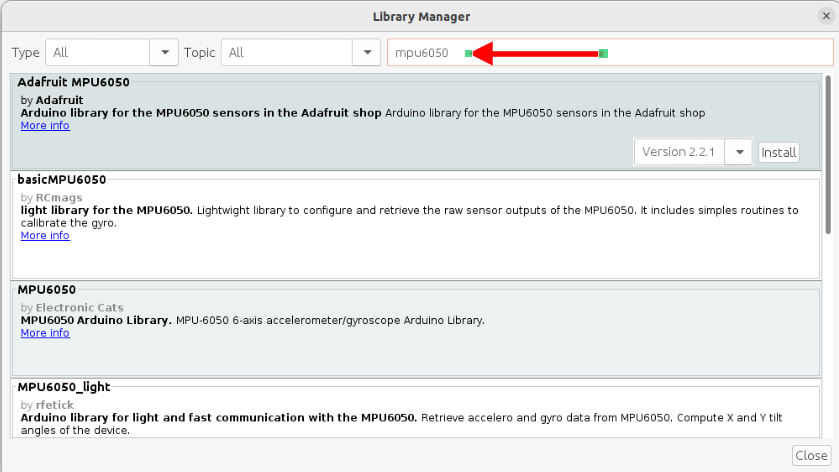
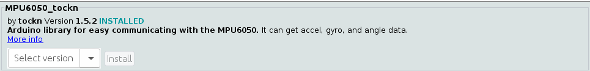

# Gyro

We'll be using this gyro...



This is the **GY 521** (...name of the board), but it's also referred to as the **MPU-6050** (...name of the chip on the board).
Features of the board includes...

* 3-axis Accelerometer
* 3-axis Rate Gyro
* I2C communication protocol

## Pins

| Pin | Purpose |
| --- | --- |
| VCC | Provides the gyro with power. Connect to 5V or 3.3V on the Arduino. |
| GND | Provides the gyro with power. Connect to GND on the Arduino |
| SCL | Serial Clock. This is used to communicate with the Arduino |
| SDA | Serial Data. This is used to communicate with the Arduino |
| XDA, XCL, AD0, INT | Ignore. They have special uses which we do not need. |

## Rate Gyro

The gyro on these modules are rate gyros.
Unlike the gyros found on ships and planes, these rate gyros cannot tell you which direction is north.
Instead, a rate gyro can only tell you how fast it is rotating.

By integrating the rate of rotation, we can determine how much the gyro has turned from its starting position.

Every rate gyro must go through a calibration step (...typically done in **setup**), and it's important that the gyro is perfectly stationary during this time.
If the calibration is done while the gyro is moving, it will lead to large errors in the reading.
Note that rate gyros all suffers from drift over time, but if calibration is done well, this drift can be as little as 1 degree per minute.

## Wiring

This gyro communicates using the I2C communication protocol.
I2C requires two pins, SCL and SDA, and you can find these pins on the Arduino.



Note that SCL and SDA are connected to the A4 and A5 pins (ie. you cannot use A4 and A5 if you are using SCL and SDA).
You can find more details of the Arduino pinouts on the [Arduino website](https://docs.arduino.cc/hardware/uno-rev3).

Connect the gyro to the Arduino as follows...



## Libraries

While we can write our own code to read the gyro (...see [this set of slides](https://www.aposteriori.com.sg/wp-content/uploads/2020/11/Arduino-Lesson-5.pdf) if you're interested), the code can be rather complicated.
So we'll make use of libraries that others have written to help us read the gyro.

In the Arduino software, click on **"Tools -> Manage Libraries"**.


There are too many libraries to scroll through one-by-one, so in the search field, key in **"MPU6050"**.
There should now be only a few libraries left.



Look for the library named **MPU6050_tockn" and install it.



## Code

Use this code to read the gyro...

```cpp hl_lines="1 2 4 8 9 10 16 18 20"
#include <MPU6050_tockn.h>
#include <Wire.h>

MPU6050 mpu6050(Wire);

void setup() {
  Serial.begin(9600);
  Wire.begin();
  mpu6050.begin();
  mpu6050.calcGyroOffsets(true);
}

void loop() {
  mpu6050.update();
  Serial.print("angleX : ");
  Serial.print(mpu6050.getAngleX());
  Serial.print(" angleY : ");
  Serial.print(mpu6050.getAngleY());
  Serial.print(" angleZ : ");
  Serial.println(mpu6050.getAngleZ());
}
```

**#include <MPU6050_tockn.h>** : This includes the **MPU6050_tockn** library into your program.

**#include <Wire.h>** : This is the **Wire** library. It's used by **MPU6050_tockn** for I2C communication with the gyro.

**MPU6050 mpu6050(Wire)** : This creates a **MPU6050** object named **mpu6050**.
We'll use this object in the later part of the code to read the gyro.

**Wire.begin()** : This initialize the **Wire** library and get it ready for I2C communication.

**mpu6050.begin()** : This initialize the **mpu6050** object and gets it ready for communication with the gyro.

**mpu6050.calcGyroOffsets(true)** : This calibrates the gyro.
Makes sure the gyro is stationary or the calibration will be incorrect!

**mpu6050.update()** : This reads the rotation rate from the gyro and integrates it to get the angle of the gyro.

**mpu6050.getAngleX(), mpu6050.getAngleY(), mpu6050.getAngleZ()** : This provides the angle of the gyro about the X/Y/Z axis.

Upload the code and open the serial terminal. Be sure not to move the gyro until the calibration is complete. After that, you can rotate the gyro and see the change in the angle.

## Exercise

No need to write any code for this exercise. Just play around with the gyro and try to determine which direction is the X, Y, and Z axis.