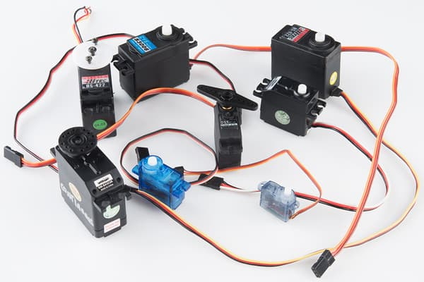
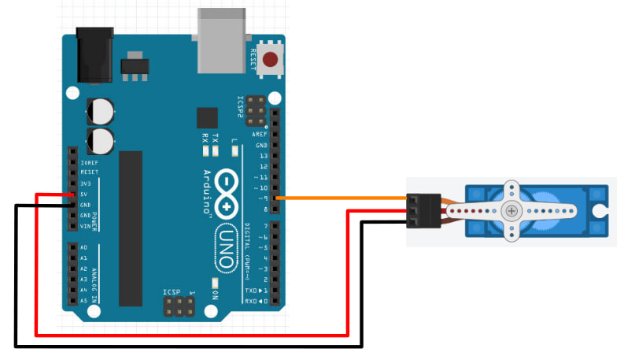
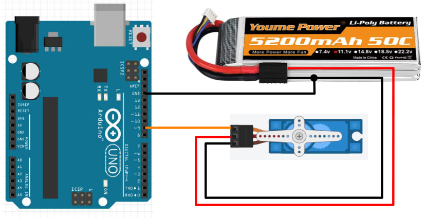
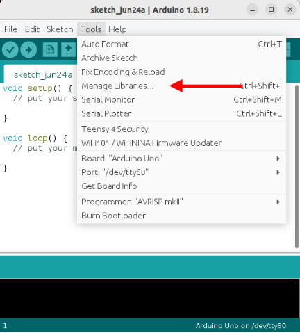
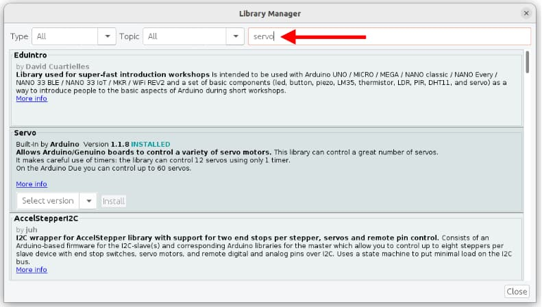
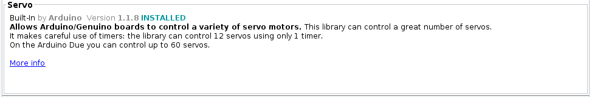

# Servo

The term **servo** refers to a device that uses feedback to correct its action.
For example, the rudders on a ship uses a servo to ensure that it turns to the correct angle ordered by the bridge.
Servos for the rudders of a ship can weigh more than a large truck, while servos for a remote control plane can be as light as a sheet of paper.

When used with an Arduino, the term **servo** usually refers to **Hobby servo** (aka **RC servo**).
These are small geared motors that can receive a signal, and based on the signal, rotate and stay at a particular angle.
Here are some examples of **Hobby servos**...



There are many different models of such servos, and they mainly differ in their size and torque.
Common features among these servos includes...

* Rotates between 0 to 180 degrees. (Exceptions exists, but are uncommon)
* Typically accepts power ranging from 4.8V to 7.2V.
* Controlled using the same type of signal.
* Uses 3 wires.

## Pins

Hobby servos usually have 3 wires.
These wires are color coded (Red, Black/Brown, Orange/Yellow/White/Blue) to indicate their purpose.

| Pin | Purpose |
| --- | --- |
| Red | Provides the servo with power. For one or two small servos, connect to **5V** on the Arduino. |
| Black/Brown | Provides the servo with power. Connect to **GND** on the Arduino |
| Orange/Yellow/White/Blue | Signal. This is used to tell the servo what angle to turn to. Connect to any of the GPIO pins on the Arduino. |

## Power

There are a few options for powering your servo...

### Arduino 5V Pin

For one or two small servos (...such as the SG90), you can connect the **Red** wire to the **5V** pin and the **Black/Brown** wire to any of the **GND** pins.

You cannot use this method for larger servos or if you are using many servos, as the Arduino **5V** pin won't be able to supply enough current and may reset or turn off.

### Arduino VIN Pin

If your Arduino is being powered by a power supply that is 7.2V or less, you can connect the **Red** wire to the **VIN** pin and the **Black/Brown** wire to any of the **GND** pins.

This method will provide the servo with the same voltage as the power supply, potentially allowing you to drive your servo at a higher voltage (...giving more speed and torque).
You can also draw a slightly more current using this method

### External Power

If powering large or many servos, you should connect the servo directly to the power supply (eg. battery pack).
Connect the **Red** wire to the **positive** terminal of your power supply and the **Black/Brown** wire to the **negative** terminal.
Ensure that the **negative** terminal of the battery is also connected to the **GND** pin on the Arduino.

Using this method, you can power any number of motors of any size or voltage, as long as your power supply is able to provide the required current.

## Wiring

Regardless of the powering method used, the **signal** wire (Orange/Yellow/White/Blue) should be connected to a GPIO pin on the Arduino.
Here is an example that uses the Arduino **5V** pin for power...



This second example uses external power...



## Libraries

While we can write our own code to control the servo, the code can be rather complicated.
So we'll make use of libraries that others have written to help us control the servo.

In the Arduino software, click on **"Tools -> Manage Libraries"**.



There are too many libraries to scroll through one-by-one, so in the search field, key in **"servo"**.
There should now be only a few libraries left.



Look for the library described as **Built-In by Arduino** and install it.



<div class="important">
On most Arduino boards, using the servo library will prevent the use of <strong>analogWrite</strong> on pins 9 and 10.
</div>

## Code

Use this code to control the servo...

```cpp hl_lines="1 3 6 10 12"
#include <Servo.h>

Servo myservo;

void setup() {
  myservo.attach(9);
}

void loop() {
  myservo.write(0);
  delay(1000);
  myservo.write(180);
  delay(1000);
}
```

**#include &lt;Servo.h&gt;** : This includes the **Servo** library into your program.

**Servo myservo** : This creates a **Servo** object named **myservo**.
If you are controlling more than one servo, create a separate **Servo** object for each servo.
We'll use this object in the later part of the code to control the servo.

**myservo.attach(9)** : Connect to the servo on pin **9**.
Change this if you are using a different pin.

**myservo.write(0)** : This tells the servo to turn to **0** degrees.
This will make the servo turn to 0 degrees and stay there.
Note that the servo cannot turn to a negative angle.

**myservo.write(180)** : This tells the servo to turn to **180** degrees.
This will make the servo turn to 180 degrees and stay there.
Note that for most servos, 180 degrees is the maximum.

## Exercise 1

Add a potentiometer and use it to control the servo position.

## Exercise 2

If you have done the **Serial** section of this course, combine what you have learned there with this section.
Write a program that reads a command from serial and set the servo angle accordingly.
This means that if I type **S 90** in the serial terminal, the servo should turn to 90 degrees.