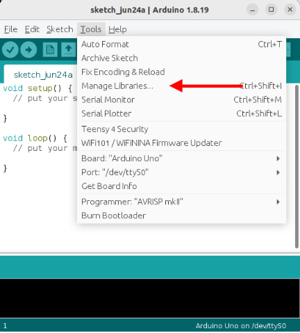

# Servo Driver (PCA9685)

In the previous section, you've learned how to control a servo using the Arduino Servo library.
It's simple to use if you only have a few servos, but there are a some problems with that approach...

* Requires one Arduino GPIO pin for each servo
* Max of 12 servos on the Arduino UNO
* Disables analogWrite on pins 9 and 10

One way to work around these limitations is to use the PCA9685 servo driver board.


Benefits of this board are...

* Uses the I2C communication protocol; only requires 2 pins and multiple I2C devices can share the same pins.
* Each PCA9685 board can control up to 16 servos, and you can use up to 62 of these boards simultaneously (...for 992 servos total).

## Pins


| Pin | Description |
| --- | --- |
| Servo Power Screw Terminals | Power supply for the **Servos Only**. Most servos max out at 7.2V so you should not exceed that. |
| Output to Servos | 16 outputs for servos. You can use as many or as little as you need, but make sure you match the color on the servo wires. |
| GND (Signal) | Ground pin. This should be connected to the **GND** pin on the Arduino. This is the same as the GND pin on the screw terminals. |
| OE (Signal) | Output Enable pin. If given a **HIGH** (3.3V or 5V) signal, it will disable all the outputs. You can leave this disconnected if you're not using it. |
| SCL (Signal) | Serial Clock. This is used to communicate with the Arduino. |
| SDA (Signal) | Serial Data. This is used to communicate with the Arduino. |
| VCC (Signal) | Provides the PCA9685 with power. This does not provide power to the servo. Connect to **5V** or **3.3V** on the Arduino. |
| V+ (Signal) | Power supply for the **Servos Only**. This is the same as the V+ pin on the screw terminals, and you only need to connect one of them. |
| Signal pins on right side | Identical to the pins on the left side. Useful to chain multiple PCA9685 boards together, but should otherwise leave them alone. |

## Power

The PCA9685 board has **TWO** power supply.
The **V+** pins only supply power to the servos, and does not power the chips on the board.
The **VCC** pin only supply power to the board, and does not power the servos.
**Both** pins must be powered for the board to work.

For testing purposes, you can connect the **5V** pin on the Arduino to the **V+** pin on the PCA9685.
This will use the Arduino to provide power to the servos on the PCA9685.
The Arduino 5V pin cannot supply much current, so this will only work with a few small servos, and the servos can only have very light loads.


To provide sufficient power to the servos, you should use either...

* A separate battery pack supplying at most 7.2V (eg. 2 x 18650 batteries).


...or if your battery pack is higher than 7.2V (eg. 12V)...

* A voltage regulator to reduce the higher voltage down to 7.2V.


In either cases, **DO NOT** connect the **V+** pin to your Arduino.

## I2C

The **SCL** and **SDA** pins are for I2C communication with the Arduino.
Nice thing about I2C, is that you can connect multiple devices to the same I2C pins in parallel...


So if you are using both the MPU-6050 gyro and the PCA9685 servo board, you'll only need two pins on the Arduino to control them all.
One limitation that you may need to watch out for, is that each device must have a unique address.
This means that you cannot use more than one of each device unless you can change the device address.

## Wiring

The example below uses a voltage regulator.
Modify accordingly if you are using a different power source for the servos.


## Libraries

While we can write our own code to control the PCA9685, the code can be rather complicated.
So we'll make use of libraries that others have written to help us control the PCA9685.

In the Arduino software, click on **"Tools -> Manage Libraries"**.



There are too many libraries to scroll through one-by-one, so in the search field, key in **"adafruit pwm"**.
There should now be only a few libraries left.


Look for the library named **Adafruit PWM Servo Driver Library** and install it.

<div class="info">
There are many other libraries for the PCA9685, and most will work just fine.
You can use a different library, but the code in the next section will need to be changed.
</div>

## Code

The below code controls one servo on port 15.
If your servo is connected to a different port, you'll need to change the code to match.

```cpp hl_lines="1 3 6 7 11 13"
#include <Adafruit_PWMServoDriver.h>

Adafruit_PWMServoDriver pwm;

void setup() {
  pwm.begin();
  pwm.setPWMFreq(50);
}

void loop() {
  pwm.writeMicroseconds(15, 600);
  delay(1000);
  pwm.writeMicroseconds(15, 2400);
  delay(1000);
}
```

**#include &lt;Adafruit_PWMServoDriver.h&gt;** : This includes the **Adafruit_PWMServoDriver** library into your program.

**Adafruit_PWMServoDriver pwm;** : This creates a **Adafruit_PWMServoDriver** object named **pwm**.
We'll use this object in the later part of the code to control the board.

**pwm.begin();** : This initialize the **pwm** object and gets it ready for use.

**pwm.setPWMFreq(50);** : The PCA9685 can operate at different frequencies.
Most servos works at 50Hz, so that's what we'll use.

**pwm.writeMicroseconds(15, 600);** : This sends a 600 micro-seconds (us) pules signal to servo 15.
This roughly correspond to the 0 degrees position (...varies depending on the servo).

**pwm.writeMicroseconds(15, 2400);** : This sends a 2400 micro-seconds (us) pulse signal to servo 15.
This roughly correspond to the 180 degrees position (...varies depending on the servo).

<div class="important">
If you hear a growling noise from your servo when it's at the extreme end of its range, that means it has hit its physical limits, and you should step your signal back a little. (eg. if you hear growling noise at 600us, try limiting your code to 650us instead.)
</div>

## Angles

Unlike the Arduino Servo library that we used in the previous section, the Adafruit library uses micro-seconds pulse length instead of degrees of rotation as an input.
If you prefer to use degrees, you can convert your angle into pulse length using the [Arduino **"map()"** function](https://www.arduino.cc/reference/en/language/functions/math/map/).

```cpp hl_lines=""
pwm.writeMicroseconds(15, map(90, 0, 180, 600, 2400);
```

The above code maps **90** degrees, from a range of **0** to **180** , into a pulse length ranging from **600 us** to **2400us**.
If required, adjust the pulse length range (...the 600 and 2400) to match your servo.