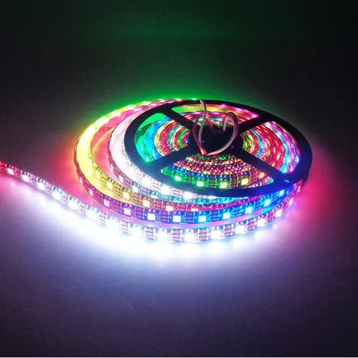
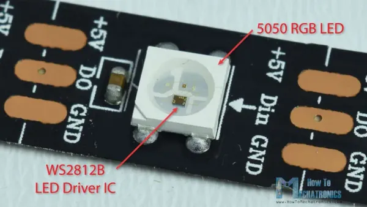
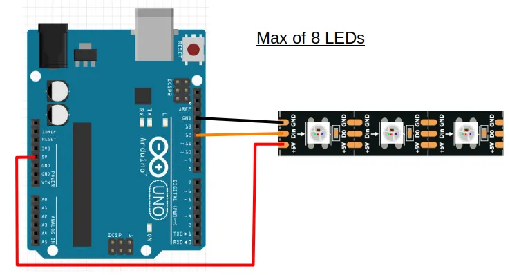
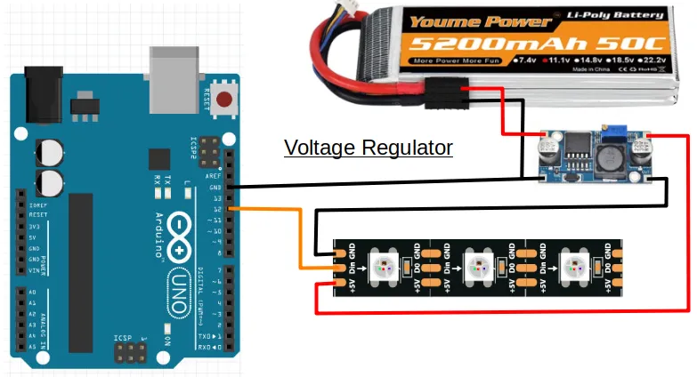
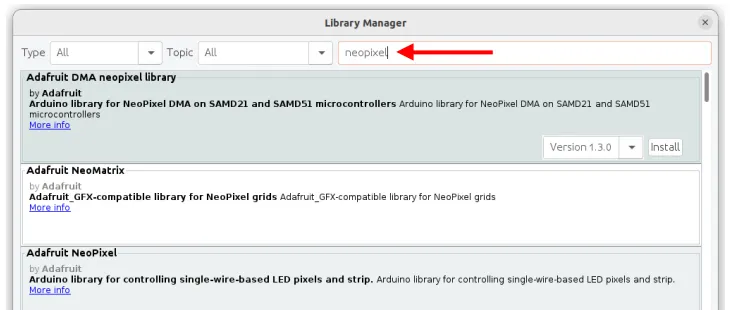

# Addressable LED (WS2812)



The WS2812 LEDs (...also known as the Neopixel after a popular brand), are addressable RGB LEDs.
Some of their features are...

* Connected in series. Only require one Arduino GPIO pin for all the LEDs.
* Individually addressable. You can control each LED individually.
* RGB. You can set the power for the Red, Green, and Blue component individually, allowing you to create any colors.

They are often sold in rolls of 5 meters, and are relatively inexpensive, making them great choices for decorating your project.

## Pins



| Pin | Description |
| --- | --- |
| +5V | Power supply for the LEDs. Connect this to the positive terminal on your power supply (eg. batteries). |
| Din | Digital Input. Signal to control the LEDs. Connect this to a GPIO pin on your Arduino. |
| GND | Ground pin. This should be connected to the **GND** pin on the Arduino. |
| DO | Digital Output. This connects from one LED to the next. You should not connect your Arduino to this. |

<div class="important">
The order of the pins are not always the same!
Always check the labels on the strip to ensure you connect them correctly.
</div>

## Wiring

Each LED consumes 60mA at max (...red/green/blue all on full brightness), while the Arduino 5V pin can supply only 500mA.
This means that you can safely power up to 8 LEDs using the 5V pin on the Arduino (...more if you don't turn on all LEDs or colors).



In the above example, we are using pin 12 to provide the digital signal to the LED, but you can use any GPIO pins on the Arduino.

If you require more than 8 LEDs, you will need a separate power supply that can provide 5V.
One way is to use a voltage regulator to reduce your battery voltage to 5V.



## Libraries

While we can write our own code to control the WS2812, the code can be rather complicated.
So we'll make use of libraries that others have written to help us control the LEDs.

In the Arduino software, click on **"Tools -> Manage Libraries"**.


There are too many libraries to scroll through one-by-one, so in the search field, key in **"neopixel"**.
There should now be only a few libraries left.



Look for the library named **Adafruit NeoPixel** and install it.

## Code

The below code alternates the color between the first and second LEDs.
It assumes that your Neopixel has at least two LEDs (...it can be more), and is connected to pin 12 on your Arduino.

```cpp hl_lines="1 3 6 10 11 12 15 16 17"
#include <Adafruit_NeoPixel.h>

Adafruit_NeoPixel strip(2, 12, NEO_GRB + NEO_KHZ800);

void setup() {
  strip.begin();
}

void loop() {
  strip.setPixelColor(0, 255, 0, 0);
  strip.setPixelColor(1, 0, 255, 0);
  strip.show();
  delay(1000);

  strip.setPixelColor(0, 0, 255, 0);
  strip.setPixelColor(1, 255, 0, 255);
  strip.show();
  delay(1000);
}
```

**#include &lt;Adafruit_NeoPixel.h&gt;** : This includes the **Adafruit_NeoPixel** library into your program.

**Adafruit_NeoPixel strip(2, 12, NEO_GRB + NEO_KHZ800);** : This creates a **Adafruit_NeoPixel** object named **strip**.
It has **2** LEDs, and is connected to pin **12** (...change these to match your strip).
We'll use this object in the later part of the code to control the LEDs.

**strip.begin();** : This initialize the **strip** object and gets it ready for use.

**strip.setPixelColor(0, 255, 0, 0);** : This sets **LED 0** (...nearest LED to Arduino) to Red (255), Green (0), Blue (0). (ie. Red color).

**strip.setPixelColor(1, 0, 255, 0);** : This sets **LED 1** (...second LED) to Red (0), Green (255), Blue (0). (ie. Green color).

**strip.setPixelColor(1, 255, 0, 255);** : This sets **LED 1** (...second LED) to Red (255), Green (0), Blue (255). (ie. Purple color).

**strip.show();** : Setting the pixel color will not have an immediate effect.
To display the color, you must run **strip.show()**.
