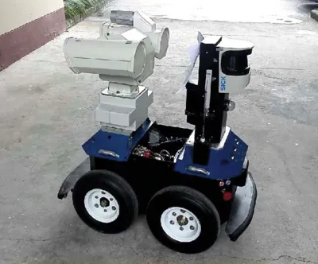

# Differential Drive

A **Differential Drive** is a type of drive system which uses two driven wheels, placed on either side of the robot.
There is typically one or more castor wheels (...an undriven wheel that can turn freely in any direction) added to help stabilize the robot.
A robot utilizing such a drive is capable of...

* Moving Forward
* Moving Backwards
* Making turns of any radius
* Turning on the spot

It is not capable of...

* Moving sideways

A differential drive robot is easy to program and control, and this drive system is used by most consumer robots (eg. Roomba).
You can read more about this drive system on [Wikipedia](https://en.wikipedia.org/wiki/Differential_wheeled_robot).

## One sided

The simplest differential drive system will place the driven wheels on one side of the robot, and the castors on the other.
Like the [Skuttle Robot](https://www.scuttlerobot.org/)...

### Good
* Stable
* Simple to build
* Weight is shared almost equally between the wheels and the castor

### Bad
* Only half the weight is on the castor, this limits its grip on the floor
* When turning, the center of mass is far from the center of rotation, this creates greater inertia

## Drop Center

The drop center arrangement is popular in some robotics competition.
In this arrangement, the drive wheels are at the center, while the four corners are supported by undriven wheels or castor wheels.
The drive wheels at the center are mounted slightly lower than the castors, hence the name "Drop Center".

### Good
* Nearly all the weight is resting on the driven wheel, giving it good grip
* Center of rotation is at the center of the robot, this reduces inertia, reduce the space needed for turning, and can look good

### Bad
* Due to the drop center, the robot may be a little wobbly
* Driven wheel needs to support almost the entire weight of the robot; this can put a lot of stress on it

## Skid Steer

In a skid steer, all the wheels are driven, and the front and rear wheels on each side turns together at the same speed.
When the robot turns, the wheels will drag or skid sideways across the ground.
Tracks (...like on a tank or bulldozer) is also a form of skid steer.

### Good
* All the weight are spread across multiple driven wheels, giving it good grip without putting too much stress on each wheel
* Multiple wheels provide opportunity for multiple motors, increasing power
* Center of rotation is around the center of the robot, this reduces inertia, reduce the space needed for turning, and can look good

### Bad
* Sideway dragging of the wheels during turn will wear out the wheels and may damage the floor
* Exact center of rotation is hard to determine, as it will depend on how much each wheel drags