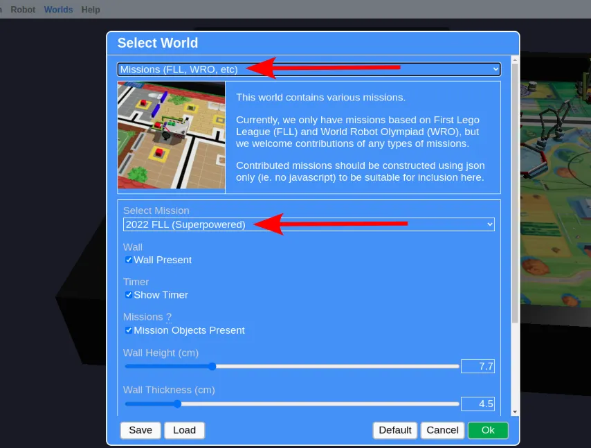
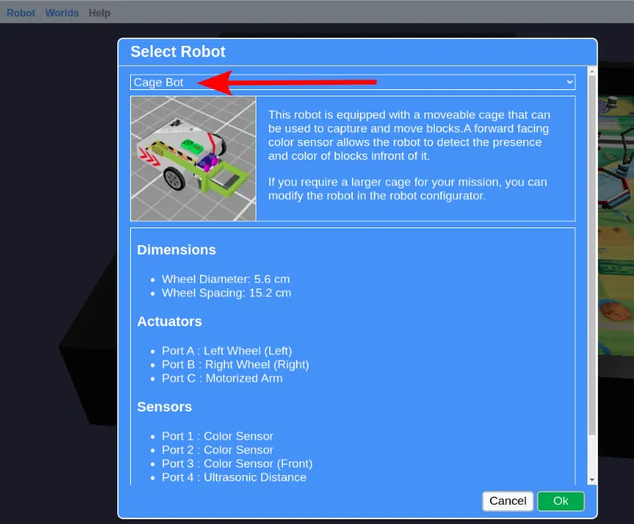

# Movement Challenges

Make use of what you have learned to complete the following challenges in [GearsBot](https://gears.aposteriori.com.sg).

Load the "2022 FLL (Superpowered)" world (Worlds => Select World => Missions => 2022 FLL Superpowered).

Switch to the "Cage Bot" robot (Robot => Select Robot => Cage Bot).

## Challenge

Pick up the tray and bring it back to the home area.

<video width="914" height="579" autoplay loop muted>
    <source src="images/fll_tray.webm" type="video/webm">
</video>

### Tips

* The motors and sensors on the "Cage Bot" are not the same as the default "Single Sensor Line Follower" robot (eg. Port 2 on the Cage Bot is not an ultrasonic). You'll need to change your motor / sensor initialization code to suit the Cage Bot, or your program won't even run!

* The tires will skid if your robot accelerates too rapidly. If your robot does not behave consistently, change the robot base settings to reduce the speed and acceleration to a low value. Read the Pybricks documentation to learn how.

* You can use the ultrasonic to stop a little more consistently near the tray, but that isn't necessary for this challenge (...in an actual competition, you should be using your sensors extensively to ensure your robot moves consistently).