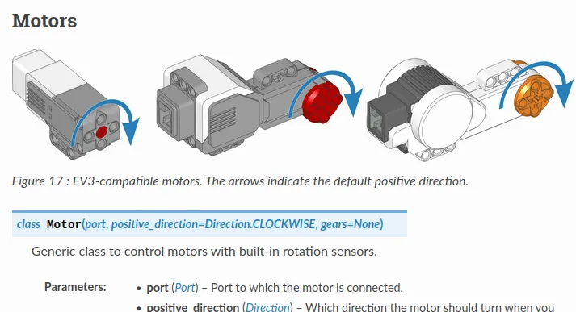
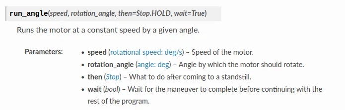

# Move and Print

Here's a basic program that moves the robot and print some sensor values.

You can copy it into the Python tab in GearsBot (...replace all existing content), then switch to the simulator tab to run it.
If running on a real robot, you need to make sure that all the motors/sensors are present and connected to the correct ports.

```python
#!/usr/bin/env pybricks-micropython

# Import the necessary libraries
from pybricks.parameters import *
from pybricks.hubs import EV3Brick
from pybricks.ev3devices import *
from pybricks.tools import wait
from pybricks.robotics import DriveBase

# Create the sensors and motors objects
ev3 = EV3Brick()

motorA = Motor(Port.A)
motorB = Motor(Port.B)

color_sensor_in1 = ColorSensor(Port.S1)
ultrasonic_sensor_in2 = UltrasonicSensor(Port.S2)
gyro_sensor_in3 = GyroSensor(Port.S3)

# Here is where your code starts

motorA.run_angle(400, 200)
motorB.run_angle(-200, 200)

print(color_sensor_in1.rgb())
print(ultrasonic_sensor_in2.distance())
print(gyro_sensor_in3.angle())
```

Let's look at what each line does...

## Hash Bang

```python
#!/usr/bin/env pybricks-micropython
```

The EV3 is running a Linux operating system.
In Linux, the first line starting with a `#!` is used to indicate the type of script in this file.
In this case, it tells the operating system that the file is a `pybricks-micropython` program.
The Spike Prime doesn't need this (...it doesn't run Linux or any other operating system).

## Imports

```python
# Import the necessary libraries
from pybricks.parameters import *
from pybricks.hubs import EV3Brick
from pybricks.ev3devices import *
from pybricks.tools import wait
from pybricks.robotics import DriveBase
```

The line starting with a `#` is a comment.
It's for humans to read, and Python will ignore it.

The line starting with `from` are imports lines.
They import functions from different modules, and make them available for use in your program.

`from pybricks.tools import wait` imports the `wait` function from the `pybricks.tools` module.

`from pybricks.ev3devices import *` imports ALL the functions form the `pybricks.ev3devices` module (...the `*` means everything).

## Initialize Motors and Sensors

```python
# Create the sensors and motors objects
ev3 = EV3Brick()

motorA = Motor(Port.A)
motorB = Motor(Port.B)

color_sensor_in1 = ColorSensor(Port.S1)
ultrasonic_sensor_in2 = UltrasonicSensor(Port.S2)
gyro_sensor_in3 = GyroSensor(Port.S3)
```

This bunch of code create objects representing each motor, sensor, and hub.

`ev3 = EV3Brick()` creates an object representing the EV3 brick/hub, and assign it to the variable `ev3`.
You can change the name on the left to whatever you want, eg. `fido = EV3Brick()`, but the part on the right cannot be changed.

`motorA = Motor(Port.A)` creates an object representing a motor, and assign it to the variable `motorA`.
We pass in the parameter `Port.A`, to tell it that we want the motor connected to Port A.
As before, the name on the left is up to you, so `left_motor = Motor(Port.A)` is perfectly valid too.

At this point, you might be wondering where did we get the right hand side from.
Why is it `Motor` and not `motor` or `LegoMotor`?
The names on the right are **Classes** and we can find the available classes on the [Pybricks documentation site](https://pybricks.com/ev3-micropython/ev3devices.html).



The `Motor` class accepts up to 3 parameters, **port**, **positive_direction**, and **gears**.
For **positive_direction** and **gears**, we didn't specify them when creating our motor objects, so they'll just use the default values.
The **port** parameter doesn't have any defaults, so we MUST specify it or we will have an error.

<div class="important">
Refer to the pybricks documentation frequently.
The ability to read documentations is one of the most important skill for a programmer.
If you can read documentations, millions of modules will be available for you to use in your programming projects.
If you can't, you'll never go beyond what is in the tutorials.
</div>

## Moving motors

```python
motorA.run_angle(400, 200)
motorB.run_angle(-200, 200)
```

These two lines move motor A and motor B, one after the other.

`run_angle()` is a **method** in the **Motor** object.
There are many other methods available, and you should refer to the [Pybricks documentation site](https://pybricks.com/ev3-micropython/ev3devices.html) to learn more.



From the documentation, you can see that the first parameter is the speed in deg/s.
The EV3 large motor has a maximum speed of around 1000 deg/s, so 400 deg/s is about 40% speed.

<div class="note">
The max speed of the motor is dependent on load, battery type, battery capacity, and varies a little from motor to motor.
When used to drive a robot, the motor can usually reach only 800 deg/s to 900 deg/s.
Try to keep your speed settings below 80%, as the robot will behave inaccurately if it hits its limits.
</div>

The second parameter is the amount to turn in deg.
In this case, the motor will turn 200 deg (...less than one rotation).

There are two more parameters that we didn't specify, **then** and **wait**.
The default value for **then** is `Stop.HOLD`, which makes the motor hold its stopping position as accurately as it can.

The default value for **wait** is `True`, which makes the program stop at that line until the movement is complete.
If we change it to `False` by writing `motorA.run_angle(400, 200, wait=False)`, then as soon as motor A starts moving, the program will move on to the next line and motor B will start to move as well. (...try it and see)

For motor B, we set the speed to `-200` which makes it go backwards.

## Printing Sensor Values

```python
print(color_sensor_in1.rgb())
print(ultrasonic_sensor_in2.distance())
print(gyro_sensor_in3.angle())
```

This group of code uses the `print()` function to print out the sensor values.

`print()` can be used to print a string or value.
Here's an example... `print('hello world')` this will print out the words **hello world** in the terminal.

`color_sensor_in1.rgb()` is a method in the **ColorSensor** object that returns the Red, Green, Blue values measured by the color sensor.
It is a tuple of 3 values.

<div class="note">
Tuples are groups of values.
We can access each individual value using an index.
For example, color_sensor_in1.rgb()[0] will provide the first value (Red).
Note that in most programming languages, we count starting from zero.
</div>


`ultrasonic_sensor_in2.distance()` returns the distance measured by the ultrasonic sensor in mm.
It is a single numeric value.

`print(color_sensor_in1.rgb())` prints out the result of the `color_sensor_in1.rgb()` method.

As always, read the [Pybricks documentation site](https://pybricks.com/ev3-micropython/ev3devices.html) to learn about all the available methods.
