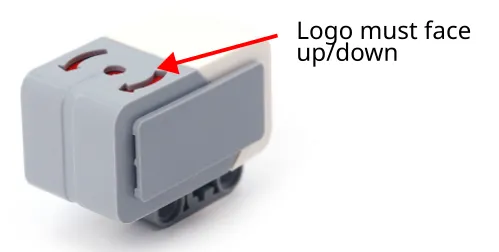
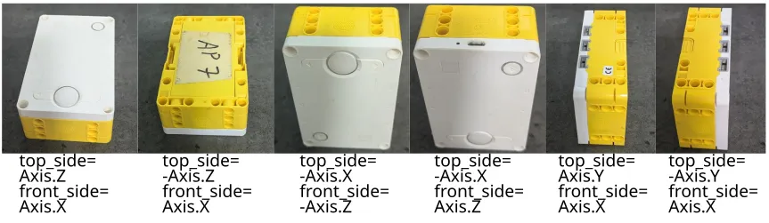

# Gyro

By using the gyro, we can ensure that our robot turn consistently and drive in a straight line.
Both the EV3 and Spike Prime are equipped with gyros, but the gyro for the EV3 is an external component while the gyro for the Spike is built into the hub.

## Initialize and Read the Gyro

<div class="tabs">
    <label>EV3</label>
    <label>Spike Prime</label>

```python
#!/usr/bin/env pybricks-micropython

# Import the necessary libraries
from pybricks.parameters import *
from pybricks.ev3devices import *

# Use this if the sensor logo is facing up
gyro_sensor = GyroSensor(Port.S3)

# Use this if the sensor logo is facing down
gyro_sensor = GyroSensor(Port.S3, positive_direction=Direction.COUNTERCLOCKWISE)


# Here is where your code starts
print(gyro_sensor.angle())
```

```python
# Import the necessary libraries
from pybricks.parameters import *
from pybricks.hubs import PrimeHub

# Use this if the hub screen is facing up (1st example in the below photos)
hub = PrimeHub()

# Use this if the side with the USB port is facing up (4th example in the below photos)
hub = PrimeHub(top_side=-Axis.X, front_side=Axis.Z)


# Here is where your code starts
print(hub.imu.heading())
```
</div>

For the EV3, the logo on the gyro must be facing up or down.
If it's facing down, you'll need to add `positive_direction=Direction.COUNTERCLOCKWISE` or all your directions will be reversed.



For the Spike, if the hub screen isn't facing up, you'll need to add the `top_side` and `front_side` parameters when initializing the hub.
You can see [this page](https://docs.pybricks.com/en/stable/signaltypes.html#robotframe) for an explanation, or refer to the below photos.



<div class="tip">
When using the above photo guide, you only need to consider which side of your hub is facing up.
</div>

## Using the Gyro for Turns

This is a simple example that uses the gyro for turns.

<div class="tabs">
    <label>EV3</label>
    <label>Spike Prime</label>

```python
#!/usr/bin/env pybricks-micropython

# Import the necessary libraries
from pybricks.parameters import *
from pybricks.ev3devices import *
from pybricks.robotics import DriveBase

# Create the sensors and motors objects
motorA = Motor(Port.A)
motorB = Motor(Port.B)

gyro_sensor = GyroSensor(Port.S3)


# Create a drive base
robot = DriveBase(motorA, motorB, 56, 152)


# Function for turning right
def turn_right(direction):
    robot.drive(0, 50) # turn CW at 50 deg/sec
    
    # Do nothing as long as the gyro direction is less
    # than our target direction
    while gyro_sensor.angle() < direction:
        pass
    
    # Stop
    robot.drive(0, 0)


# Turn until the robot is facing direction 90
turn_right(90)
```

```python
# Import the necessary libraries
from pybricks.parameters import *
from pybricks.hubs import PrimeHub
from pybricks.pupdevices import *
from pybricks.tools import wait
from pybricks.robotics import DriveBase

# Create the sensors and motors objects
hub = PrimeHub()

motorA = Motor(Port.A, Direction.COUNTERCLOCKWISE)
motorB = Motor(Port.B)

# Create a drive base
robot = DriveBase(motorA, motorB, 56, 152)


# Function for turning right
def turn_right(direction):
    robot.drive(0, 50) # turn CW at 50 deg/sec
    
    # Do nothing as long as the gyro direction is less
    # than our target direction
    while gyro_sensor.angle() < direction:
        pass
    
    # Stop
    robot.brake()


# Turn until the robot is facing direction 90
turn_right(90)
```
</div>

<div class="tip">
The above turn_right function is meant to demonstrate how to use the gyro; it is not very good.
At the end of this page, there are links to some documents explaining how to make good gyro turn and gyro move functions.
</div>

## Turn-To vs Turn-By

Try running this code...

```python
turn_right(90)
wait(500)
turn_right(90)
```

You'll notice that the robot only turn once!
That's because the angles provided by the gyro is relative to the **starting** direction.

In the first `turn_right(90)`, the robot **turns to** the 90 degrees direction (ie. if the robot starts facing north, the robot will turn until it face east).
**It does not turn by 90 degrees.**
When the second `turn_right(90)` runs, the robot will try to turn until it faces the 90 degrees direction, but will stop immediately because it is already facing the 90 degrees direction (ie. east).

If you try this...

```python
turn_right(90) # Turn to east
wait(500)
turn_right(180) # Turn to south
```

...you should now see the robot turn twice.

## Resetting Gyro

You can reset the gyro, this will make the current direction be whatever you specify.
Try this code...

<div class="tabs">
    <label>EV3</label>
    <label>Spike Prime</label>

```python
turn_right(90)
gyro_sensor.reset_angle(0)
wait(500)
turn_right(90)
```

```python
turn_right(90)
hub.imu.reset_heading(0)
wait(500)
turn_right(90)
```
</div>

In the above code, the robot turns until it face east (90 deg).
It then sets the gyro angle back to 0 (...so east is now 0 deg).
The second turn will now rotate the robot to face south.

### Important!
**Resetting the gyro when the robot isn't physically aligned to an external reference will lead to accumulation of errors!**

The below video demonstrates what happen when you reset the gyro (...left robot) and when you don't (...right robot).
You'll notice that both robots have a slight error when making the first turn, but while the error for the left robot increases with each turn, the error for the right robot stays the same.

<iframe width="560" height="315" src="https://www.youtube.com/embed/uxT3SbEqbyU?si=M7pWfYzAf-ErSsAt" title="YouTube video player" frameborder="0" allow="accelerometer; autoplay; clipboard-write; encrypted-media; gyroscope; picture-in-picture; web-share" referrerpolicy="strict-origin-when-cross-origin" allowfullscreen></iframe>

In practice, the accumulated error won't be as significant as in the video (...I deliberately coded the above robots to maximize error), but it will accumulate, and it will get worse the more you turn.
To ensure that your gyro moves remains as accurate as possible, you should only reset the gyro when the robot is physically aligned to the environment (eg. when the back of the robot is pressed against a wall).

## Gyro Turn and Gyro Move

Now that you know how to use the gyro, you can use it to create functions for turning and driving straight.
Refer to the links below for more details.

* [Gyro Turn](https://www.aposteriori.com.sg/wp-content/uploads/Gyro-Turn.pdf)
* [Gyro Move](https://www.aposteriori.com.sg/wp-content/uploads/2022/03/Gyro-Follower.pdf)
* [Ending the Loop](https://www.aposteriori.com.sg/wp-content/uploads/2022/03/Ending-the-Loop.pdf)