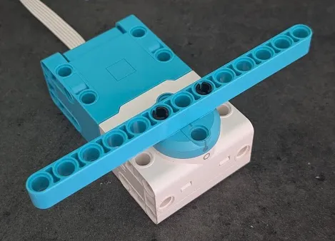

# Intro

Our robots often need to use arms and claws to move mission models.
While these arms and claws are usually driven by the same types of motors that we use for wheels, there are a few special considerations that we need to take note of.

Most of the code in this section will be difficult to test in the simulator, so it's best to have a physical robot when going through these lessons.
Have a motor prepared like in the following photo.

