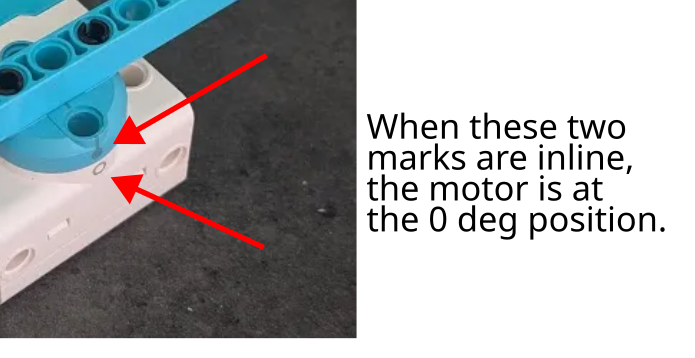

# run_angle vs run_target

When moving an arm / claw into the desired position, you can use either `run_angle` or `run_target`.
The differences between the two are...

## run_angle

`run_angle` is relative to the **current motor position**.
So in the following code...

```python
motor.run_angle(200, 90)
wait(1000) # wait for 1 second
motor.run_angle(200, 90)
```

...the motor will run twice, and ends 180 degrees from where it started.

## run_target

`run_target` is relative to the **marked zero position**.



So in the following code...

```python
motor.run_target(200, 90) # This line may run more or less than 90 degs
wait(1000) # wait for 1 second
motor.run_target(200, 90) # This line does nothing!
```

...the first run may run more or less than 90 degs (...depending on where the motor starts), but it will always end with the motor markings 90 degrees apart.
The second run will not result in any movements, because the command is telling it to move to the 90 degrees position, but it is already at the 90 degrees position after the first move.

<div class="important">
The EV3 motors does not have a marking, and run_target is instead relative to the position on program start.
</div>


## Which is better?

Generally, `run_target` is a better choice (...especially for Spike Prime).
It ensures that your arm / claw moves to a consistent position regardless of where it started from.


## Don't start at 180 degrees!

The starting position for the Spike motor is always in the range of -180 to 180 degrees.
If the motor starts at 180 degrees, the reported motor angle may be -180 or 180 degrees (...mathematically, these are the same angles and both are correct).

Consider if the motor starts at 180/-180 degrees, and you run `motor.run_target(200, 90)`.
If the motor thinks that it is at 180 degrees, it will turn 90 degrees counter-clockwise which is probably fine.
If it thinks that it is at -180 degrees, it will turn 270 degrees clockwise, which will probably result in the motor getting stuck.

To avoid this issue, simply avoid starting your motors at the 180 degrees position.