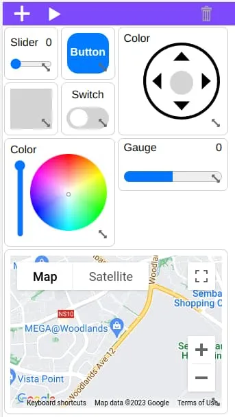
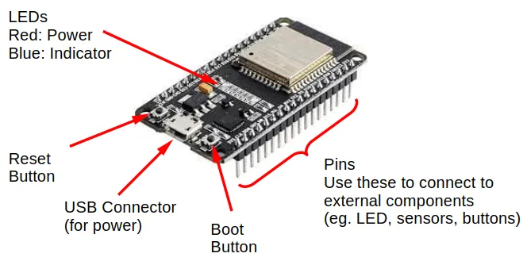

# Introduction

This is the documentation for **IoTy**.

You can find the repository of IoTy at [https://github.com/QuirkyCort/IoTy](https://github.com/QuirkyCort/IoTy)

## What is IoTy?

IoTy provides a web-based environment for coding micropython devices in Blocks and in Python.
It also provides a web-based app builder for creating IoT (Internet-of-Things) apps.

 

IoTy primarily supports the ESP32 microcontroller, but should work with any micropython devices such as the Raspberry Pi Pico.

IoTy with ESP32 is similar to the popular Arduino UNO and the micro:bit.
Compared with the Arduino UNO, IoTy provides...

* Web-based programming interface
* Programming in Blocks or Python
* Faster processor and much more memory
* Built-in WiFi

Compared with the micro:bit, IoTy provides...

* Faster processor and more memory
* Built-in WiFi
* Lower cost
* Breadboard compatibility

## ESP32

The ESP32 is a low cost (~$4) microcontroller with built-in WiFi and Bluetooth support.
There are many varients of the ESP32 boards; if this is your first time working with one, I would recommend purchasing the "ESP32-WROOM-32 chip, on a ESP32 DEV KIT DOIT board (30 pin version)" (...see below image).
It is widely available on Aliexpress, Amazon, etc.

This ESP32 board is breadboard compatible, allowing it to easily connect to a variety of low cost components.

## Installing the firmware

### Requirements

* ESP32
* USB Cable
* Computer (...not a phone or tablet)
* Webbrowser (Chrome is preferred, but others may work too)

### Instructions

The recommended way to install the IoTy firmware on the ESP32 is to use this page: [https://quirkycort.github.io/IoTy-Flash/public/index.html](https://quirkycort.github.io/IoTy-Flash/public/index.html).

You'll need to connect the ESP32 to your computer via a USB cable.
If your device could not be detected, you may need to...

* **Windows** [Install the CP210 driver](https://randomnerdtutorials.com/install-esp32-esp8266-usb-drivers-cp210x-windows/) or [Install the CH340 driver](https://learn.sparkfun.com/tutorials/how-to-install-ch340-drivers/all) (...depends on what your ESP32 is using)
* **Linux** Add your user to the "dialout" group using: `sudo usermod -a -G dialout <username>` (...restart your computer for the changes to take effect).

If you are not using an ESP32 (eg. Raspberry Pi Pico), install the firmware using the instructions here [https://github.com/QuirkyCort/IoTy/wiki/Non%E2%80%90browser-based-setup](https://github.com/QuirkyCort/IoTy/wiki/Non%E2%80%90browser-based-setup).
