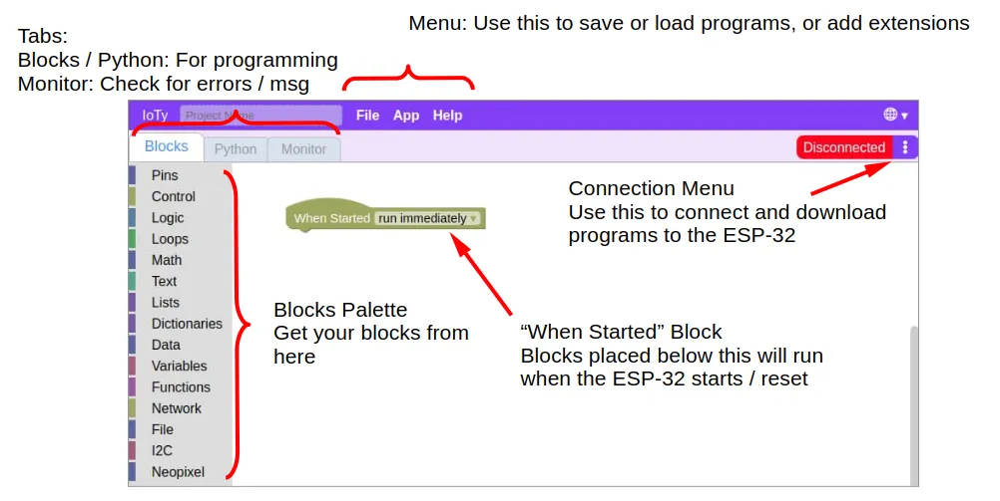
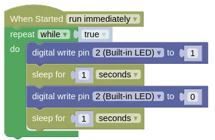

# First Program

The ESP32 is equipped with a blue LED that we can control using pin 2.
For this first program, we will make the blue LED blink.

While it is possible to use IoTy on a phone or tablet, the instructions below are for connection via serial mode which only works on computers.

IoTy supports 4 different ways of connecting to your device.
Serial is the easiest to use, but does not work on mobile devices.
To use IoTy on a mobile device (eg. phone, tablets), you'll need to use "Bluetooth", "Internet", or "Access Point" mode.
Read the section on "Connection Mode" to learn more.

## Power and Connection

Connect your ESP32 to your computer via the USB cable.
This provides power to your board as well as a serial connection for transfering programs.

On power up (...or reset), the blue LED will blink 3 times; this is the boot-up indicator for IoTy.
If you do not see the 3 blinks, the firmware was probably not flashed correctly.

## The IoTy interface

Open the IoTy coding page... [https://ioty.a9i.sg/editor.html (Main)](https://ioty.a9i.sg/editor.html)

You can also use the <a href="https://quirkycort.github.io/IoTy/public/editor.html">development page</a> for the latest features.

## Connecting your device

Open the connection menu (...click on the 3 dots) and select "Connection mode".
Change the mode to "Serial" then click "Ok".

Now open the connection menu again, and select "Connect (Serial)".
Select "Filtered Connect", select your device (...there will probably be just one), and click "Connect".

<video width="974" height="642" autoplay loop muted>
    <source src="images/connect.mp4" type="video/mp4">
</video>

## Writing the Code

Write the following code...

Your code must be connected to the "When Started" block, and you may only have a single "When Started" block in each program.

Pin 2 is connected to the built-in blue LED.
When 1 (HIGH) is written to pin 2, the LED is turned on.
When 0 (LOW) is written to pin 2, the LED is turned off.

The "repeat while true" block ensures that the code inside is repeated forever.

The "sleep" block adds a short delay after turning the LED on or off.
Feel free to change the duration.

The Blocks code will be automatically converted to Python; you can switch to the Python tab at anytime to see the generated code.
You can also edit the Python code, but be warned that changes to the Python code will not convert back to Blocks.

## Download to Device

Open the connection menu (...click on the 3 dots) and select "Download to device".
When completed, click "Reset" to reset your device; your program will only run after a reset.
If you accidentally click "Ok" instead, you can reset your device either through the connection menu or by pressing the reset button on your ESP32.

<video width="974" height="642" autoplay loop muted>
    <source src="images/download.mp4" type="video/mp4">
</video>

Once downloaded, the program will be stored on your ESP32.
The program will run automatically when the ESP32 is powered up, even if it is not connected to a computer.
Try unplugging your ESP32 from your computer and connect it to a USB charger instead; you should see your program run after the 3 boot-up blinks.

## What's Next?

You've completed your first IoTy program!
You should now know how to connect to your ESP32, write code, and download it to your device.

The following chapters will cover more features of IoTy.
You can read through them in order, or simply skip to the topic that interest you.
