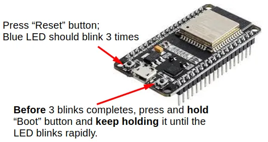

# Connection Modes

IoTy supports 4 different ways to connect to your device.

* **Serial.** This is the preferred way, but only works on computers and not mobile devices (eg. phone and tablets).
* **Bluetooth.** This works on computers and Android devices, but not on iOS (eg. iPads).
* **Internet.** This works on all devices, but requires WiFi and an MQTT account.
* **Access Point.** This works on all devices, but requires the most steps when downloading programs to your device.

## Serial Mode

* Preferred connection mode.
* Works on laptops and desktops running Chrome browser.
* Does not work on mobile devices.
* Only method that stays connected when the device is reset.

### Connection Steps

1. Open connection menu.

2. Switch to "Serial" mode and click "Ok".

3. Connect device to computer using USB cable.
4. Open connection menu and click "Connect".
5. Select "Filtered Connect", select your device (...there will probably be just one), and click "Connect".
6. Open connection menu and click "Download to device".
7. Reset your device to run the new code.

## Bluetooth Mode

* Only works on Chrome.
* Does not work on iOS (iPhone and iPads) even with Chrome.
* Slow when transferring large programs and may have hardware compatibility issues.

### Connection Steps

1. Open connection menu.

2. Switch to "Bluetooth" mode and click "Ok".

3. Switch your device to programming mode by pressing reset, then hold the boot button until the Blue LED stays on.

4. Open connection menu and click "Connect".
5. Select your device (...it should show the name that you've selected when flashing firmware) and click "Connect".
6. Open connection menu and click "Download to device".
7. Reset your device to run the new code.

## Internet Mode

* Recommended mode for iPads.
* Works on any device using any browser.
* Need to provide your device with WiFi access (...many school and public WiFi will not allow this, but home routers and phone hotspot should work fine).
* Need access to an MQTT server (...you can use the public server provided by [Hivemq](https://www.hivemq.com/mqtt/public-mqtt-broker/)).
* Needs to configure your device using another mode first (...to provide it with the network settings).

### Configuring Network

1. Connect using one of the other modes.
2. Open the connection menu, and select "Configure Device Network".
3. Provide your WiFi SSID and password.
4. Fill in the MQTT Host, Port, Username, and Password. If using the public server provided by [Hivemq](https://www.hivemq.com/mqtt/public-mqtt-broker/), set Host to `broker.hivemq.com`, Port to `1883`, Username can be anything (...choose something unique), and leave password blank.
5. Click "Ok".

### Connection Steps

1. Open connection menu.

2. Switch to "Internet" mode and click "Ok".

3. Switch your device to programming mode by pressing reset, then hold the boot button until the Blue LED stays on.

4. The Blue LED will then perform double blinks while it connects to your WiFi. When the Blue LED stays on, connection to the MQTT server is complete.
5. Open connection menu and click "Connect".
6. Provide the MQTT Host, Username, and Password. If using the public server provided by [Hivemq](https://www.hivemq.com/mqtt/public-mqtt-broker/), set Host to `ws://broker.hivemq.com:8000/mqtt`, Username to what you have used when configuring network, and leave password blank. Click "Ok".
7. Open connection menu and click "Download to device".
8. Reset your device to run the new code.

## Access Point Mode

* Works on any device using any browser.
* ESP32 will act as a router.
* Most steps required.

### Download Program

To use Access Point mode, you must first download your program as a JSON package.
Click "File", then "Save code to JSON package".

### Connection Steps

1. Switch your device to access point mode by pressing reset, then hold the boot button until the Blue LED blinks rapidly.

2. On your computing device (eg. Computer, phone, tablet), open the WiFi menu and look for an access point with the name of your IoTy device (...name that you have selected when flashing firmware). Connect to that access point.
3. Upon connection, you will lose internet access. **This is normal!**
4. Click "App", then "Access point page".

5. In the access point page, look for the "Upload Code" section, select "Choose file", then select the JSON package you have downloaded earlier.
6. Click the "Upload" button. You should see a success message.

7. Reset your device to run the new code.