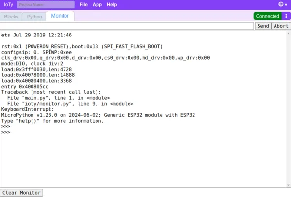
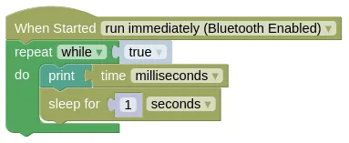
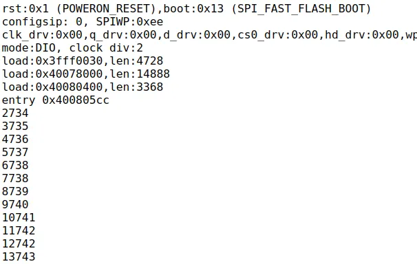
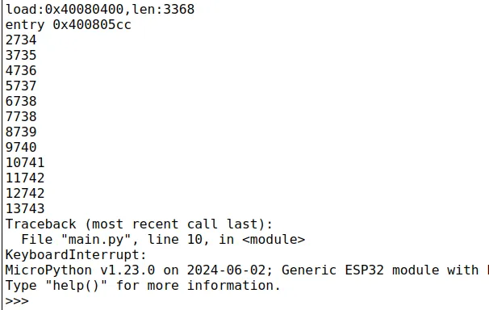
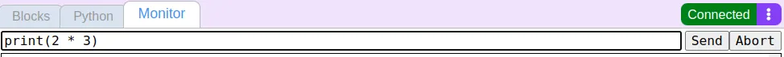
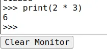
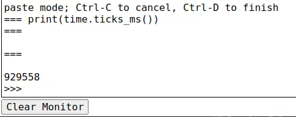
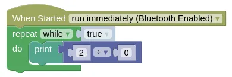
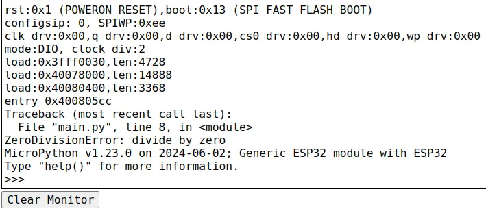

# Monitor

When connected in Serial, Bluetooth, or Internet mode, the monitor tab will be linked to the micropython terminal.
Error messages will appear here, so you should check the monitor if your code isn't working.
Messages from the "print" block and Python's "print" command will also appear here.



You can abort a running program by clicking the "Abort" button.
This will drop you into the Python command prompt (">>>").

You can send text to your code by typing it into the text box at the top and clicking "Send" or pressing "Enter".
When in the Python command prompt, Python commands can also be sent using the text box.

### Bluetooth Mode

When the IoTy device is reset, it will cause Bluetooth mode to disconnect.
By the time you reconnect to your device, you may have already missed some error messages or print messages.

To avoid this problem, you can set your "When Started" block to "wait for Bluetooth connection".


A program that is set to "wait for Bluetooth connection" will not run immediately after reset.
Instead, it will wait for a Bluetooth connection before the program starts running.

### Internet Mode

In Internet mode, the monitor can only display messages; you cannot send text or Python commands to your device.

The IoTy device will not normally connect to the internet.
To make it connect to the internet and send messages to the monitor, you need to set the "When Started" block to "wait for internet connection".


Your network settings must be configured for this to work.

## Printing to Monitor

Write the following code in either Blocks or Python, download it to your device, then reset your device.

### Blocks



### Python

```python
import time

while True:
    print(time.ticks_ms())
    time.sleep(1)
```

### Monitor

Switch to the monitor.
You should see messages like the following...



The first part of the text is the boot up message.
The numbers that follows is the time (...in milliseconds) printed by our code.

## Abort

Click the "Abort" button; this will terminate the running program and drop you into the Python prompt (">>>").



## Running Python Commands

Type the following command into the text box and click "Send" (...or press "Enter").



You should see the command and the result (6) appear in the monitor.



## Running Selected Blocks

Instead of typing in Python commands, you can also run selected blocks.
Switch to the Blocks tab, select the "print" block, open the connection menu, then click "Run selected block".

<video width="454" height="268" autoplay loop muted>
    <source src="images/runSelected.mp4" type="video/mp4">
</video>

Switch back to the Monitor tab and you should see the result.



## Errors

Write the following code in either Blocks or Python, download it to your device, then reset your device.

### Blocks



### Python

```python
import time

while True:
    print(2 / 0)
```

### Monitor

You should see an error displayed in the monitor.



It's a divide-by-zero error!

The error will not tell you which Block is responsible for the error, only the Python line number where the error occured.
Fortunately, even if you do not understand Python, it is usually easy to figure out which Block is responsible for the error by looking at the line of Python code causing the problem.