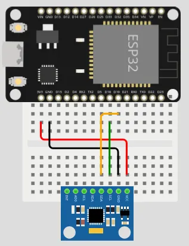
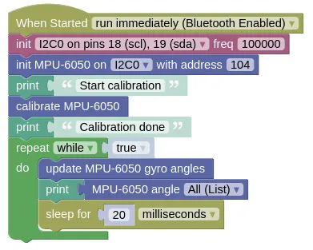

# Gyro (MPU-6050)


This is the GY 521 (...name of the board), but it's also referred to as the MPU-6050 (...name of the chip on the board). This gyro is cheap and commonly available, making one of the most popular model. Features of the board includes...

* 3-axis Accelerometer
* 3-axis Rate Gyro
* I2C communication protocol

## Rate Gyro

The gyro on these modules are **rate gyros**.
Unlike the gyros found on ships and planes, these rate gyros cannot tell you which direction is north.
Instead, a rate gyro can only tell you how fast it is rotating.

By [integrating](https://www.mathsisfun.com/calculus/integration-introduction.html) the rate of rotation, we can determine how much the gyro has turned from its starting position.

Every rate gyro must go through a **calibration** step (...typically done in **setup**), and it's important that the gyro is perfectly stationary during this time.
If the calibration is done while the gyro is moving, it will lead to large errors in the reading.
Note that rate gyros all suffers from drift over time, but if calibration is done well, this drift can be as little as 1 degree per minute.

## Pins

| Pin | Purpose |
| --- | --- |
| VCC | Provides the ultrasonic with power. Connect to **3V3** on the ESP32. |
| GND | Provides the ultrasonic with power. Connect to **GND** on the ESP32. |
| SCL | Serial Clock. This is used to communicate with the ESP32 using the I2C protocol. |
| SDA | Serial Clock. This is used to communicate with the ESP32 using the I2C protocol. |
| XDA, XCL, AD0, INT | Ignore. They have special uses which we do not need. |

## Wiring

In this example, we are using Pin 18 for SCL and Pin 19 for SDA.
If you use different pins, change your code accordingly.



## Code

This code will calibrate the gyro, then start displaying the angles rapidly.
The gyro must be stationary during calibration, else it may never complete.

The `update` is required to perform the integration step, and needs to run frequently.
Without it, the angles will not change.
Here we introduce a 20ms sleep to prevent printing too often to the monitor; if you don't need to print to monitor, you should run without any sleep.

### Blocks



### Python

```python
import machine
import mpu6050
import time

i2c0 = machine.I2C(0, freq=100000)
mpu6050_device = mpu6050.MPU6050(i2c0, 104)
print('Start calibration')
mpu6050_device.calibrate_gyro()
print('Calibration done')
while True:
    mpu6050_device.update_angle()
    print(mpu6050_device.angle_all())
    time.sleep_ms(20)
```

### Results

You should see angles in the x/y/z axis printed in the monitor.
As you rotate the gyro, you should see the angles change.

# `class MPU6050` - read and control MPU-6050 gyro

!!!!!
## Constructors

### mpu6050.MPU6050(i2c, addr=104)

Create an MPU6050 object.

The arguments are:

* `i2c` An i2c object.

* `addr` The i2c address of the gyro. By default, this should be 104.

Returns an `MPU6050` object.

## Methods

### MPU6050.reset_gyro(x=0, y=0, z=0)

Reset the gyro angles to the specified angles.

The arguments are:

* `x`, `y`, `z` A number specifying the angle for each axis in degrees.

Returns `None`.

### MPU6050.calibrate_gyro(reps=80, threshold=100)

Perform a gyro calibration.
The gyro must be stationary during calibration.

The arguments are:

* `reps` An integer specifying number of readings to take during calibration. A larger number will improve accuracy, but the calibration will take longer.

* `threshold` Difference between consecutive readings during calibration must be below this value to be accepted. This prevents accidental movement from spoiling the calibration. You generally do not need to change this.

Returns `None`.

### MPU6050.get_calibration()

Gets the calibration values as a list.
You can use this to save the calibration values to file, and reuse it on the next boot up.

Returns a `list` containing the zero error (`float`) for the x, y, and z rate of rotation.

### MPU6050.set_calibration(calibration)

Sets the calibration values.
You can use this to restore a previous calibration.

The argument are:

* `calibration` A list containing the zero error (`float`) for the x, y, and z rate of rotation.

Returns `None`.

### MPU6050.accel_all()

Gets the acceleration for all 3 axis.

Returns a `list` containing the acceleration (`float`) in milligravity for the x, y, and z axis.

### MPU6050.accel_x(), MPU6050.accel_y(), MPU6050.accel_z()

Gets the acceleration for the specified axis.

Returns a `float` containing the acceleration in milligravity for the specified axis.

### MPU6050.temperature_6050()

Gets the temperature for the chip.

Returns a `float` representing the temperature in Celsius.

### MPU6050.temperature_6500()

Gets the temperature for the chip.
Use this if your chip is a MPU-6500.

Returns a `float` representing the temperature in Celsius.

### MPU6050.rate_all()

Gets the rotation rate for all 3 axis.

Returns a `list` containing the rotation rate (`float`) in degrees per second for the x, y, and z axis.

### MPU6050.rate_x(), MPU6050.rate_y(), MPU6050.rate_z()

Gets the rotation rate for the specified axis.

Returns a `float` representing the rotation rate in degrees per second for the specified axis.

### MPU6050.angle_all()

Gets the rotation angle for all 3 axis.
You must run `update_angle` regularly for this to work.

Returns a `list` containing the rotation angle (`float`) in degrees for the x, y, and z axis.

### MPU6050.angle_x(), MPU6050.angle_y(), MPU6050.angle_z()

Gets the rotation angle for the specified axis.
You must run `update_angle` regularly for this to work.

Returns a `float` representing the rotation angle in degrees for the specified axis.

### MPU6050.update_angle()

Gets the rotation rate and update the rotation angle through integration.

The gyro angles will not be accurate if you do not run this frequently.
If you only need rotation rate and acceleration, then you do not need to run this method.

Returns `None`
!!!!!
