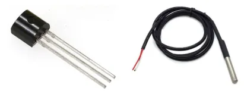
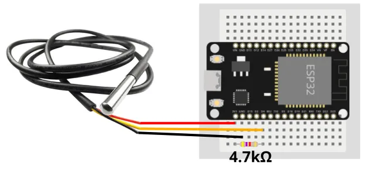
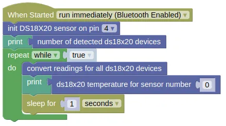

# Temperature Sensor (DS18S20, DS18B20)



The DS18S20 (0.5°C precision) and DS18B20 (0.0625°C precision) are low cost thermometers.
They are available packaged in a waterproof probe, making them a popular choice for measuring fluid temperature or in outdoors environment.

These sensors uses the [1-wire bus](https://en.wikipedia.org/wiki/1-Wire) to communicate.
The 1-wire bus allows multiple devices to be connected to the same data wire, so you could potentially connect a dozen sensors using just one pin on your microcontroller.

IoTy provides an **EZ DS18X20** extension to read these devices, but you can also use micropython's built-in module to read them.

<div class="info">
You could connect different types of 1-Wire devices to the same pin, but there are not many 1-Wire devices other than the DS18x20 sensors.
</div>

## Pins


| Pin | Description |
| --- | --- |
| VCC (Red) | Power for the sensor. Connect to **3V3**. |
| GND (Black) | Ground pin. This should be connected to the **GND** pin on the ESP32. |
| DATA (Yellow/White) | Data. This should be connected to an output capable pin on the ESP32. |

## Wiring



You can connect multiple units of this temperature sensor to the same pin on the ESP32.

## Code

This code will display the temperature once every second.

<div class="important">
You must perform a "convert readings" before reading the temperature. The temperature readings will not change until you perform another "convert readings". It takes around 750ms to perform a "convert reading", so you should not perform it more often than that.
</div>

### Blocks



If you have a second sensor connected to pin 4, you can read it by specifying `1` as the sensor number.
The order of the sensors is dependent on their internal ID and will not change, but the first time you run it, you'll need to test to determine which is sensor 0 and which is sensor 1.

### Python

```python
import ez_ds18x20
import time

ds_device = ez_ds18x20.DS18X20(4)
print(ds_device.device_count())
while True:
    ds_device.convert_temp()
    print(ds_device.read_temp(0))
    time.sleep(1)
```

The `ez_ds18x20` module provides a thin wrapper over the `ds18x20` module built into micropython.
You can also use the built-in `ds18x20` module directly; refer to the [micropython documentations](https://docs.micropython.org/en/latest/esp32/quickref.html#onewire-driver).

### Results

You should first see the number of connected device printer on the monitor, followed by the temperature (Celsius) once every second.

# `class DS18X20` - control DS18S20 and DS18B20 temperature sensors

!!!!!
## Constructors

### ez_ds18x20.DS18X20(pin)

Creates a DS18X20 object.

The arguments are:

* `pin` An integer specifying the microcontroller pin that the sensors data lines are connected to.

Returns a `DS18X20` object.

## Methods

### DS18X20.device_count()

Returns the number of connected sensors.

Note that sensors are scanned for during object construction, so hotplugged devices may not be detected.

Returns an integer representing the number of connected sensors.

### DS18X20.convert_temp()

Performs a temperature measurement.
This should not be performed more than once every 750ms.

Returns `None`.

### DS18X20.read_temp(i)

Returns the temperature measured during the last `convert_temp()`.

The arguments are:

* `i` An integer specifying the device index (...starting from `0`). This is based on the device's internal ID, so the order will not change (...unless you add or remove devices). You will however need to test to determine which sensor correspond to which index the first time you run it.

Returns a float representing the temperature in Celsius.
!!!!!