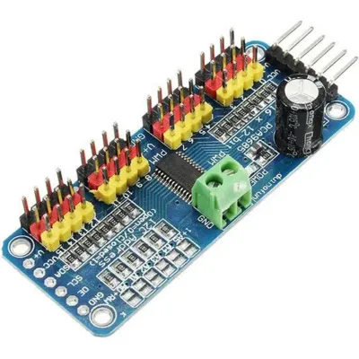
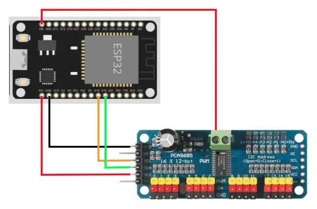
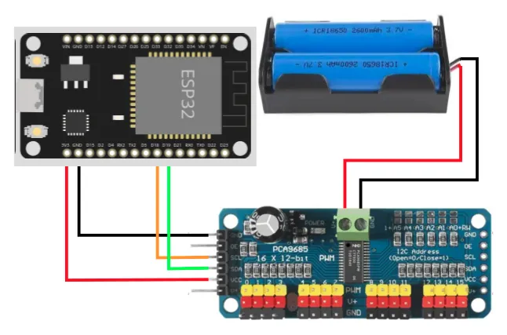
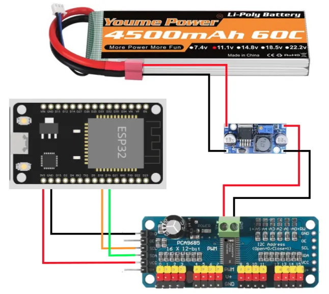
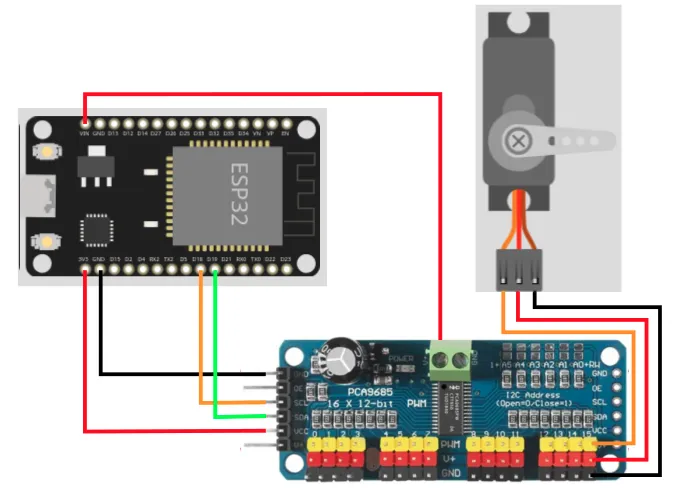
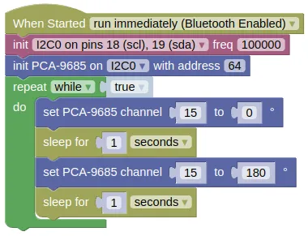

# Servo Driver (PCA9685)

While we can control servos using the IO pins, there are a some problems with that approach...

* Requires one pin for each servo
* Wiring can be a hassle if you need to provide separate power for the servo

One way to work around these limitations is to use the PCA9685 servo driver board.



Benefits of this board are...

* Uses the I2C communication protocol; only requires 2 pins and multiple I2C devices can share the same pins.
* Each PCA9685 board can control up to 16 servos, and you can use up to 62 of these boards simultaneously (...for 992 servos total).
* Simplified wiring.

## Pins


| Pin | Description |
| --- | --- |
| Servo Power Screw Terminals | Power supply for the **Servos Only**. Most servos max out at 7.2V so you should not exceed that. |
| Output to Servos | 16 outputs for servos. You can use as many or as little as you need, but make sure you match the color on the servo wires. |
| GND (Signal) | Ground pin. This should be connected to the **GND** pin on the ESP32. This is the same as the GND pin on the screw terminals. |
| OE (Signal) | Output Enable pin. If given a **HIGH** (3.3V or 5V) signal, it will disable all the outputs. You can leave this disconnected if you're not using it. |
| SCL (Signal) | Serial Clock. This is used to communicate with the ESP32 using the I2C protocol. |
| SDA (Signal) | Serial Data. This is used to communicate with the ESP32 using the I2C protocol. |
| VCC (Signal) | Provides the PCA9685 with power. This does not provide power to the servo. Connect to **3V3** on the ESP32. |
| V+ (Signal) | Power supply for the **Servos Only**. This is the same as the V+ pin on the screw terminals, and you only need to connect one of them. |
| Signal pins on right side | Identical to the pins on the left side. Useful to chain multiple PCA9685 boards together, but should otherwise leave them alone. |

## Power

The PCA9685 board has **TWO** power supply.
The **V+** pins only supply power to the servos, and does not power the chips on the board.
The **VCC** pin only supply power to the board, and does not power the servos.
**Both** pins must be powered for the board to work.

For testing purposes, you can connect the **VIN** pin on the EPS32 to the **V+** pin on the PCA9685.
The **VIN** pin cannot supply much current, so this will only work with a few lightly loaded servos.



To provide sufficient power to the servos, you should use either...

* A separate battery pack supplying at most 7.2V (eg. 2 x 18650 batteries).



...or if your battery pack is higher than 7.2V (eg. 12V)...

* A voltage regulator to reduce the higher voltage down to 7.2V.



## Wiring

The example below uses power from **VIN**.
Modify accordingly if you are using a different power source for the servos.



## Code

This code will change the angle for servo on channel 15, from 0 to 180 degrees and back.

### Blocks



### Python

```python
import machine
import pca9685
import time

i2c0 = machine.I2C(0, freq=100000)
pca9685_device = pca9685.PCA9685(i2c0, 64)
while True:
    pca9685_device.servo_deg(15, 0)
    time.sleep(1)
    pca9685_device.servo_deg(15, 180)
    time.sleep(1)
```

### Results

You should see the servo turn from 0 to 180 degrees and back.
Depending on the model of your servo, you may find it turning less or more than 180 degrees; different servo models interpretes the servo command signal differently.


# `class PCA9685` - control PCA9685 servo driver

## Constructors

### pca9685.PCA9685(i2c, addr=64)

Create a PCA9685 object.

The arguments are:

* `i2c` An i2c object.
* `addr` The i2c address of the gyro. By default, this should be 64.

Returns an `PCA9685` object.

## Methods

### PCA9685.set_frequency(freq)

Sets the PWM frequency for the PCA9685.
Most RC servos works at 50Hz.

The arguments are:

* `freq` A number specifying the frequency in Hz.

Returns `None`.

### PCA9685.pwm(channel, duty)

Sets the PWM duty cycle for the specified channel.
This can be useful when using the PCA9685 to control LED or brushed motors (...not servo motors).

The arguments are:

* `channel` An integer specifying the channel (0 to 15)
* `duty` A number representing the duty cycle (0 to 4095).

Returns `None`.

### PCA9685.servo_us(channel, us)

Sets the pulse width for the specified channel.
When controlling servos, you would typically use values ranging from 500us to 2500us.

The arguments are:

* `channel` An integer specifying the channel (0 to 15)
* `us` A number representing the pulse width in microseconds (us).

Returns `None`.

### PCA9685.servo_deg(channel, deg)

Sets the angle for the servo on the specified channel.
The output PWM width will range from 1000us (0 deg) to 2000us (180 deg).

Depending on the model of your servo, you may find it turning less or more than 180 degrees; different servo models interpretes the servo command signal differently.

The arguments are:

* `channel` An integer specifying the channel (0 to 15)
* `us` A number representing the angle in degrees.

Returns `None`.

