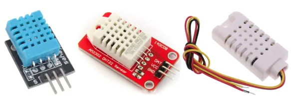
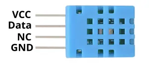
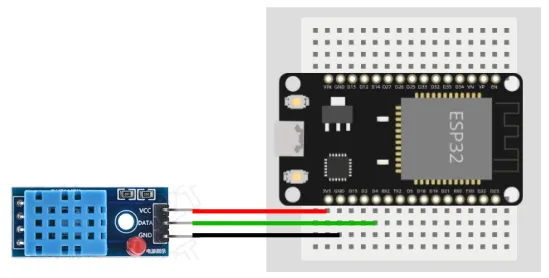
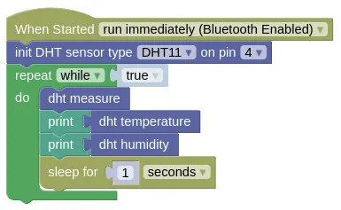

# Temperature and Humidity (DHT11, DHT22, AM2302)



The DHT11 is a low cost temperature and humidity sensor.
The DHT22 is an improved version with a larger detection range and better accuracy.
The AM2302 is the wired version of the DHT22.

## Pins



| Pin | Description |
| --- | --- |
| VCC / + (Red) | Power for the sensor. Connect to **3V3**. |
| GND / - (Black) | Ground pin. This should be connected to the **GND** pin on the ESP32. |
| OUT / DATA (Yellow) | Data. This should be connected to an output capable pin on the ESP32. |
| NC | Not Connected. Don't connect this to anything. |

This sensor is often sold mounted on a breakout board with only 3 pins (NC is not exposed).
The order of the pins on such boards varies, so you'll need to refer to the labels.

## Wiring



The above image shows a DHT11 with breakout board, but the wiring is the same for all DHT11, DHT22, and AM2302 devices.

Note that the order of the pins may vary.

## Code

This code will display the temperature and humidity once every second.

<div class="important">
You must perform a "measure" before reading the temperature and humidity. The temperature and humidity readings will not change until you perform another "measure". You should not "measure" more than once every second.
</div>

### Blocks



If you are using a DHT22 or AM2302, you'll need to set the sensor type accordingly in the "init" block.

### Python

```python
import dht
import machine
import time

dht_device = dht.DHT11(machine.Pin(4))
# Replace the above with the next line if you have a DHT22 or AM2302
# dht_device = dht.DHT22(machine.Pin(4))

while True:
    try:
        dht_device.measure()
    except:
        pass
    print(dht_device.temperature())
    print(dht_device.humidity())
    time.sleep(1)
```

"measure" may sometimes result in an error, especially if you're reading too fast.
Without the `try except`, the error will cause your program to terminate.

### Results

You should see the temperature (Celsius) and relative humidity (percentage) printed in the monitor once every second.

# `class DHT22` - control DHT11, DHT22, and AM2302 Temperature and Humidity Sensors

!!!!!
## Constructors

### dht.DHT11(pin)

Creates a DHT11 object.

The arguments are:

* `pin` A micropython Pin object.

Returns a `DHT11` object.

### dht.DHT22(pin)

Creates a DHT22 object.

The arguments are:

* `pin` A micropython Pin object.

Returns a `DHT22` object.

## Methods

### DHT11.measure() / DHT22.measure()

Performs a temperature and humidity measurement.
This should not be performed more than once every second.

Returns `None`.

### DHT11.temperature() / DHT22.temperature()

Returns the temperature measured during the last `measure()`.

Returns a float representing the temperature in Celsius.

### DHT11.humidity() / DHT11.humidity()

Returns the humidity measured during the last `measure()`.

Returns a float representing the relative humidity in percentage.
!!!!!