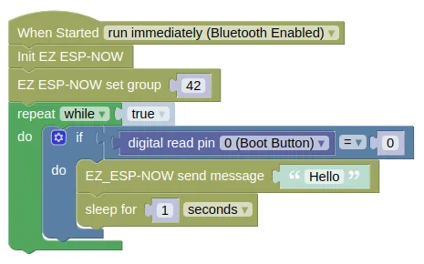
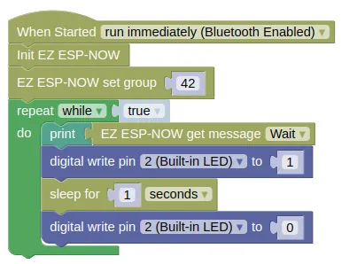

# EZ ESP-NOW

The ESP-NOW protocol allows direct communication between up to 20 registered peers, without requiring a WiFi access point.
In normal usage, peers needs to be registered using their MAC address, and only string and bytes can be sent.

EZ ESP-NOW simplify the use of ESP-NOW.
When using EZ ESP-NOW, you won't need the recipient's MAC address, instead, each device will set a group, and messages are broadcast to all devices within the same group (similar to the microbit "radio").
EZ ESP-NOW also allows you to send other data types (eg. list, dictionaries).

## Code

This sample code requires two devices, one to send and another to receive.

The sender device will send "Hello" when the boot button is pressed.

The receiving device will print the recieved message and flash the built-in LED when it arrives.

### Blocks

**Sender**



**Receiver**



### Python

**Sender**

```python
import ez_espnow
import time
from ioty import pin

ez_espnow.init()
ez_espnow.set_group(42)
while True:
    if pin.digital_read(0) == 0:
        ez_espnow.send('Hello')
        time.sleep(1)
```

**Receiver**

```python
import ez_espnow
import time
from ioty import pin

ez_espnow.init()
ez_espnow.set_group(42)
while True:
    print(ez_espnow.recv(True))
    pin.digital_write(2, 1)
    time.sleep(1)
    pin.digital_write(2, 0)
```

### Results

When the boot button is pressed on the sender, the receiver device should print "Hello" to the monitor and flash the built-in blue LED.

## ESP-NOW and WiFi

ESP-NOW can work even when your device is connected to a WiFi network, but there will be some impact.

1. Wifi Power-saving Mode is automatically activated, making it unreliable in receiving ESP-NOW messages.
You can work around this by disabling power saving; `sta.config(pm=sta.PM_NONE)`.

2. The radio on the esp device changes wifi channel to match the channel used by the Access Point.
You'll need to ensure that all devices are set to the same WiFi channel.
Use `sta.config("channel")` to retrieve the current channel, and `sta.config(channel=X)` (where `X` is the channel number) to set the channel.

# `ez_espnow` - easy use of ESP-NOW

!!!!!
## Constructors

None.

Use the functions provided by `ez_espnow`.

## Functions

### ez_espnow.init()

Initialize ESP-NOW.

Returns `None`.

### ez_espnow.set_group(g)

Set the group.
Devices in the same group can send and receive messages from each other.

The arguments are:

* `g` An integer specifying the group number. Any number can be used.

Returns `None`.

### ez_espnow.send(message)

Send a message.
All devices within range and in the same group will receive the message.

The arguments are:

* `message` Any data type. The supplied data will be JSON encoded before it is sent.

Returns `None`.

### ez_espnow.recv(wait)

Receive data sent by other devices in the same group.

The arguments are:

* `wait` A boolean. If `True`, this will block until a message is received. If `False`, it will return `None` if there are no messages available.

Returns the sent data. May return `None` if wait is `False`.
!!!!!