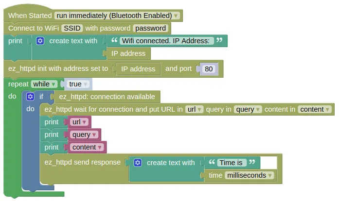
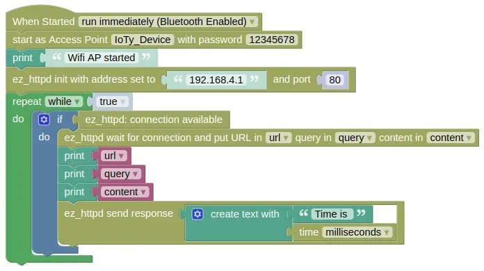

# EZ HTTP (Web Server)

This extension allows you to easily create a webserver on your device.
It works in either station mode (device connected to a router) or AP mode (your device acts as a router).

## Code

There are multiple code examples here, demonstrating different ways of using the EZ HTTP Server.

* **Station Mode** Device connects to your router and starts a webserver. Connecting to the device using a web browser will return a page containing the time. The webserver ignores the URL and returns the same page regardless of what was requested.

* **AP Mode** Works the same as example 1, but the device starts as an Access Point (WiFi router). You'll need to first connect to your device via WiFi, before connecting using a web browser.

* **URL and Query** This example returns different values depending on the URL and query string.

The **Results** section will have more details on how to test out your code.

### Blocks

**Station Mode**



You must put in your actual WiFi SSID and password in the `Connect to WiFi` block, or this will not work.

**AP Mode**



Since your device will be acting as the WiFi router in AP mode, you can use anything for the SSID and password.

**URL and Query**


You must put in your actual WiFi SSID and password in the `Connect to WiFi` block, or this will not work.

### Python

**Station Mode**

```python
import ioty.wifi
import ez_httpd
import time

ioty_wifi = ioty.wifi.connect('SSID', 'password') # Put in actual WiFi SSID/Password

ip = ioty.wifi.get_ip()
print('Wifi connected. IP Address: ' + str(ip))
ezhttpd = ez_httpd.HTTPD(address=ip, port=80)
while True:
    if ezhttpd.available():
        url, query, content = ezhttpd.wait_for_connection()
        print(url)
        print(query)
        print(content)
        ezhttpd.send_response(('Time is ' + str(time.ticks_ms())))
```

**AP Mode**

```python
import ioty.wifi
import ez_httpd
import time

ioty_wifi = ioty.wifi.start_ap('IoTy_Device', '12345678')
print('Wifi AP started')

ezhttpd = ez_httpd.HTTPD(address='192.168.4.1', port=80)
while True:
    if ezhttpd.available():
        url, query, content = ezhttpd.wait_for_connection()
        print(url)
        print(query)
        print(content)
        ezhttpd.send_response(('Time is ' + str(time.ticks_ms())))
```

**URL and Query**

```python
import ioty.wifi
import ez_httpd

ioty_wifi = ioty.wifi.connect('SSID', 'password') # Put in actual WiFi SSID/Password

ip = ioty.wifi.get_ip()
print('Wifi connected. IP Address: ' + str(ip))
ezhttpd = ez_httpd.HTTPD(address=ip, port=80)
while True:
    if ezhttpd.available():
        url, query, content = ezhttpd.wait_for_connection()
        try:
            a = float(query['a'])
            b = float(query['b'])
        except:
            pass
        if url == '/add':
            ezhttpd.send_response((str((a + b))))
        elif url == '/subtract':
            ezhttpd.send_response((str((a - b))))
        else:
            ezhttpd.send_response('Hello')
```

### Results

* **Station Mode**

    1. Device will connect to your WiFi router and display its assigned IP address on the IoTy monitor. Note this down.

    2. Make sure your computer is connected to the same router. Open a web browser and visit "http://IP_ADDR/" where "IP_ADDR" is replaced with the address from step 1 (eg "http://192.168.1.10/"). You should see a message displaying the device time.

    3. In the IoTy monitor, you should see the URL that the web browser is retrieving (...probably "/" and "/favicon.ico"), the query string (...an empty dict "{}"), and the content sent by the web browser (...an empty string).

* **AP Mode**

    1. Device will start up in AP mode and display a "Wifi AP started" message in the IoTy monitor.

    2. In your computer's wifi menu, connect to your device (...default name "IoTy_Device"). When prompted for password, use "12345678".

    3. Open a web browser and visit "http://192.168.4.1/" (...this is the default IP address for your device in AP mode). You should see a message displaying the device time.

    4. In the IoTy monitor, you should see the URL that the web browser is retrieving (...probably "/" and "/favicon.ico"), the query string (...an empty dict "{}"), and the content sent by the web browser (...an empty string).

* **URL and Query**

    1. Device will connect to your WiFi router and display its assigned IP address on the IoTy monitor. Note this down.

    2. Make sure your computer is connected to the same router. Open a web browser and visit "http://IP_ADDR/" where "IP_ADDR" is replaced with the address from step 1 (eg "http://192.168.1.10/"). You should see the message "Hello".

    3. Visit "http://IP_ADDR/add?a=2&b=3". You should see the result ("5.0") displayed.

    4. Visit "http://IP_ADDR/subtract?a=4&b=7". You should see the result ("-3.0") displayed.

    5. The "?" in the URL indicates that everything after it is a [query string](https://en.wikipedia.org/wiki/Query_string). "a=2" sets the value of "a" to 2, and "b=3" sets the value of "b" to 3. Each parameter is separated by a "&".

# `ez_httpd` - easy web server

!!!!!
## Constructors

### ez_httpd.HTTPD(address='192.168.4.1', port=80)

Create an HTTPD object.

The arguments are:

* `address` A string specifying the IP address of your device. In AP mode, this will be "192.168.4.1". In Station mode, you can retrieve this using `ioty_wifi.ifconfig()[0]` where `ioty_wifi` is a `network.WLAN` object.

* `port` An integer specifying the port number. The default port for web server is `80`.

Returns a `HTTPD` object.

## Methods

### HTTPD.available()

Checks if there are pending requests available.
If it returns `True`, you can perform a `wait_for_connection()` without blocking.

Returns a `boolean`.

### HTTPD.wait_for_connection()

Wait for a connection and return the url, query string, and request content.

If there are no pending requests, this will block until a request arrives.
To prevent blocking, use `available()` to check for availability of requests first.

Returns a `tuple` containing 3 items `url, query, content`:

* `url` A string containing the URL sent by the browser. This excludes the domain name, but includes the leading `/`. So if you use "http://192.168.4.1/index.html" as the URL in the browser, the `url` will be `/index.html`. This will not be blank; "http://192.168.4.1" will return `/`.

* `query` A dictionary of the query string. So if you use "http://192.168.4.1/?a=2&b=3" as the URL, `query` will be `{'a':'1', 'b':'2'}`.

* `content` A string containing the content sent by the browser with the request. For GET requests, this should be empty.

### HTTPD.send_response(response_data, status='200 OK'):

Send a string response to a request.
You must perform a `wait_for_connection()` before this.

The arguments are:

* `response_data` A string containing the response to the client's request.

* `status` A string containing the [HTTP status code](https://en.wikipedia.org/wiki/List_of_HTTP_status_codes). The default `200 OK` is usually the correct choice.

Returns `None`.

### HTTPD.send_bytes(response_data, status='200 OK')

Send a bytes response to a request.
You must perform a `wait_for_connection()` before this.

The arguments are:

* `response_data` A bytes object containing the response to the client's request.

* `status` A string containing the [HTTP status code](https://en.wikipedia.org/wiki/List_of_HTTP_status_codes). The default `200 OK` is usually the correct choice.

Returns `None`.

### HTTPD.send_file(filename)

Send the content of a file as the response to a request.
The file can be uploaded to your device using the Connection Menu (3 dots) => Files on Device... => Upload.
You must perform a `wait_for_connection()` before this.

The arguments are:

* `filename` A string specifying the file to send.

Returns `None`.

### HTTPD.start_mjpeg_response()

Start an mjpeg (Motion JPEG video) response.
You must perform a `wait_for_connection()` before this.

Unlike the other response methods, mjpeg are sent frame by frame continuously until the connection is closed.
Starting the mjpeg response will not send any frames, you will need to use `send_mjpeg_frame()` to send the video frames.

Returns `None`.

### HTTPD.send_mjpeg_frame(frame_data)

Send an mjpeg video frame.
You must perform a `start_mjpeg_response()` before this.
You should also check that the mjpeg connection is still open using `mjpeg_connection_open()` before sending.

The arguments are:

* `frame_data` A bytes object containing the video frame data.

Returns `None`.

### HTTPD.mjpeg_connection_open()

Check if the mjpeg connection is still open.
If it returns `True`, you can safely run `send_mjpeg_frame()`.
If it returns `False`, the connection has been closed, and you should not send anymore mjpeg frame until a new request comes in.

Returns a `boolean`.
!!!!!