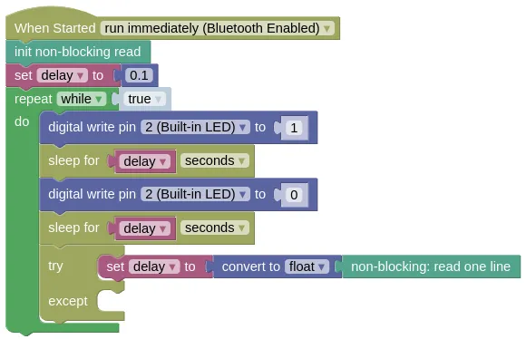

# Non-Blocking Read

Normally, when you read from the terminal (...monitor) using the `prompt for input with message` block or Python's `input()`, it works in a **Blocking** manner.
This means that the program stops at that point until data is available to read.

Blocking is often undesirable, as it prevents your program from doing anything else while waiting for input.

This extension allows you to read without blocking.
If data isn't available, it will return an empty string.

## Code

This program will blink the built-in Blue LED, while also reading from the input.

A `try except` is used to convert the input into a float, as the input may contain an string that cannot be converted into a number (eg. 'abc').
Without the `try except`, the program will exit with an exception.

### Blocks



### Python

```python
import non_block
import time
from ioty import pin

nblock = non_block.NonBlock()
delay = 0.1
while True:
    pin.digital_write(2, 1)
    time.sleep(delay)
    pin.digital_write(2, 0)
    time.sleep(delay)
    try:
        delay = float(nblock.readline())
    except:
        pass
```

### Results

The LED should blink rapidly.
Type '0.5' into the textbox in Monitor, and send it; you should now see the LED blink slower.

# `non_block` - non-blocking reading from terminal

!!!!!
## Constructors

### non_block.NonBlock()

Create a NonBlock object.

Returns a `NonBlock` object.

## Methods

### NonBlock.read(count)

Reads the specified number of characters.
If the available characters to read is less than what was requested, an empty string will be returned.

The arguments are:

* `count` The number of characters to read. Use `-1` to read all available characters.

Returns a `string` containing the requested number of characters, or an empty string if there are insufficient characters available to read.

### NonBlock.readline()

Reads a full line (...until `\n` is found)
If a full line isn't available to read, it will return an empty string.

Returns a `string` containing the a line of characters (...including the trailing `\n`), or an empty string if a full line isn't available to read..
!!!!!