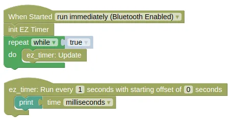
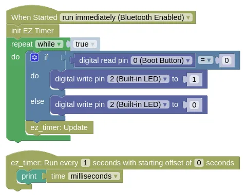
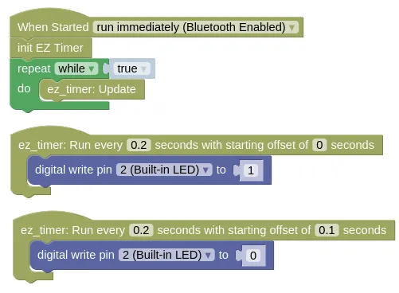
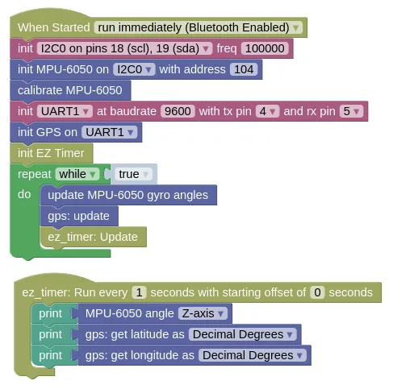

# EZ Timer

We often need to run things at regular interval (eg. print a message or blink an LED every second).
Using a `sleep` command is an easy solution, but during the `sleep`, the microcontroller cannot do anything else.

This can be a problem with certain hardware (eg. GPS needs to run `update` frequently to read data, gyro needs the same to calculate headings).
It can also be an issue if you need to read sensors or inputs (ie. you can't check if a button is pressed until the sleep ends).

The **EZ Timer** extension allows you to run things at regular intervals or after a delay, but without using `sleep`.

<div class="important">
EZ Timer is one of the most important extension in IoTy for intermediate to advanced projects. Avoiding the need to use <code>sleep</code> allows you to build devices that can do multiple things simultaneously (eg. play music, animate LEDs, and detect button presses, all at the same time).
</div>

## Code

We have a few examples here.

* **Basic** Demonstrates the basic use of EZ Timer.

* **Simultaneous** Demonstrates doing two things simultaneously (detect button press and print to monitor).

* **Offset** Demonstrates using offset to blink an LED.

* **Gyro / GPS** Demonstrates using EZ Timer to update the Gyro and GPS frequently, while printing the result out infrequently. You'll need to connect a Gyro and GPS to run this example.

### Blocks

**Basic**



**Simultaneous**



**Offset**



The second timer block runs at the same frequency as the first (0.2s), but the offset of 0.1s makes it start slightly later.

**Gyro / GPS**



### Python

**Basic**

```python
import ez_timer
import time

def print_time():
    print(time.ticks_ms())

ez_timer_obj = ez_timer.Timer()
ez_timer_obj.set_interval(print_time, 1)

while True:
    ez_timer_obj.update()
```

**Simultaneous**

```python
import ez_timer
import time
from ioty import pin

def print_time():
    print(time.ticks_ms())

ez_timer_obj = ez_timer.Timer()
ez_timer_obj.set_interval(print_time, 1)

while True:
    if pin.digital_read(0) == 0:
        pin.digital_write(2, 1)
    else:
        pin.digital_write(2, 0)
    ez_timer_obj.update()
```

**Offset**

```python
import ez_timer
from ioty import pin

def led_on():
    pin.digital_write(2, 1)

def led_off():
    pin.digital_write(2, 0)

ez_timer_obj = ez_timer.Timer()
ez_timer_obj.set_interval(led_on, 0.2)
ez_timer_obj.set_interval(led_off, 0.2, offset=0.1)

while True:
    ez_timer_obj.update()
```

**Gyro / GPS**

```python
import machine
import mpu6050
import gps
import ez_timer

def print_readings():
    print(mpu6050_device.angle_z())
    print(gps_device.get_lat())
    print(gps_device.get_lng())

i2c0 = machine.I2C(0, freq=100000)
mpu6050_device = mpu6050.MPU6050(i2c0, 104)
mpu6050_device.calibrate_gyro()

uart1 = machine.UART(1, baudrate=9600, tx=4, rx=5)
gps_device = gps.GPS(uart1)

ez_timer_obj = ez_timer.Timer()
ez_timer_obj.set_interval(print_readings, 1)

while True:
    mpu6050_device.update_angle()
    gps_device.update()
    ez_timer_obj.update()
```

### Results

**Basic**

You should see the time (...in ms) printed in the monitor every second.

**Simultaneous**

Same as in **Basic**, you should see the time (...in ms) printed in the monitor every second.
If you press the boot button, the built-in Blue LED should light up immediately.

**Offset**

You should see the built-in Blue LED blink rapidly (...5 times per second).

**Gyro / GPS**

You should see the gyro heading and GPS position printed in the monitor every second.

# `Timer` - easy to use, non-blocking timer

!!!!!
## Constructors

### ez_timer.Timer()

Create a Timer object.

Returns a `Timer` object.

## Methods

### Timer.set_interval(cb, interval, offset=0, count=-1)

Run the provided [callback function](https://en.wikipedia.org/wiki/Callback_(computer_programming)) at the specified interval.

The arguments are:

* `cb` A function. EZ Timer will run this callback function at the specified interval.

* `interval` A float representing the number of seconds between each run of the callback function.

* `offset` A float representing the number of seconds to delay before the start of this timer.

* `count` An integer representing the maximum number of times to run this timer. A `-1` means that the timer can run for an unlimited number of times.

Returns `None`.

### Timer.set_timeout(cb, interval)

Run the provided [callback function](https://en.wikipedia.org/wiki/Callback_(computer_programming)) after the specified timeout.
Unlike in the `set_interval` method, the callback function will only run once.

The arguments are:

* `cb` A function. EZ Timer will run this [callback function](https://en.wikipedia.org/wiki/Callback_(computer_programming)) at the specified interval.

* `interval` A float representing the number of seconds between each run of the callback function.

Returns `None`.

### Timer.update()

Updates all the timers.

You must run this frequently for EZ Timer to work.
The callback functions can only run during an update.

Returns `None`.
!!!!!