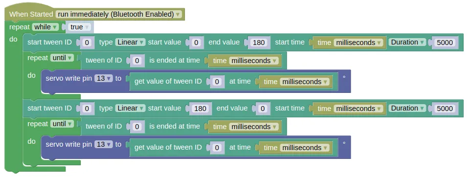

# Tween

<video width="600" height="308" autoplay loop muted>
    <source src="images/tween_demo.mp4" type="video/mp4">
</video>

*From left: No Tweening, Linear Tween, In-Out Quadratic Tween*

It is often undesirable to start and stop something instantly. For example, when moving a servo arm, you might want it to start slow, gradually speed up, then slow down when it approaches its destination.

With this extension, you can provide the start, stop, and duration (or speed), and it will generate the intermediate steps for you with the appropriate easing function.

## Wiring

The tween extension doesn't require any hardware, but it'll be hard to demonstrate how it works without an output device.
For the example code, we'll be using a servo to demonstrate tweening.


## Code

This code will change the angle for servo on pin 13, from 0 to 180 degrees and back using a linear tween.

<div class="info">
We use milliseconds in the code, but you can use seconds too if you prefer that. Do note that in micropython, <code>time.time()</code> has a 1 second resolution, so the movement will be jerky. You can work around this by using <code>time.ticks_ms() / 1000</code> to get a floating point value for the time in seconds.
</div>

### Blocks



### Python

```python
import tween
import time
from ioty import pin

while True:
    tween.start(0, tween.LINEAR, 0, 180, time.ticks_ms(), duration=5000)
    while not tween.is_ended(0, time.ticks_ms()):
        pin.servo_write_deg(13, tween.get(0, time.ticks_ms()))
    tween.start(0, tween.LINEAR, 180, 0, time.ticks_ms(), duration=5000)
    while not tween.is_ended(0, time.ticks_ms()):
        pin.servo_write_deg(13, tween.get(0, time.ticks_ms()))
```

### Results

You should see the servo turn gradually from 0 to 180 degrees over 5 seconds, then turn back to 0 over the same duration.

# `tween` - tweening extension

!!!!!
## Constructors

None.

Use the functions provided by `tween`.

## Methods

### tween.start(id, type, y0, y1, x0, duration=0, speed=1)

Starts a tween.

The arguments are:

* `id` Any value (eg. integer, string, float). You can think of this as a name to identify the tween.

* `type` The easing type (see [https://easings.net/](https://easings.net/)) for the tween, which can be one of the following:

    * `tween.LINEAR` Changes the output linearly.

    * `tween.IN_QUAD` Gradually speed up, but stops abruptly.

    * `tween.OUT_QUAD` Starts abruptly, but gradually slow down.

    * `tween.IN_OUT_QUAD` Gradually speed up and slow down.

    * `tween.IN_CUBIC` Same as IN_QUAD, but with a more distinct change in speed.

    * `tween.OUT_CUBIC` Same as OUT_QUAD, but with a more distinct change in speed.

    * `tween.IN_OUT_CUBIC` Same as IN_OUT_QUAD, but with a more distinct change in speed.

    * `tween.OUT_ELASTIC` Overshoots the end, then gradually settle down.

    * `tween.OUT_BOUNCE` Bounce when it hits the end.

* `y0` A number. Starting output value.

* `y1` A number. Ending output value.

* `x0` A number. Starting input value. This is usually the time.

* `duration` A number representing the tween duration. In the same unit as whatever you use for `x0`.

* `speed` A number representing the speed. In the same unit as whatever you use for `x0`. This is only used if duration is 0.

Returns `None`.

### tween.remove(id)

Removed the specified tween.

The arguments are:

* `id` Any value (eg. integer, string, float). This should be the same value used when creating the tween.

Returns `None`.

### tween.is_ended(id, x)

Check if the tween is ended at the given x value.

The arguments are:

* `id` Any value (eg. integer, string, float). This should be the same value used when creating the tween.

* `x` A number representing the current x value. This is usually the time.

Returns a Boolean. True if the tween is ended, else False.

### tween.get(id, x)

Get the y value for the given x.

The arguments are:

* `id` Any value (eg. integer, string, float). This should be the same value used when creating the tween.

* `x` A number representing the current x value. This is usually the time.

Returns a float representing the current y value.
!!!!!