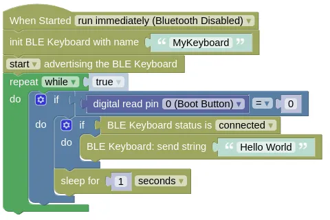

# Bluetooth Low Energy Human Interface Device

This extension allows the ESP32 to emulate a Bluetooth Low Energy (BLE) Human Interface Device (HID) device (eg. keyboard, mouse, joystick).
You can use it to send keyboard/mouse/joystick commands to your computer or phone.

The BLE devices this extension can emulate includes:

* Keyboard
* Mouse
* Joystick
* Consumer Control Device

Currently only works with micropython 1.19.1 and 1.23.0.

<div class="info">
You may not know what a Consumer Control Device is, but you're probably using one right now. Many keyboards includes buttons for volume control, pause/play music, open calculator app, etc. These are actually not part of the keyboard device keys. The keyboard registers two devices with your OS; a regular keyboard and a Consumer Control Device. These special keys are sent to the computer via the the Consumer Control Device.
</div>

## Code

This code will emulate a Bluetooth keyboard.
If you connect your computer to it and press the boot button, it will send the keypresses for "Hello World" to your computer.

<div class="info">
Keyboards sends <strong>Key Codes</strong>, not characters. This means that the character that appears on your computer will depend on your keyboard layout settings. If you're not using a US English QWERTY layout, the text that appears on screen may differ from what you send.
</div>

### Blocks



### Python

```python
import hid_services
import time
from ioty import pin

hid_keyboard = hid_services.Keyboard('MyKeyboard')
hid_keyboard.start()
hid_keyboard.start_advertising()
while True:
    if pin.digital_read(0) == 0:
        if hid_keyboard.get_state() is hid_services.Keyboard.DEVICE_CONNECTED:
            hid_keyboard.send_string('Hello World')
        time.sleep(1)
```

### Results

Download the code to your device and reset it.
Search for a Bluetooth keyboard named "MyKeyboard" on your computer or phone, and connect to it.
Open a text editor then press the boot button on your ESP32; you should see "Hello World" typed out in your text editor.

<div class="info">
You may need to remove/forget the device from your computer/phone and re-add it again the next time you connect.
</div>

# `hid_services` - emulation of Bluetooth LE Human Interface Devices

!!!!!
## Constructors

### hid_services.Keyboard(name="Bluetooth Keyboard")

Creates a Keyboard object.

The arguments are:

* `name` A string representing the name of the device. This is used when advertising the device over Bluetooth.

Returns a `Keyboard` object.

### hid_services.Mouse(name="Bluetooth Mouse", type="rel")

Creates a Mouse object.
Despite the name, this also include touchpad and touchscreen type devices.

The arguments are:

* `name` A string representing the name of the device. This is used when advertising the device over Bluetooth.

* `type` A string representing the mouse type. This can be `"rel"` for a relative device that sends changes in position (eg. mouse), or `"abs"` for a device that sends absolute position (eg. touchscreen).

Returns a `Mouse` object.

### hid_services.Joystick(name="Bluetooth Joystick")

Creates a Joystick object.

The arguments are:

* `name` A string representing the name of the device. This is used when advertising the device over Bluetooth.

Returns a `Joystick` object.

### hid_services.ConsumerControl(name="Bluetooth CCD")

Creates a ConsumerControl object.

The arguments are:

* `name` A string representing the name of the device. This is used when advertising the device over Bluetooth.

Returns a `ConsumerControl` object.

## Methods (All)

### HumanInterfaceDevice.start()

Starts the device.
You must start the device before doing anything else.

Returns `None`.

### HumanInterfaceDevice.stop()

Stops the device.

Returns `None`.

### HumanInterfaceDevice.start_advertising()

Start advertisement of the device.
If advertisement is not started, the device will not be found by your computer / phone when searching for Bluetooth devices.

Returns `None`.

### HumanInterfaceDevice.stop_advertising()

Stop advertisement of the device.

Returns `None`.

### HumanInterfaceDevice.get_state()

Get the state of the device.
This can be one of the following...

* `HumanInterfaceDevice.DEVICE_STOPPED` Device is stopped.

* `HumanInterfaceDevice.DEVICE_IDLE` Device is started and idling.

* `HumanInterfaceDevice.DEVICE_ADVERTISING` Device is advertising itself.

* `HumanInterfaceDevice.DEVICE_CONNECTED` Device is connected.

Returns the state of the device.

## Methods (Keyboard)

### Keyboard.send_string(st)

Sends the provided string as keypresses.

Your device must be in the `DEVICE_CONNECTED` state before running this.

The arguments are:

* `st` A string representing the keypresses to send. The characters in the string will be converted to keypresses based on a US English Dvorak keyboard layout and sent to the connected device.

Returns `None`.

### Keyboard.send_key(key, right_gui=0, right_alt=0, right_shift=0, right_control=0, left_gui=0, left_alt=0, left_shift=0, left_control=0)

Sends the provided key code with modifier.
This can be used to send keys that can't be easily represented in a string (eg. "Enter", "CTRL-C").

Your device must be in the `DEVICE_CONNECTED` state before running this.

The arguments are:

* `key` An integer representing the keycode to send.

* `right_gui` / `left_gui` An integer (0 or 1) indicating if the **GUI** key (AKA. Windows Key, CMD Key) is held down during keypress.

* `right_alt` / `left_alt` An integer (0 or 1) indicating if the **Alt** is held down during keypress.

* `right_shift` / `left_shift` An integer (0 or 1) indicating if the **Shift** is held down during keypress.

* `right_control` / `left_control` An integer (0 or 1) indicating if the **Ctrl** is held down during keypress.

Returns `None`.

### Keyboard.set_keys(k0=0x00, k1=0x00, k2=0x00, k3=0x00, k4=0x00, k5=0x00)

Sets the provided key code.
This can be used to send multiple simultaneous keys presses, as well as simulate holding down a key.

Unlike `send_str()` and `send_key()`, this does **NOT** send the keypress; you must perform a `notify_hid_report()` to send it.
Also, this only sends a key down; you must send a separate key up by setting keys to zero and performing another `notify_hid_report()`.

The arguments are:

* `k0` to `k5` An integer representing the keycode to send. This allows you to send up to 6 simultaneous keypresses.

Returns `None`.

### Keyboard.set_modifiers(right_gui=0, right_alt=0, right_shift=0, right_control=0, left_gui=0, left_alt=0, left_shift=0, left_control=0)

Sets the modifiers.
This is used together with `set_keys()` to send multiple simultaneous keypresses with modifiers.

The arguments are:

* `right_gui` / `left_gui` An integer (0 or 1) indicating if the **GUI** key (AKA. Windows Key, CMD Key) is held down during keypress.

* `right_alt` / `left_alt` An integer (0 or 1) indicating if the **Alt** is held down during keypress.

* `right_shift` / `left_shift` An integer (0 or 1) indicating if the **Shift** is held down during keypress.

* `right_control` / `left_control` An integer (0 or 1) indicating if the **Ctrl** is held down during keypress.

Returns `None`.

### Keyboard.notify_hid_report()

Sends the key codes.
Run this after setting the key codes and modifiers to send the key codes.

Your device must be in the `DEVICE_CONNECTED` state before running this.

Returns `None`.

## Methods (Mouse)

### Mouse.send_rel(x=0, y=0, w=0)

Sends the relative position (ie. change) in the axis.
This only works if the device is initialized in relative (`"rel"`) mode.

Your device must be in the `DEVICE_CONNECTED` state before running this.

The arguments are:

* `x` An integer (-127 to 127) representing the change in x position.

* `y` An integer (-127 to 127) representing the change in y position.

* `w` An integer (-127 to 127) representing the change in mouse wheel position.

Returns `None`.

### Mouse.send_abs(x, y)

Sends the absolute position.
This only works if the device is initialized in absolute (`"abs"`) mode.

Your device must be in the `DEVICE_CONNECTED` state before running this.

The arguments are:

* `x` An integer (0 to 32767) representing the x position. This is scaled to the screen (ie. 32767 is always at the extreme right of the screen, regardless of the screen resolution).

* `y` An integer (0 to 32767) representing the y position. This is scaled to the screen (ie. 32767 is always at the extreme bottom of the screen, regardless of the screen resolution).

Returns `None`.

### Mouse.send_buttons(b1=0, b2=0, b3=0)

Sends the state of the mouse buttons.
Note that to send a mouse click, you will need to first send a **button down** followed by a **button up**.

Your device must be in the `DEVICE_CONNECTED` state before running this.

The arguments are:

* `b1` An integer (0 or 1) representing the state of the left button (down or up).

* `b2` An integer (0 or 1) representing the state of the right button (down or up).

* `b3` An integer (0 or 1) representing the state of the middle button (down or up).

Returns `None`.

## Methods (Joystick)

### Joystick.send_axes(x=0, y=0)

Sends the position of the axis.

Your device must be in the `DEVICE_CONNECTED` state before running this.

The arguments are:

* `x` An integer (-127 to 127) representing the x position.

* `y` An integer (-127 to 127) representing the y position.

Returns `None`.

### Joystick.send_buttons(self, b1=0, b2=0, b3=0, b4=0, b5=0, b6=0, b7=0, b8=0)

Sends the state of the joystick buttons.

Your device must be in the `DEVICE_CONNECTED` state before running this.

The arguments are:

* `b1` to `b8` An integer (0 or 1) representing the state of the button (down or up).

Returns `None`.

## Methods (ConsumerControl)

### ConsumerControl.send_key(key)

Sends the provided key code.

Your device must be in the `DEVICE_CONNECTED` state before running this.

The arguments are:

* `key` An integer representing the keycode to send. See the [HID Usage Table](https://usb.org/sites/default/files/hut1_21_0.pdf) for a list of Consumer Control keycodes. There are hundreds of keycodes, but your computer / phone will likely only response to a small handful of them.

Returns `None`.

### ConsumerControl.set_key(key=0x00)

Sets the provided key code.
This can be used to simulate holding down a key.

Unlike `send_key()`, this does **NOT** send the keypress; you must perform a `notify_hid_report()` to send it.
Also, this only sends a key down; you must send a separate key up by setting key to zero and performing another `notify_hid_report()`.

The arguments are:

* `key` An integer representing the keycode to send. See the [HID Usage Table](https://usb.org/sites/default/files/hut1_21_0.pdf) for a list of Consumer Control keycodes. There are hundreds of keycodes, but your computer / phone will likely only response to a small handful of them.

Returns `None`.

### ConsumerControl.notify_hid_report()

Sends the key code.
Run this after setting the key code to send it.

Your device must be in the `DEVICE_CONNECTED` state before running this.

Returns `None`.
!!!!!