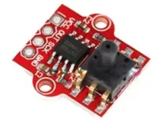
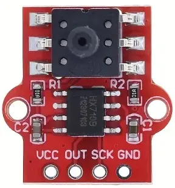
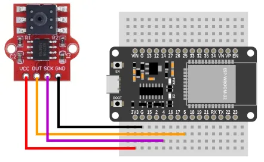

# HX710 (Analog-to-Digital)



The HX710 is a Analog-to-Digital converter, commonly used with load cells for weight / force measurement, or in pressure sensors (...shown above).

## Pins



| Pin | Description |
| --- | --- |
| VCC | Power for the sensor. Connect to **3V3**. If your device is on USB power, you can also use **VIN**. |
| GND | Ground pin. This should be connected to the **GND** pin on the ESP32. |
| OUT | Data pin. This should be connected to an input capable pin on the ESP32 (default pin 5). |
| SCK | Serial Clock. This should be connected to an output capable pin on the ESP32 (default pin 4). |

## Wiring



## Code

This code will print out measured value every 1 second.
It return a unitless value, so calibration is required if you want to measure weight.

During each read, you can set the mode of the next read.

* **10Hz** Highest Accuracy.
* **40Hz** Lower Accuracy, but respond faster to changes.
* **Temperature / Analog Voltage** The HX710A contains a temperature sensor, while the HX710B contains an analog voltage sensor. You can read these in temperature / voltage mode.

### Blocks


### Python

```python
import hx710
import time

hx710_device = hx710.HX710(5, 4)
while True:
    print(hx710_device.read(hx710.DIFF_10HZ))
    time.sleep(1)
```

### Results

You should see in the monitor a value within the range −8,388,608 to 8,388,607 printed every second.

To convert this value to a pressure reading, you'll need to calibrate it against a known pressure.

# `class HX710` - read HX710 analog-to-digital converter

!!!!!
## Constructors

### hx710.HX710(dt_pin, sck_pin)

Creates a HX710 object.

The arguments are:

* `dt_pin` An integer specifying the microcontroller pin connected to DT.

* `sck_pin` An integer specifying the microcontroller pin connected to SCK.

Returns a `HX710` object.

## Methods

### HX710.read(next)

Reads from the HX710.

The arguments are:

* `next` The next read mode, which can be one of the following:

    * `hx710.DIFF_10HZ` Set the next read to 10Hz mode.

    * `hx710.DIFF_40HZ` Set the next read to 40Hz mode.

    * `hx710.TEMPERATURE_AVOLTAGE` Set pin to temperature / voltage mode.

Returns an integer within the range −8,388,608 to 8,388,607 representing the unitless reading value.
!!!!!