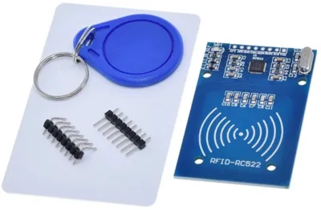
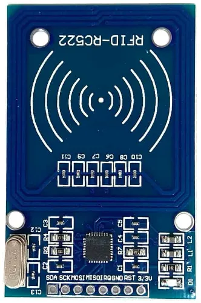
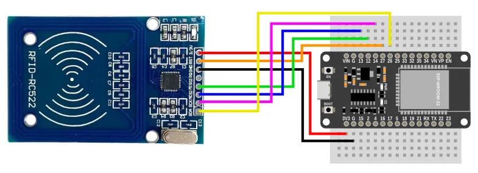
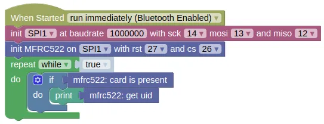

# RFID Reader (MFRC522)



The MFRC522 is a cheap and popular RFID reader.
You can find it for less than $2, and it comes with a card tag and a key fob tag.

This extension allows you to read the tag ID (Blocks and Python), as well as read / write data to the tag (Python only).

<div class="important">
While it is a popular project to use RFID tag ID to control locks, this is not secure as the tag IDs can be easily copied and replicated. Still, it can be good fun to build such a device; just don't rely on it to secure anything too important.
</div>

## Pins



| Pin | Description |
| --- | --- |
| 3.3V | Power for the sensor. Connect to **3V3**. |
| RST | Reset pin. You need to connect this to an output capable pin on the ESP32 (default pin 27). |
| GND | Ground pin. This should be connected to the **GND** pin on the ESP32. |
| IRQ | Interrupt pin. This is used to notify the microcontroller that a card is present. It's not supported by this extension. |
| MISO | Master-In-Slave-Out. This is used to communicate with the ESP32 using the SPI protocol (default pin 12). |
| MOSI | Master-Out-Slave-In. This is used to communicate with the ESP32 using the SPI protocol (default pin 13). |
| SCK | Serial Clock. This is used to communicate with the ESP32 using the SPI protocol (default pin 14). |
| SDA | This is the CS (Chip Select) pin. You need to connect this to an output capable pin on the ESP32 (default pin 26). |

<div class="info">
The MFRC522 is also capable of communicating using the UART and I2C protocol, but most boards are hard-wired for SPI only. This extension only support SPI.
</div>

## Wiring



## Code

This code will check if a tag is present, if it is, it'll retrieve and print out its ID.

### Blocks



### Python

```python
import machine
import mfrc522

spi1 = machine.SPI(1, baudrate=1000000, sck=Pin(14), mosi=Pin(13), miso=Pin(12))
mfrc522_device = mfrc522.MFRC522(spi1, 27, 26)
while True:
    if mfrc522_device.card_present():
        print(mfrc522_device.get_uid())
```

### Results

Bring an RFID tag close to the MFRC522.
You should see a hexidecimal string printed in the monitor

# `class MFRC522` - control MFRC522 RFID reader

!!!!!
## Constructors

### mfrc522.MFRC522(spi, rst, cs)

Creates an MFRC522 object.

The arguments are:

* `spi` An SPI object.

* `rst` An integer specifying the microcontroller pin connected to RST.

* `cs` An integer specifying the microcontroller pin connected to CS (often labelled as SDA on the board).

Returns a `MFRC522` object.

## Methods

Only a few methods are documented here.
More methods are available, but you'll need to read the source code.

### MFRC522.card_present()

Check if a card is detected by the reader.

Returns `True` if a card is detected, else `False`.

### MFRC522.get_uid()

Gets the UID on the tag.
The UID is 4 bytes (32 bits).
When printed in hexidecimal, it will use 2 characters per byte, so the returned string will have 8 characters.

Returns a string representing the tag's UID in hexidecimal.
!!!!!