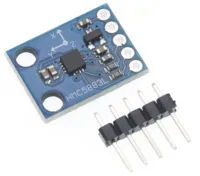
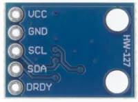
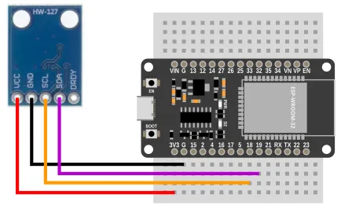
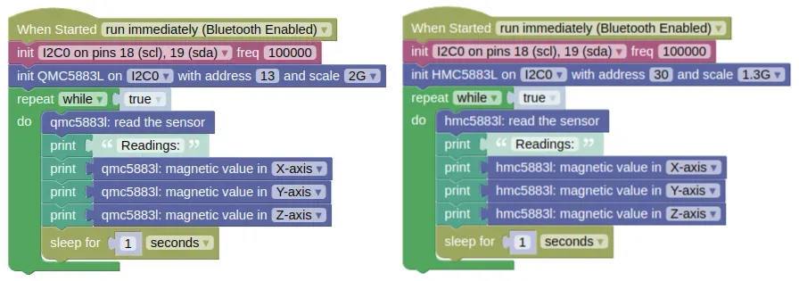
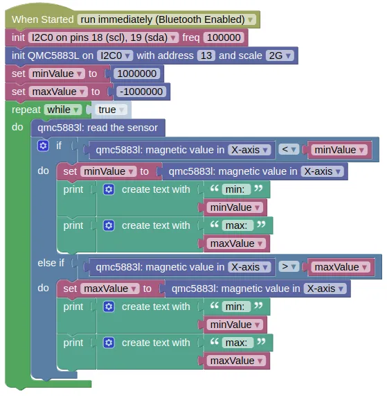
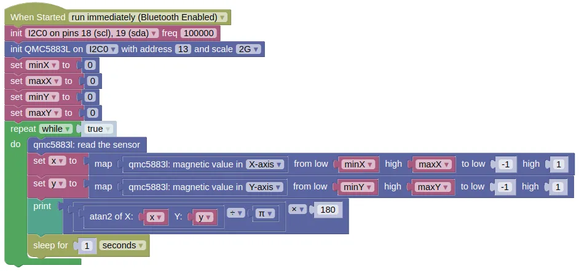

# Magnetic Sensor (QMC5883L, HMC5883L)



The QMC5883L and HMC5883L are 3-axis magnetic sensors often used as a magnetic compass for navigation purposes.
Both models works in the same way, but each require their own extension.

<div class="important">
It is quite common to find QMC5883L sold as HMC5883L and vice versa.
You can check which model you have by performing an I2C scan; the QMC5883L will have an address of 0x0D (13), while the HMC5883L uses address 0x1E (30).
</div>

## Pins



| Pin | Description |
| --- | --- |
| VCC | Power for the sensor. Connect to **3V3**. |
| GND | Ground pin. This should be connected to the **GND** pin on the ESP32. |
| SCL (Signal) | Serial Clock. This is used to communicate with the ESP32 using the I2C protocol (default pin 18). |
| SDA (Signal) | Serial Data. This is used to communicate with the ESP32 using the I2C protocol (default pin 19). |
| DRDY | Data Ready. We are not using this. Leave unconnected. |

## Wiring



## Code

This code will print the sensor readings for all 3 axis.

There are two versions provided; for the QMC5883L and HMC5883L.
Use the code suitable for your sensor.

### Blocks



### Python

**QMC5883L**

```python
import machine
import qmc5883l
import time

i2c0 = machine.I2C(0, freq=100000)
qmc5883l_device = qmc5883l.QMC5883L(i2c0, addr=13, scale=qmc5883l.SCALE_2G)
while True:
    qmc5883l_device.read()
    print('Readings:')
    print(qmc5883l_device.get_x())
    print(qmc5883l_device.get_y())
    print(qmc5883l_device.get_z())
    time.sleep(1)
```

**HMC5883L**

```python
import machine
import hmc5883l
import time

i2c0 = machine.I2C(0, freq=100000)
hmc5883l_device = hmc5883l.HMC5883L(i2c0, addr=30, scale=hmc5883l.SCALE_1300G)
while True:
    hmc5883l_device.read()
    print('Readings:')
    print(hmc5883l_device.get_x())
    print(hmc5883l_device.get_y())
    print(hmc5883l_device.get_z())
    time.sleep(1)
```

### Results

You should see the sensor readings printed in the monitor.

As you turn the sensor, you should see the readings change.
You should also see changes if you bring a magnetic object or (...to a lesser extent) large metal object close to the sensor.

## Magnetic Compass

To use these magnetic sensors as a compass, you must perform calibration.

This can be rather involved if you need high accuracy (...[especially in the presence of soft iron distortion](https://atadiat.com/en/e-magnetometer-soft-iron-and-hard-iron-calibration-why-how/)), but here we show a simple method which is good enough most of the time.

The following steps assumes that the Z-axis is facing up. Adjust the code if you have a different axis facing up; the axis facing up or down need not be calibrated.

### Steps (Calibration):

1. Mount the sensor in its intended position (eg. on your robot). This position should be far from any magnetically permeable materials (eg. iron).

2. Transfer the following code on to your device and run it.

    

3. Slowly rotate your device (ie. if the sensor is mounted on a robot, rotate the entire robot and not just the sensor). As you rotate, you should see the minimum and maximum sensor readings printed in the monitor. Keep rotating until no new values are printed and note down the last values.

4. Repeat the same test, but with the axis changed to 'Y-axis' in the code. Note down the last values.

### Steps (Usage as Compass)

1. Write the following code in IoTy.

    

2. In the `set minX / maxX / minY / maxY` blocks, put in the values that you have obtained during calibration.

3. Transfer the following code on to your device and run it.

You should see the compass direction printed in the monitor.
The values will range from -180 to 180; if you need it to be from 0 to 360, add 360 if the angle is less than 0.

# `class QMC5883L` / `class HMC5883L` - control QMC5883L and HMC5883L magnetic sensors

!!!!!
## Constructors

### qmc5883l.QMC5883L(i2c, addr=13, scale=SCALE_2G)

Creates an QMC5883L object.

The arguments are:

* `i2c` An i2c object.

* `addr` The i2c address of the QMC5883L. By default, this should be 13.

* `scale` The maximum value readable by the sensor, which can be one of the following:

    * `qmc5883l.SCALE_2G` Max of 2 gauss. This is enough for a compass.

    * `qmc5883l.SCALE_8G` Max of 8 gauss.

Returns a `QMC5883L` object.

### hmc5883l.HMC5883L(i2c, addr=30, scale=SCALE_1300G)

Creates an HMC5883L object.

The arguments are:

* `i2c` An i2c object.

* `addr` The i2c address of the HMC5883L. By default, this should be 30.

* `scale` The maximum value readable by the sensor, which can be one of the following:

    * `hmc5883l.SCALE_880G` Max of 0.88 gauss.

    * `hmc5883l.SCALE_1300G` Max of 1.3 gauss. This is enough for a compass.

    * `hmc5883l.SCALE_1900G` Max of 1.9 gauss.

    * `hmc5883l.SCALE_2500G` Max of 2.5 gauss.

    * `hmc5883l.SCALE_4000G` Max of 4.0 gauss.

    * `hmc5883l.SCALE_4700G` Max of 4.7 gauss.

    * `hmc5883l.SCALE_5600G` Max of 5.6 gauss.

    * `hmc5883l.SCALE_8100G` Max of 8.1 gauss.

Returns a `HMC5883L` object.

## Methods

### QMC5883L.read() / HMC5883L.read()

Performs a reading.
This will read all 3 axis values and store them.

Returns a list containing 3 integers representing the x, y, and z readings.

### QMC5883L.get_x() / QMC5883L.get_y() / QMC5883L.get_z()
### HMC5883L.get_x() / HMC5883L.get_y() / HMC5883L.get_z()

Gets the reading for the specified axis.

You must perform a `read()` first.

Returns an integer representing the reading for the axis

### QMC5883L.get_all() / QMC5883L.get_all()

Gets the readings for all 3 axis.

You must perform a `read()` first.
The values returned by `get_all()` are the same as the values returned by the last `read()`.

Returns a list containing 3 integers representing the x, y, and z readings.
!!!!!