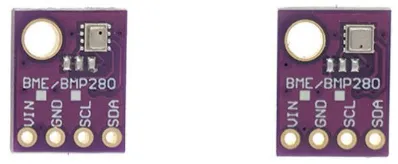
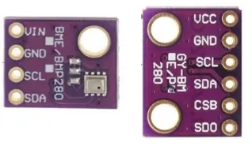
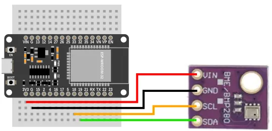
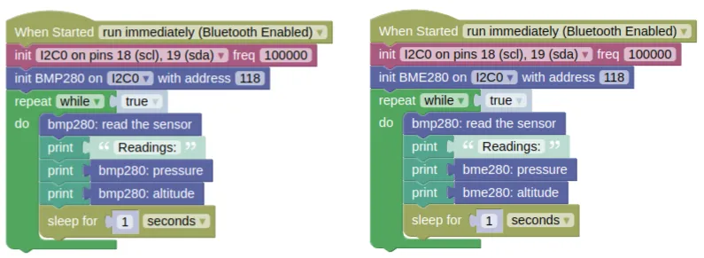

# Barometric Pressure (BMP280, BME280)



The BMP280 and BME280 are [barometric pressure](https://en.wikipedia.org/wiki/Atmospheric_pressure) sensors with a measurement range of 300hPa to 1100hPa.
Both sensors are also equipped with temperature sensors, and the BME280 is additionally equipped with a humidity sensor.

By utilizing the fact that atmospheric pressure changes with altitude, we can use the pressure reading to estimate our altitude.
These sensors are precise enough to detect changes of as little as 10cm in altitude (...though due to noise, you really need about a meter change in altitude for the changes to be discernible).

## Identifying Device

Some sellers will try to pass off a cheaper BMP280 as the (slightly) more expensive (BME280).
See the image at the top of this page; both devices are labeled as 'BME/BMP280', but only the device on the right is an actual BME280.


To identify the device, pay close attention to the sensor chip; the BMP280 chip is rectangular with a hole at the corner, while the BME280 is square with a hole at the center of one side.

## Pins



| Pin | Description |
| --- | --- |
| VIN / VCC | Power for the sensor. Connect to **3V3**. |
| GND | Ground pin. This should be connected to the **GND** pin on the ESP32. |
| SCL / SCK | Serial Clock. This is used to communicate with the ESP32 using the I2C protocol (default pin 18). |
| SDA / SDI | Serial Data. This is used to communicate with the ESP32 using the I2C protocol (default pin 19). |
| CSB / CS| Chip Select. Leave unconnected or connect to **3V3** for I2C mode. |
| SDO | Connect to **3V3** to change the I2C address to 119 (0x77). Leave unconnected to use the default address of 118 (0x76) |

<div class="info">
These sensors can support both I2C and SPI communication, but if you have a board with only 4 pins, then only I2C can be used. This extension only supports I2C.
</div>

## Wiring



## Code

This code will print the pressure and altitude every second.

### Blocks



### Python

**BMP280**

```python
import machine
import bmp280
import time

i2c0 = machine.I2C(0, freq=100000)
bmp280_device = bmp280.BMP280(i2c0, addr=118)
while True:
    bmp280_device.read()
    print('Readings:')
    print(bmp280_device.get_pressure())
    print(bmp280_device.get_altitude())
    time.sleep(1)
```

**BME280**

```python
import machine
import bme280
import time

i2c0 = machine.I2C(0, freq=100000)
bme280_device = bme280.BME280(i2c0, addr=118)
while True:
    bme280_device.read()
    print('Readings:')
    print(bme280_device.get_pressure())
    print(bme280_device.get_altitude())
    time.sleep(1)
```

### Results

You should see the sensor readings printed in the monitor.

As you move the sensor up and down (...at least a meter), you should see the readings change.

# `class BMP280` / `class BME280` - control BMP280 and BME280 barometric pressure sensors

!!!!!
## Constructors

### bmp280.BMP280(i2c, addr=118)

Creates an BMP280 object.

The arguments are:

* `i2c` An i2c object.

* `addr` The i2c address of the BMP280. By default, this should be 118.

Returns a `BMP280` object.

### bme280.BME280(i2c, addr=118)

Creates an BME280 object.

The arguments are:

* `i2c` An i2c object.

* `addr` The i2c address of the BME280. By default, this should be 118.

Returns a `BME280` object.

## Methods

### BMP280.read() / BME280.read()

Performs a reading and store the result internally.
This will read all values; pressure, temperature, and humidity (BME280 only).

Returns a list containing 2 or 3 integers representing the raw temperature, pressure, and humidity (BME280 only) readings.
You can generally ignore this, as complex calculations are required to turn the raw values useful.

### BMP280.get_temperature() / BME280.get_temperature()

Gets the temperature reading.

You must perform a `read()` first.

Returns a float representing the temperature in Celsius.

### BMP280.get_pressure() / BME280.get_pressure()

Gets the pressure reading.

You must perform a `read()` first.

Returns a float representing the pressure in Pascal.

### BMP280.get_altitude() / BME280.get_altitude()

Gets the altitude reading.

You must perform a `read()` first.

Returns a float representing the altitude in meters above sea level.
!!!!!