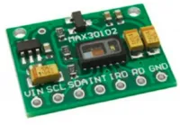
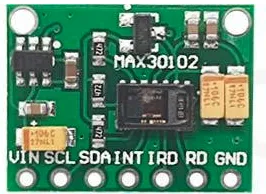
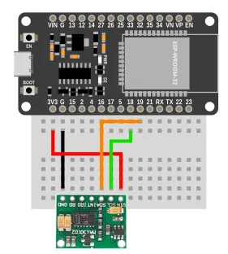
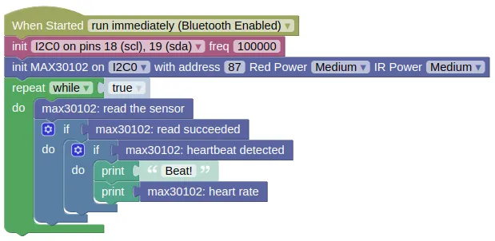

# Heart Rate Sensor (MAX30102)



The MAX30102 is an integrated pulse oximetry and heart-rate monitor module. This extension allows you to detect heart beats, read heart rate (bpm), and get the raw readings (IR and Red).

## Pins



| Pin | Description |
| --- | --- |
| VIN | Power for the sensor. Connect to **3V3**. |
| GND | Ground pin. This should be connected to the **GND** pin on the ESP32. |
| SCL | Serial Clock. This is used to communicate with the ESP32 using the I2C protocol (default pin 18). |
| SDA | Serial Data. This is used to communicate with the ESP32 using the I2C protocol (default pin 19). |
| INT / IRQ / RD | Not in use. Leave unconnected. |

## Wiring



## Code

This code will print the measured heartrate everytime it detects a pulse.

### Blocks



### Python

```python
import machine
import max30102

i2c0 = machine.I2C(0, freq=100000)
max30102_device = max30102.MAX30102(i2c0, addr=87, red_led=0x7F, ir_led=0x7F)
while True:
    max30102_device.read()
    if max30102_device.read_succeeded:
        if max30102_device.get_beat():
            print('Beat!')
            print(max30102_device.get_bpm())
```

### Results

Place your finger lightly on the sensor.
You should see the word 'Beat!' and the measured heartrate printed in the monitor everytime a pulse is detected.

It can take a 2 to 3 seconds before it starts detecting pulses, and a few seconds more before the heartrate stabilize.


# `class MAX30102` - control MAX30102 pulse oximeter and heartrate monitor

!!!!!
## Constructors

### max30102.MAX30102(i2c, addr=87, red_led=0x7F, ir_led=0x7F, buf_len=100)

Creates an MAX30102 object.

The arguments are:

* `i2c` An i2c object.

* `addr` The i2c address of the MAX30102. By default, this should be 87.

* `red_led` An integer (0 to 255) specifying the brightness of the red LED. The default is usually ok, but you may want to adjust this if you can't get a good reading. The red LED is used for both heartrate and SpO2.

* `ir_led` An integer (0 to 255) specifying the brightness of the IR LED. The default is usually ok, but you may want to adjust this if you can't get a good reading. The IR led is only used for SpO2.

* `buf_len` An integer specifying the amount of readings to buffer. The default is usually fine.

Returns a `MAX30102` object.

## Methods

### MAX30102.read()

Performs a reading of the red and IR reflected light value, check for heartbeat, and update the heartrate.

You need to run this frequently for the sensor to work.

Returns `True` if the read succeeded, and `False` if there are no new data to read.

### MAX30102.get_red()

Gets the red reflected light value.

You must perform a `read()` first.

Returns an integer (−8,388,608 to 8,388,607) representing the red reflected light value.

### MAX30102.get_ir()

Gets the IR reflected light value.

You must perform a `read()` first.

Returns an integer (−8,388,608 to 8,388,607) representing the IR reflected light value.

### MAX30102.get_beat()

Returns `True` if a heartbeat was detected in the last `read()`.

### MAX30102.get_bpm()

Returns a float representing the heartrate in beats per minute.

### MAX30102.get_spo2()

Calculate the oxygen saturation level.

Returns a float representing the oxygen saturation (SpO2) in percentage.

### MAX30102.get_temperature()

Get the sensor's internal temperature.

Returns a float representing the temperature in Celsius.

## Properties

### MAX30102.read_succeeded

A boolean indicating if the last read was successful.
!!!!!