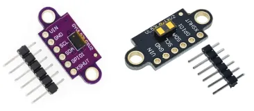
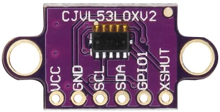
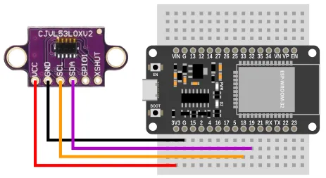
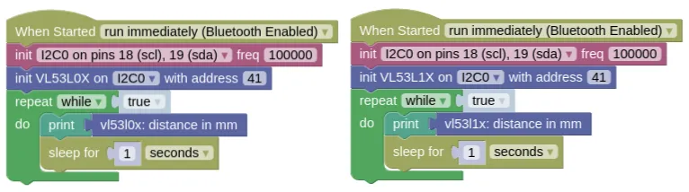

# Laser Ranging (VL53L0X, VL52L1X)



The VL53L0X (2m range) and VL53L1X (4m range) are Time-of-Flight (ToF) laser ranging module.
They are much smaller than ultrasonic distance sensors, are less prone to interference from multiple sensors, and have a narrower detection cone.

## Pins



| Pin | Description |
| --- | --- |
| VCC | Power for the sensor. Connect to **3V3**. |
| GND | Ground pin. This should be connected to the **GND** pin on the ESP32. |
| SCL | Serial Clock. This is used to communicate with the ESP32 using the I2C protocol (default pin 18). |
| SDA | Serial Data. This is used to communicate with the ESP32 using the I2C protocol (default pin 19). |
| GPI01 / XSHUT | Not in use. Leave unconnected. |

## Wiring



## Code

This code will print the measured distance every second.

### Blocks



### Python

**VL53L0X**

```python
import machine
import vl53l0x
import time

i2c0 = machine.I2C(0, freq=100000)
vl53l0x_device = vl53l0x.VL53L0X(i2c0, addr=41)
vl53l0x_device.start()
while True:
    print(vl53l0x_device.read())
    time.sleep(1)
```

**VL53L1X**

```python
import machine
import vl53l1x
import time

i2c0 = machine.I2C(0, freq=100000)
vl53l1x_device = vl53l1x.VL53L1X(i2c0, addr=41)
vl53l1x_device.start()
while True:
    print(vl53l1x_device.read())
    time.sleep(1)
```

### Results

You should see the distance (...in mm) printed in the monitor.
Move your hands in front of the sensor and you should see the printed distance change.

# `class VL53L0X` / `class VL53L1X` - control VL53L0X / VL53L1X laser ranging sensor

!!!!!
## Constructors

### vl53l0x.VL53L0X(i2c, addr=0x29)

Creates an VL53L0X object.

The arguments are:

* `i2c` An i2c object.

* `addr` The i2c address of the VL53L0X. By default, this should be 41 (0x29).

Returns a `VL53L0X` object.

### vl53l1x.VL53L1X(i2c, addr=0x29)

Creates an VL53L1X object.

The arguments are:

* `i2c` An i2c object.

* `addr` The i2c address of the VL53L1X. By default, this should be 41 (0x29).

Returns a `VL53L1X` object.

## Methods

### VL53L0X.start() / VL53L1X.start()

Starts the sensor.
You must run this before taking any readings.

Returns `None`

### VL53L0X.stop() / VL53L1X.stop()

Stops the sensor.
If you don't need to use the sensor, you can stop it to save some power.

Returns `None`

### VL53L0X.read() / VL53L1X.read()

Reads the sensor value.

Returns an integer representing the distance in mm.

### VL53L1X.set_distance_mode_short()

Set the distance mode to short.
In this mode, the sensor is less affected by ambient light, but maximum range is limited to around 1.3m.

Returns `None`

### VL53L1X.set_distance_mode_long()

Set the distance mode to long.
In this mode, the sensor is capable of up to 4m range, but is more prone to interference by ambient light.

Returns `None`
!!!!!