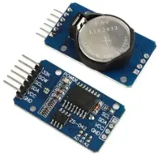
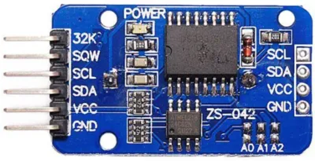
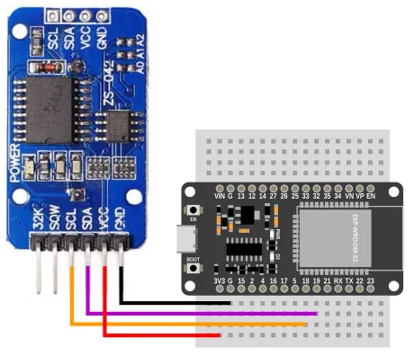
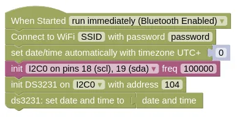
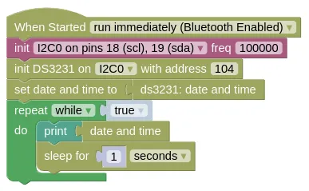

# Real-Time Clock (DS3231)



DS3231 is a low-cost real-time clock (RTC).
When equipped with a battery, it can continue to track the time even when the microcontroller is powered off.

The ESP32 is capable of retrieving the time from the internet, but this won't work if WiFi isn't available.
The DS3231 allows the ESP32 to retrieve the time anywhere, without relying on network connections.

## Pins



| Pin | Description |
| --- | --- |
| VCC | Power for the sensor. Connect to **3V3**. |
| GND | Ground pin. This should be connected to the **GND** pin on the ESP32. |
| SCL | Serial Clock. This is used to communicate with the ESP32 using the I2C protocol (default pin 18). |
| SDA | Serial Data. This is used to communicate with the ESP32 using the I2C protocol (default pin 19). |
| 32K / SQW | Not in use. Leave unconnected. |

## Wiring



## Code

There are 2 sets of code.

1. **Set Time** The controller connects to WiFi, retrieve the time, and save it to the DS3231. You need to run this code first, and the DS3231 must be equipped with a battery.

2. **Retrieve Time** The controller retrieves the time from the DS3231, obtaining the time without requiring WiFi. It then prints out the time every second.

### Blocks

**Set Time**



You must put in your actual WiFi SSID and password in the `Connect to WiFi` block, or this will not work.

**Retrieve Time**



### Python

**Set Time**

```python
import ioty.wifi
import ntptime
import machine
import ds3231

ioty_wifi = ioty.wifi.connect('SSID', 'password') # Put in actual WiFi SSID/Password
print('Connected to WiFi')

ntptime.settime()
dateTime = list(machine.RTC().datetime())
dateTime[4] += 0
machine.RTC().datetime(dateTime)
i2c0 = machine.I2C(0, freq=100000)
ds3231_device = ds3231.DS3231(i2c0, 104)
ds3231_device.datetime(machine.RTC().datetime())
```

**Retrieve Time**

```python
import machine
import ds3231
import time

i2c0 = machine.I2C(0, freq=100000)
ds3231_device = ds3231.DS3231(i2c0, 104)
machine.RTC().datetime(ds3231_device.datetime())
while True:
    print(machine.RTC().datetime())
    time.sleep(1)
```

### Results

**Set Time**

Run this set of code first.
Make sure that WiFi is available.

Your device will retrieve the time and save it to the DS3231.
As long as the DS3231 is powered by the battery, it will continue to track the time even if the ESP32 is powered off.

**Retrieve Time**

The ESP32 won't connect to WiFi here, but will retrieve the time from the DS3231.

You should see the correct time printed in the monitor.
Even if you reset or power cycle (...power off and on) the ESP32, it will still continue to show the correct time.

# `class DS3231` - control DS3231 real-time clock

!!!!!
## Constructors

### ds3231.DS3231(i2c, addr=104)

Creates an DS3231 object.

The arguments are:

* `i2c` An i2c object.

* `addr` The i2c address of the DS3231. By default, this should be 104.

Returns a `DS3231` object.

## Methods

### DS3231.datetime(dt=None)

Gets or set the time.

If `dt` is not provided (`None`), it will return the date and time.

If `dt` is provided, it will set the date and time on the DS3231.

In both cases, the date and time should be in a format compatible with the `set date and time to` block or Python's `machine.RTC().datetime()`.

The arguments are:

* `dt` A list containing `year, month, day, weekday, hours, minutes, seconds, subseconds`, or a `None`.

Returns `None` if setting time, else a `tuple` containing 8 items `year, month, day, weekday, hours, minutes, seconds, subseconds`:

* `year` An integer representing the year (eg. 2024).

* `month` An integer representing the month.

* `day` An integer representing the day.

* `weekday` An integer representing the day of the week.

* `hours` An integer representing the hour.

* `minutes` An integer representing the minute.

* `seconds` An integer representing the seconds.

* `subseconds` This is always `0`.
!!!!!