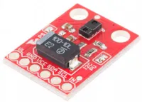
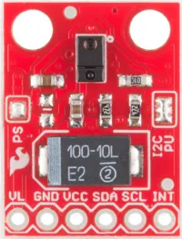
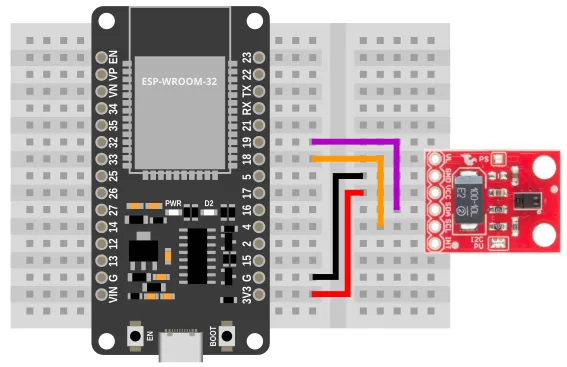
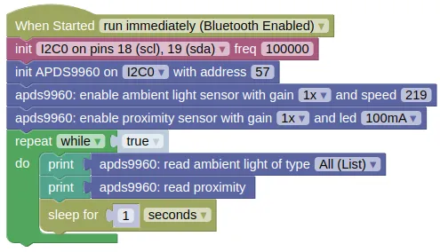
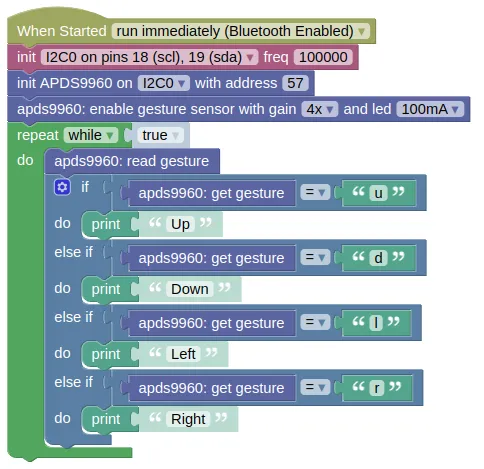

# Light, Proximity, Gesture (APDS9960)



APDS-9960 is a digital RGB, ambient light, proximity and gesture sensor device.
You can use it to sense...

* Ambient light
* Object color (use ambient light sensor and bring the object close)
* Proximity (max of around 10cm, does not give an accurate distance)
* Gesture (pass your hands above it in the up/down/left/right direction)

## Pins



| Pin | Description |
| --- | --- |
| VCC | Power for the sensor. Connect to **3V3**. |
| GND | Ground pin. This should be connected to the **GND** pin on the ESP32. |
| SCL | Serial Clock. This is used to communicate with the ESP32 using the I2C protocol (default pin 18). |
| SDA | Serial Data. This is used to communicate with the ESP32 using the I2C protocol (default pin 19). |
| VL / INT | Not in use. Leave unconnected. |

## Wiring



## Code

There are 2 sets of code.

1. **Ambient and Proximity** Demonstrate how to read the ambient light (RGB + Clear) and proximity value.

2. **Gesture** Detect gestures and print it out.

### Blocks

**Ambient and Proximity**



**Gesture**



### Python

**Ambient and Proximity**

```python
import machine
import apds9960
import time

i2c0 = machine.I2C(0, freq=100000)
apds9960_device = apds9960.APDS9960(i2c0, addr=57)
apds9960_device.enable_light_sensor(apds9960.AGAIN_1, 219)
apds9960_device.enable_prox_sensor(apds9960.GAIN_1, apds9960.LED_100MA)
while True:
    print(apds9960_device.read_light())
    print(apds9960_device.read_prox())
    time.sleep(1)
```

**Gesture**

```python
import machine
import apds9960

i2c0 = machine.I2C(0, freq=100000)
apds9960_device = apds9960.APDS9960(i2c0, addr=57)
apds9960_device.enable_gesture_sensor(apds9960.GAIN_4, apds9960.LED_100MA)
while True:
    apds9960_device.read_gesture()
    if apds9960_device.get_gesture() == 'u':
        print('Up')
    elif apds9960_device.get_gesture() == 'd':
        print('Down')
    elif apds9960_device.get_gesture() == 'l':
        print('Left')
    elif apds9960_device.get_gesture() == 'r':
        print('Right')
```

### Results

**Ambient and Proximity**

You should see the 2 sets of sensor readings printed in the monitor; the first is a list of 4 numbers representing the detected clear (...any color), red, green, and blue light level, while the second is a single number representing proximity.

If you bring a colored object (eg. red) near to the sensor, you should see the green and blue value fall, while the red value remain high.
Turning the lights in the room off should cause all the values to fall.

To test the proximity sensor, bring your hand close to the sensor (less than 10cm), and you should see the values change depending on the distance.

**Gesture**

Wave your hand across the sensor, and it should print out the direction.
Your hand needs to be close to the sensor (~5cm should be good).

# `class APDS9960` - control light, proximity, gesture sensor

!!!!!
## Constructors

### apds9960.APDS9960(i2c, addr=57)

Creates an APDS9960 object.

The arguments are:

* `i2c` An i2c object.

* `addr` The i2c address of the APDS9960. By default, this should be 57.

Returns a `APDS9960` object.

## Methods

### APDS9960.enable_light_sensor(gain=AGAIN_1, atime=219)

Enables the ambient light sensor.

The arguments are:

* `gain` The sensor gain. Higher gain will increase sensitivity. It must be one of the following:

    * `apds9960.AGAIN_1` Gain of 1.

    * `apds9960.AGAIN_4` Gain of 4.

    * `apds9960.AGAIN_16` Gain of 16.

    * `apds9960.AGAIN_64` Gain of 64.

* `atime` An integer (0 to 255) representing the detection speed. Higher speed will result in lower sensitivity. At 0, each read will take 712ms, while at 255 (max), each read will take 2.78ms.

Returns `None`.

### APDS9960.disable_light_sensor()

Disables the ambient light sensor.

Returns `None`.

### APDS9960.read_light()

Reads the ambient light value.

Returns a list containing 4 integers representing the light level for clear (any color), red, green, and blue.

### APDS9960.enable_prox_sensor(gain=GAIN_1, led=LED_100MA)

Enables the proximity sensor.
This works by turning on the built-in IR LED, and measuring how much IR is reflected back.

The gesture sensor must be disabled for the proximity sensor to work.

The arguments are:

* `gain` The sensor gain. Higher gain will increase sensitivity. It must be one of the following:

    * `apds9960.GAIN_1` Gain of 1.

    * `apds9960.GAIN_2` Gain of 2.

    * `apds9960.GAIN_4` Gain of 4.

    * `apds9960.GAIN_8` Gain of 8.

* `led` The power of the built-in IR LED. Higher power will increase sensitivity. It must be one of the following:

    * `apds9960.LED_100MA` Run the LED at 100mA.

    * `apds9960.LED_50MA` Run the LED at 50mA.

    * `apds9960.LED_25MA` Run the LED at 25mA.

    * `apds9960.LED_12MA` Run the LED at 12mA.

Returns `None`.

### APDS9960.disable_prox_sensor()

Disables the proximity sensor.

Returns `None`.

### APDS9960.read_prox()

Reads the proximity value.

This gives an indication of how close an object is, but cannot be converted into a distance as differences in object reflectivity will affect the returned value.

Returns an integers representing the proximity.

### APDS9960.enable_gesture_sensor(gain=GAIN_1, led=LED_100MA, prox_enter=40, prox_exit=30)

Enables the gesture sensor.
This works by turning on the built-in IR LED, and measuring how much IR is reflected back on to different regions of the detector.

The proximity sensor must be disabled for the gesture sensor to work.

The arguments are:

* `gain` The sensor gain. Higher gain will increase sensitivity. It must be one of the following:

    * `apds9960.GAIN_1` Gain of 1.

    * `apds9960.GAIN_2` Gain of 2.

    * `apds9960.GAIN_4` Gain of 4.

    * `apds9960.GAIN_8` Gain of 8.

* `led` The power of the built-in IR LED. Higher power will increase sensitivity. It must be one of the following:

    * `apds9960.LED_100MA` Run the LED at 100mA.

    * `apds9960.LED_50MA` Run the LED at 50mA.

    * `apds9960.LED_25MA` Run the LED at 25mA.

    * `apds9960.LED_12MA` Run the LED at 12mA.

* `prox_enter` An integer representing the minimum level at which gesture detection starts.

* `prox_exit` An integer representing the level at which gesture detection ends.

Returns `None`.

### APDS9960.disable_gesture_sensor()

Disables the gesture sensor.

Returns `None`.

### APDS9960.read_gesture()

Reads the gesture value.

You need to run this frequently, as new gestures cannot be detected until the old gestures are read.

Returns a string representing the detected gesture.
Will be one of the following; `"u"` (Up), `"d"` (Down), `"l"` (Left), `"r"` (Right), `""` (Empty string, no gesture detected).

### APDS9960.get_gesture()

Gets the last detected gesture.

You must run `read_gesture()` first.

Returns a string representing the detected gesture.
Will be one of the following; `"u"` (Up), `"d"` (Down), `"l"` (Left), `"r"` (Right), `""` (Empty string, no gesture detected).
!!!!!