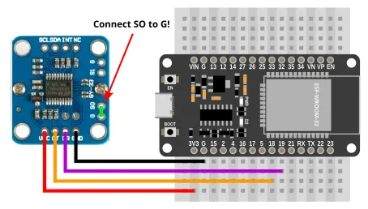
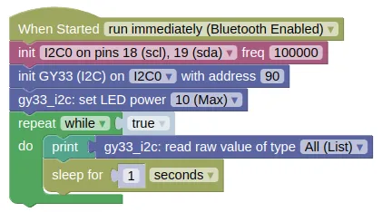

# Color Sensor (GY-33, I2C)


The GY-33 is a color sensor, useful in robotics for line following or color detection.

It uses a TCS3472 sensor, but does not expose the TCS3472 by default.
Instead, it contains a STM32F030F4 micro-controller which provides UART and I2C interface for the TCS3472 and the onboard LED.

This page is for the **I2C Mode**.

It is also possible to bypass the STM32F030F4 and use the TCS3472 directly, but you will need to set a jumper and use the TCS3472 extension.

## Pins


| Pin | Description |
| --- | --- |
| VCC | Power for the sensor. Connect to **3V3** or **VIN** (5V) if using USB power. Using 5V will result in a brighter LED. |
| GND | Ground pin. One of these should be connected to the **GND** pin on the ESP32. |
| CT | Serial Clock. This is used to communicate with the ESP32 using the I2C protocol (default pin 18). |
| DR | Serial Data. This is used to communicate with the ESP32 using the I2C protocol (default pin 19). |
| SO | Connect this to **GND** to put the device in I2C mode. There is a GND pin next to it, and you can connect them with a jumper. |
| S1 | If connected to **GND**, the STM32F030F4 will be disabled, and you'll be able to use the TCS3472 directly. |
| NC / INT / SCL / SDA | Do not connect. |

<div class="important">
The SCL and SDA pins are only used if the STM32F030F4 is disabled. You should normally leave it enabled and use the CT and DR pins instead.
</div>

## Wiring



## Code

This code will print the raw readings.
You can also print the calibrated readings using the "read value" block, but unless you perform a calibration first, the calibrated readings are likely no more useful than the raw readings.

<div class="important">
The integration time is an important setting that allows you to balance between resolution and update rate, but this setting is not available in I2C mode. Instead, you must set the integration time in UART mode, and the setting will persist even if you power it off and switch to I2C mode.
</div>

<div class="info">
You can change the I2C address of the GY-33. This allows you to use multiple GY-33 without requiring a multiplexer. However, the I2C address can only be changed in UART mode and there are currently no blocks for it (...must use Python).
</div>

### Blocks



### Python

```python
import machine
import gy33_i2c
import time

i2c0 = machine.I2C(0, freq=100000)
gy33_i2c_device = gy33_i2c.GY33_I2C(i2c0, addr=90)
gy33_i2c_device.set_led(10)
while True:
    print(gy33_i2c_device.read_raw())
    time.sleep(1)
```

### Results

You should see the the sensor readings printed in the monitor; each reading is a list of 4 number representing the detected red, green, blue, clear (...any color) light level.

If you bring a colored object (eg. red) near to the sensor, you should see the green and blue value fall, while the red value remain high.

# `class GY33_I2C` - control GY-33 color sensor in I2C mode

!!!!!
## Constructors

### gy33_i2c.GY33_I2C(i2c, addr=90)

Creates a GY33_I2C object.

The arguments are:

* `i2c` An i2c object.

* `addr` The i2c address of the GY33_I2C. By default, this should be 90.

Returns a `GY33_I2C` object.

## Methods

Only the more useful methods are documented here.
More methods are available, and you can refer to [https://github.com/QuirkyCort/micropython-gy33/tree/main/gy33-i2c](https://github.com/QuirkyCort/micropython-gy33/tree/main/gy33-i2c).

### GY33_I2C.set_led(pwr)

Sets the LED power.

The arguments are:

* `pwr` An integer (0 to 10) representing the LED power.

Returns `None`.

### GY33_I2C.read_raw()

Gets the red, green, blue, and clear values.

Returns a list containing 4 integers (0 to 65535), representing the red, green, blue, and clear (any color) values.

### GY33_I2C.read_calibrated()

Gets the calibrated red, green, blue, and clear values.

If calibration is done, black should return 0 for all values, and white 255 for all values.
Note that due to changes in environment and inaccuracies in calibration, it is possible for the returned values to be less than 0 or greater than 255.

Returns a list containing 4 integers (approximately 0 to 255), representing the red, green, blue, and clear (any color) values.

### GY33_I2C.calibrate_white()

Sets the white calibration.

The sensor should be on white before you run this.

Returns `None`.

### GY33_I2C.calibrate_black()

Sets the black calibration.

The sensor should be on black before you run this.

Returns `None`.
!!!!!