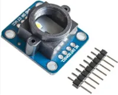
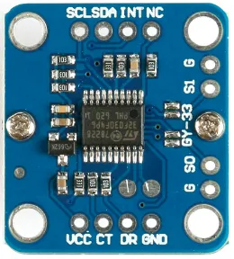
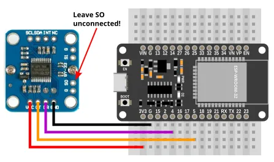
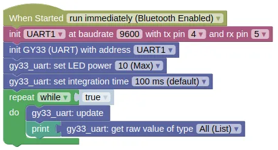

# Color Sensor (GY-33, UART)



The GY-33 is a color sensor, useful in robotics for line following or color detection.

It uses a TCS3472 sensor, but does not expose the TCS3472 by default.
Instead, it contains a STM32F030F4 micro-controller which provides UART and I2C interface for the TCS3472 and the onboard LED.

This page is for the **UART Mode**.

It is also possible to bypass the STM32F030F4 and use the TCS3472 directly, but you will need to set a jumper and use the TCS3472 extension.

## Pins



| Pin | Description |
| --- | --- |
| VCC | Power for the sensor. Connect to **3V3** or **VIN** (5V) if using USB power. Using 5V will result in a brighter LED. |
| GND | Ground pin. One of these should be connected to the **GND** pin on the ESP32. |
| CT | Data transmit. This should be connected to the UART **RX** pin on the ESP32 (default is Pin 5). |
| DR | Data receive. This should be connected to the UART **TX** pin on the ESP32 (default is Pin 4). |
| SO | Leave this unconnected to put the device in UART mode. There is a GND pin next to it, and you can connect them with a jumper. |
| S1 | If connected to **GND**, the STM32F030F4 will be disabled, and you'll be able to use the TCS3472 directly. |
| NC / INT / SCL / SDA | Do not connect. |

<div class="important">
The SCL and SDA pins are only used if the STM32F030F4 is disabled. You should normally leave it enabled and use the CT and DR pins instead.
</div>

## Wiring



## Code

This code will print the raw readings.
You can also print the calibrated readings using the "read value" block, but unless you perform a calibration first, the calibrated readings are likely no more useful than the raw readings.

In UART mode, you'll need to run `update()` frequently to retrieve data from the sensor.

### Blocks



### Python

```python
import machine
import gy33_uart

uart1 = machine.UART(1, baudrate=9600, tx=4, rx=5)
gy33_uart_device = gy33_uart.GY33_UART(uart1)
gy33_uart_device.set_output(True, False, False)
gy33_uart_device.set_led(10)
gy33_uart_device.set_integration_time(100)
while True:
    gy33_uart_device.update()
    print(gy33_uart_device.get_raw())
```

### Results

You should see the the sensor readings printed in the monitor; each reading is a list of 4 number representing the detected red, green, blue, clear (...any color) light level.

If you bring a colored object (eg. red) near to the sensor, you should see the green and blue value fall, while the red value remain high.

# `class GY33_UART` - control GY-33 color sensor in UART mode

!!!!!
## Constructors

### gy33_i2c.GY33_UART(uart)

Creates a GY33_UART object.

The arguments are:

* `uart` A uart object.

Returns a `GY33_UART` object.

## Methods

### GY33_UART.update(wait=False, timeout=1000)

Reads from the uart, parse the messages, and store the results.
This method does not return any values; you'll need to use the corresponding "get" methods to retrieve them.

You must run this frequently.

The arguments are:

* `wait` If True, the method will block until it successfully reads a single message or timeout is reached.

* `timeout` Timeout in milliseconds. Only used if wait is True.

Returns `None`.

### GY33_UART.set_output(raw, lcc, processed)

Sets the values that the GY-33 will continuously output.
If continuously output is turned off, you can still retrieve the readings using a "query" command.

This setting will persist across a power cycle.

The arguments are:

* `raw` If True, continuously output the raw values.

* `lcc` If True, continuously output the Lux (Brightness), Color Temperature, and Color values.

* `processed` If true, continuously output the processed color values.

Returns `None`.

### GY33_UART.set_led(pwr, save)

Sets the LED power.

The arguments are:

* `pwr` An integer (0 to 10) representing the LED power.

* `save` If True, the setting will persist across a power cycle.

Returns `None`.

### GY33_UART.set_integration_time(time)

Sets the integration time in milliseconds.
A higher integration time will provide a higher resolution for the raw values, but at the expense of a lower update rate.

This setting will persist across a power cycle.

The arguments are:

* `time` Integration time in milliseconds. (Valid values are 700, 154, 100 (default), 24, or 2.4).

Returns `None`.

### GY33_UART.set_baudrate(rate)

Sets the baudrate.

This setting will persist across a power cycle.

The arguments are:

* `rate` Must be either 9600 or 115200.

Returns `None`.

### GY33_UART.set_i2c_addr(addr)

Sets the i2c address (...for use in I2C mode).

This setting will persist across a power cycle.

The arguments are:

* `addr` Desired i2c address. Must be between 0 to 127.

Returns `None`.

### GY33_UART.query_raw() / GY33_UART.query_lcc() / GY33_UART.query_processed()

Request for a single reading of the raw, lcc, or processed values.
When continuously output is turned off, you can use this to trigger a single read.

Note that you will still need to perform an "update()" and a "get" to retrieve the values.

Returns `None`.

### GY33_UART.query_i2c()

Request for a single reading of the i2c address (...for use in I2C mode).
This value is never sent automatically, so you must send a query to obtain the i2c address.

Note that you will still need to perform an "update()" and a "get" to retrieve the values.

Returns `None`.

### GY33_UART.calibrate_white_balance()

Performs a white balance calibration.
The sensor should first be placed on a suitable white surface.

This is handled by the built-in micro-controller and affects the processed RGB values.
The built-in microcontroller does not provide a black calibration.

Returns `None`.

### GY33_UART.calibrate_white()

Sets the white calibration.

The sensor should be on white before you run this.

Returns `None`.

### GY33_UART.calibrate_black()

Sets the black calibration.

The sensor should be on black before you run this.

Returns `None`.

### GY33_UART.read_calibrated()

Gets the calibrated red, green, blue, and clear values.

You must perform an "update()" first.

If calibration is done, black should return 0 for all values, and white 255 for all values.
Note that due to changes in environment and inaccuracies in calibration, it is possible for the returned values to be less than 0 or greater than 255.

These uses calibration values stored in the gy33 object, and are not the same as the values obtained from "get_processed()" (...which uses calibration stored in the sensor module).

Returns a list containing 4 integers (approximately 0 to 255), representing the red, green, blue, and clear (any color) values.

### GY33_UART.get_raw()

Gets the red, green, blue, and clear values.

You must perform an "update()" first.

Returns a list containing 4 integers (0 to 65535), representing the red, green, blue, and clear (any color) values.

### GY33_UART.get_lcc()

Returns a list containing the "Lux (brightness), Color Temperature, Color" values.

You must perform an "update()" first.

The "Color" value should be interpreted as follows:

| Bit | Color |
| --- | --- |
| 7	| Blue |
| 6 | Navy Blue |
| 5 | Green |
| 4 | Black |
| 3 | White |
| 2 | Pink |
| 1 | Yellow |
| 0 | Red |

Returns a list containing 3 integers (0 to 65535), representing the Lux, Color Temperature, and Color values.

### GY33_UART.get_processed()

Gets the processed red, green, and blue values..

You must perform an "update()" first.

Returns a list containing 3 integers (0 to 255), representing the red, green, and blue values.

### GY33_UART.get_i2c()

Gets the i2c address (...for use in I2C mode).

You must perform an "query_i2c()" and "update()" first.

Returns an integer (0 to 127), representing the I2C address.
!!!!!