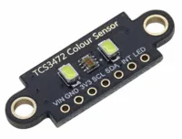
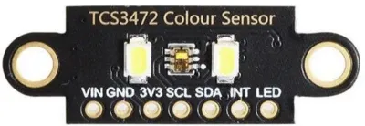
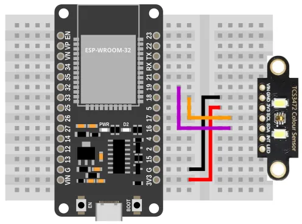
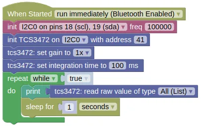

# Color Sensor (TCS3472)



The TCS3472 is a color sensor, useful in robotics for line following or color detection.

## Pins



| Pin | Description |
| --- | --- |
| VIN | Power for the sensor. Connect to **VIN** (5V) if using USB power. You can also leave this unconnected and supply power through the **3V3** pin.  |
| GND | Ground pin. One of these should be connected to the **GND** pin on the ESP32. |
| 3V3 | Power for the sensor. Connect to **3V3** on the ESP32. |
| SCL | Serial Clock. This is used to communicate with the ESP32 using the I2C protocol (default pin 18). |
| SDA | Serial Data. This is used to communicate with the ESP32 using the I2C protocol (default pin 19). |
| INT | Not using this. Leave it unconnected. |
| LED | You can turn off the LED by connecting this to **GND**. Else, leave it unconnected. |

## Wiring



## Code

This code will print the raw readings.
You can also print the calibrated readings using the "read value" block, but unless you perform a calibration first, the calibrated readings are likely no more useful than the raw readings.

### Blocks



### Python

```python
import machine
import tcs3472
import time

i2c0 = machine.I2C(0, freq=100000)
tcs3472_device = tcs3472.TCS3472(i2c0, addr=41)
tcs3472_device.set_gain(0)
tcs3472_device.set_integration_time(100)
while True:
    print(tcs3472_device.read())
    time.sleep(1)
```

### Results

You should see the the sensor readings printed in the monitor; each reading is a list of 4 number representing the detected clear (...any color), red, green, and blue.

If you bring a colored object (eg. red) near to the sensor, you should see the green and blue value fall, while the red value remain high.

# `class TCS3472` - control TCS3472 color sensor

!!!!!
## Constructors

### tcs3472.TCS3472(i2c, addr=41)

Creates a TCS3472 object.

The arguments are:

* `i2c` An i2c object.

* `addr` The i2c address of the TCS3472. By default, this should be 41.

Returns a `TCS3472` object.

## Methods

### TCS3472.set_gain(gain)

Sets the gain.

The arguments are:

* `gain` An integer (0 to 3) representing a gain of 1x, 4x, 16x, and 60x.

Returns `None`.

### TCS3472.set_integration_time(ms)

Sets the integration time in milliseconds.
A higher integration time will provide a higher resolution, but at the expense of a lower update rate.

The arguments are:

* `ms` A float representing the integration time in ms. Must be between 2.4 to 614.4.

Returns `None`.

### TCS3472.read()

Gets the clear, red, green, and blue values.

Returns a list containing 4 integers (0 to 65535), representing the clear (any color), red, green, and blue  values.

### TCS3472.read_calibrated()

Gets the calibrated red, green, blue, and clear values.

If calibration is done, black should return 0 for all values, and white 255 for all values.
Note that due to changes in environment and inaccuracies in calibration, it is possible for the returned values to be less than 0 or greater than 255.

Returns a list containing 4 integers (approximately 0 to 255), representing the clear (any color), red, green, and blue values.

### TCS3472.calibrate_white()

Sets the white calibration.

The sensor should be on white before you run this.

Returns `None`.

### TCS3472.calibrate_black()

Sets the black calibration.

The sensor should be on black before you run this.

Returns `None`.
!!!!!