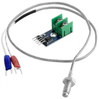
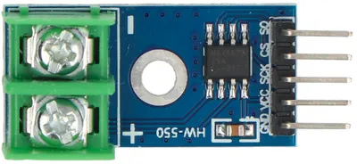
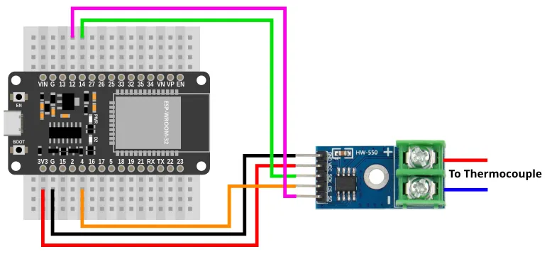
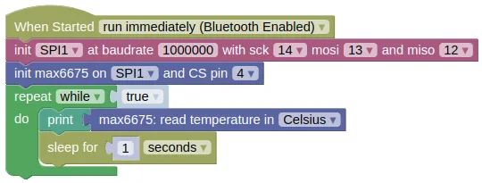

# Thermocouple Board (MAX6675)



The MAX6675 digitize and returns the readings from a type-K thermocouple using the SPI interface.
Temperature resolution is 0.25C and readings can be as high as 1024C (...provided a suitable thermocouple is used).

This sensor is mainly used for measuring high temperature.
For lower temperatures, other sensors like the DHT22 or DS18B20 are better choices.

## Pins



| Pin | Description |
| --- | --- |
| VIN | Power for the sensor. Connect to **3V3**. If your device is on USB power, you can also use **VIN**. |
| GND | Ground pin. Connect to the **GND** pin on the ESP32. |
| SCK | Serial Clock. This is used to communicate with the ESP32 using the SPI protocol (default pin 14). |
| SO | Serial Out (aka MISO). This is used to communicate with the ESP32 using the SPI protocol (default pin 12). |
| CS | Chip Select. This is used to activate communication with the sensor. Connect to any output capable pin (default pin 4). |
| + (screw terminal) | Thermocouple +. Connect to the red lead of the thermocouple. |
| - (screw terminal) | Thermocouple -. Connect to the blue/black lead of the thermocouple. |

<div class="important">
While this sensor uses the SPI protocol, it does not have a MOSI pin. The MOSI pin on the microcontroller can be left unconnected.
</div>

## Wiring



## Code

This code will print the temperature readings.

<div class="important">
Note that the MAX6675 performs a measurement and stores the result after every read. On the next read, it returns the stored result. This means that the result may be very outdated if reading is infrequent. To get the latest measurement, perform a read, wait 0.22secs, then read again.
</div>

### Blocks



### Python

```python
import machine
import max6675
import time

spi1 = machine.SPI(1, baudrate=1000000, sck=Pin(14), mosi=Pin(13), miso=Pin(12))
max6675_device = max6675.MAX6675(spi1, 4)
while True:
    print(max6675_device.read_celsius())
    time.sleep(1)
```

### Results

You should see the temperature readings printed in the monitor.

# `class MAX6675` - control MAX6675 thermocouple board

!!!!!
## Constructors

### max6675.MAX6675(spi, cs)

Creates a MAX6675 object.

The arguments are:

* `spi` An spi object.

* `cs` An integer representing the microcontroller pin connected to the CS pin on the sensor.

Returns a `MAX6675` object.

## Methods

### MAX6675.read_celsius()

Get the currently stored temperature, then trigger a new reading.

Note that this returns the stored temperature (...which might be from a long time ago).

Returns a number representing the temperature in Celsius.

### MAX6675.read_fahrenheit()

Get the currently stored temperature, then trigger a new reading.

Note that this returns the stored temperature (...which might be from a long time ago).

Returns a number representing the temperature in Fahrenheit.

### MAX6675.read_kelvin()

Get the currently stored temperature, then trigger a new reading.

Note that this returns the stored temperature (...which might be from a long time ago).

Returns a number representing the temperature in Kelvin.
!!!!!