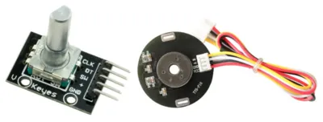
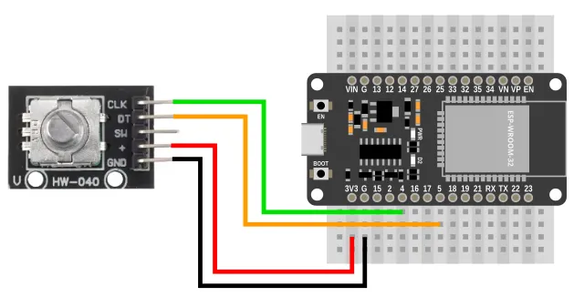
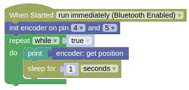

# Incremental Encoder



This extension is for incremental quadrature encoders.
Such encoders are used to detect motor movements as well as some knobs.
It can detect direction, relative position, and speed.

Such encoders can operate using mechanical, optical, or magnetic (hall effect) sensors.
The above image shows a rotary knob (mechanical) and a motor sensor (hall effect).
While their working principles may differ, the wiring and code is the same.

## Pins

This extension isn't for any specific model of encoder, but most incremental quadrature encoders will have the following pins.

| Pin | Description |
| --- | --- |
| VIN / V+ | Power for the sensor. Connect to **3V3**. |
| GND | Ground pin. Connect to the **GND** pin on the ESP32. |
| A / CLK | Channel A of the encoder. |
| B / DT | Channel B of the encoder. |

Some rotary encoders for knobs will come with an additional **SW** pin for the built-in switch.

<div class="important">
If your encoder only has a single output channel, then it is NOT an incremental quadrature encoder and isn't compatible with this extension.
</div>

## Wiring



As there are many different types of incremental quadrature encoders, your wiring may differ.

## Code

This code will print the position.

### Blocks



### Python

```python
import encoder
import time

encoder_device = encoder.Encoder(4, 5)
while True:
    print(encoder_device.position())
    time.sleep(1)
```

### Results

You should see the temperature readings printed in the monitor.

# `class Encoder` - read incremental quadrature encoders

!!!!!
## Constructors

### encoder.Encoder(pin_x, pin_y, scale=1, min_speed=5)

Creates an Encoder object.

The arguments are:

* `pin_x` An integer representing the pin connected to the first encoder channel.

* `pin_y` An integer representing the pin connected to the second encoder channel.

* `scale` A number representing the scaling factor for position (ie. If set to 2, then every 1 steps on the encoder will result in a 2 steps change in position). Does not affect speed readings. You should usually leave this as 1.

* `min_speed` A number representing the minimum speed. If the measure speed is lower than this, a speed of 0 will be returned.

Returns an `Encoder` object.

## Methods

### Encoder.position(value=None)

Get or set the encoder position.

The arguments are:

* `value` If not None, this will set the current encoder position to the provided value.

Returns a number representing the encoder position if `value` is None or not provided, else returns None.

### Encoder.speed()

Get the encoder speed.

Returns a number representing the encoder speed.
!!!!!