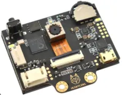
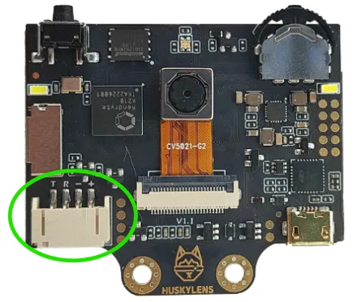
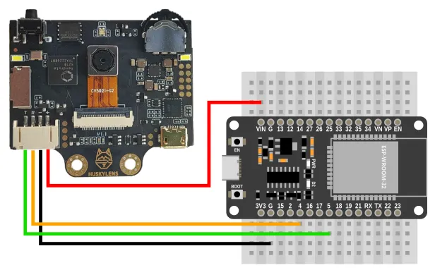
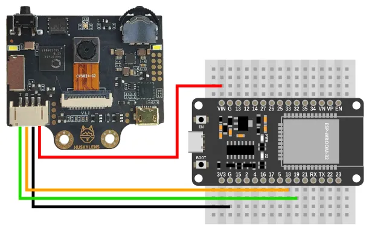
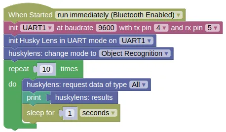

# Husky Lens



The Husky Lens is a camera with some built-in machine vision capabilities (eg. face recognition, object tracking, object recognition, line tracking, colour recognition and tag (QR code) recognition).
It is capable of communicating with the IoTy device via I2C or UART.

## Pins



### UART Mode

| Pin | Description |
| --- | --- |
| T | Data transmit. This should be connected to the UART **RX** pin on the ESP32 (default is Pin 5). |
| R | Data receive. This should be connected to the UART **TX** pin on the ESP32 (default is Pin 4). |
| - | Ground pin. Connect to the **GND** pin on the ESP32. |
| + | Power for the sensor. Connect to **3V3**. If your device is on USB power, you can also use **VIN**. |

### I2C Mode

| Pin | Description |
| --- | --- |
| T | Serial Data. This is used to communicate with the ESP32 using the I2C protocol (default pin 19). |
| R | Serial Clock. This is used to communicate with the ESP32 using the I2C protocol (default pin 18). |
| - | Ground pin. Connect to the **GND** pin on the ESP32. |
| + | Power for the sensor. Connect to **3V3**. If your device is on USB power, you can also use **VIN**. |

<div class="important">
The Husky Lens consumes 320mA at 3.3V. It is likely that your ESP32 won't be able to supply this, so it is preferable to use VIN.
</div>

## Wiring

### UART Mode



### I2C Mode



## Code

This code will print the full result (list of dictionaries).

### Blocks

**UART Mode**



**I2C Mode**


### Python

**UART Mode**

```python
import machine
import huskylib
import time

uart1 = machine.UART(1, baudrate=9600, tx=4, rx=5)
huskylens = huskylib.HuskyLensUART(uart1)
huskylens.algorithm(huskylib.OBJECT_RECOGNITION)
for count in range(10):
    huskylens.requestAll()
    print(huskylens.results)
    time.sleep(1)
```

**I2C Mode**

```python
import machine
import huskylib
import time

i2c0 = machine.I2C(0, freq=100000)
huskylens = huskylib.HuskyLensI2C(i2c0, 50)
huskylens.algorithm(huskylib.OBJECT_RECOGNITION)
for count in range(10):
    huskylens.requestAll()
    print(huskylens.results)
    time.sleep(1)
```

### Results

You should see the detection result printed in the monitor.
Each set of results is a list of dictionary, and each dictionary entry consists of...

**Block Type**

* x => (Integer) x coordinate of the center of the square
* y => (Integer) y coordinate of the center of the square
* width  =>  (Integer) width of the square
* height =>  (Integer) height of the square
* ID => (Integer) Objects ID (if not learned, ID is 0)
* learned => (Boolean) True  if the object is learned
* type => "BLOCK"

**Arrow Type** (Line Tracking mode only)

* xTail => (Integer) x coordinate of the tail of the arrow
* yTail => (Integer) y coordinate of the tail of the arrow
* xHead => (Integer) x coordinate of the head of the arrow
* yHead => (Integer) y coordinate of the head of the arrow
* ID => (Integer) Objects ID (if not learned, ID is 0)
* learned => (Boolean) True  if the object is learned
* type => "ARROW"

# Python Documentation

Refer to https://github.com/HuskyLens/HUSKYLENSPython for the Python documentation.
