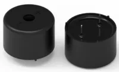
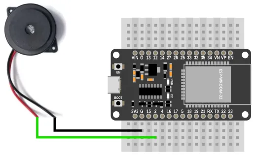
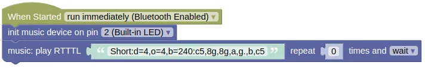

# Music



Plays tones, musical notes, and songs in [Ring Tone Text Transfer Language (RTTTL)](https://en.wikipedia.org/wiki/Ring_Tone_Text_Transfer_Language#:~:text=Ring%20Tone%20Text%20Transfer%20Language%20(RTTTL)%20is%20a%20text%2D,the%20name%20of%20the%20ringtone.) format.

You can find many RTTTL songs online (eg. [https://picaxe.com/rtttl-ringtones-for-tune-command/](https://picaxe.com/rtttl-ringtones-for-tune-command/)).
No special softwares are required to compose RTTTL songs, but something like this... [https://eddmann.com/nokia-composer-web/](https://eddmann.com/nokia-composer-web/) can make the process easier.

## Pins

The music extension does not require any specific hardware.
You can use it with a **passive** piezoelectric speaker, earphones, or speakers (...through an amplifier).

<div class="important">
The piezoelectric speaker must be the passive type. The active type speakers contains built-in circuits to generate a fixed tone, and are unsuitable for music. Connect the speaker directly to power; if it makes a tone, it's an active type, else it is a passive type.
</div>

## Wiring



Depending on the type of speaker you're using, the wiring may differ.

## Code

This code will play a short music segment.

### Blocks



### Python

```python
import music

music_device = music.Music(2)
music_device.play_rtttl('Short:d=4,o=4,b=240:c5,8g,8g,a,g.,b,c5', wait=True, loops=0)
```

### Results

You should hear a short music segment play from the speakers.

# `class Music` - play music

!!!!!
## Constructors

### music.Music(pin)

Creates an Music object.

The arguments are:

* `pin` An integer representing the pin connected to the speaker or amplifier.

Returns an `Music` object.

## Methods

### Music.play_tone(freq, ms, wait=True)

Plays a tone of the specified frequency.

The arguments are:

* `freq` An integer representing the frequency to play in Hz.

* `ms` An integer representing the duration of the tone in milliseconds.

* `wait` A boolean. If True, the method will block until the tone completes playing. If False, you must run `update()` frequently or the tone will not end.

Returns None.

### Music.play_notes(note, wait=True, loops=0)

Plays notes in the RTTTL format.

The arguments are:

* `note` A string representing RTTTL notes (eg. **'2b4'**: Half note, B, 4th octave, **'1a#3'** Full note, A sharp, 3rd octave). If there are multiple notes, they should be separated by a comma (eg. **'2b4,1a#3'**). Case insensitive.

* `wait` A boolean. If True, the method will block until the notes completes playing. If False, you must run `update()` frequently or the notes will not play correctly.

* `loops` An integer specifying how many times to loop the notes. The default 0 means that it will play once without repeating. If set to a negative value (eg. -1), the notes will loop forever.

Returns None.

### Music.play_rtttl(tune, wait=True, loops=0)

Plays a note in the RTTTL format.

The arguments are:

* `tune` A string representing an [RTTTL tune](https://en.wikipedia.org/wiki/Ring_Tone_Text_Transfer_Language#:~:text=Ring%20Tone%20Text%20Transfer%20Language%20(RTTTL)%20is%20a%20text%2D,the%20name%20of%20the%20ringtone.). An RTTTL tune contains a title, settings, and notes.

* `wait` A boolean. If True, the method will block until the notes completes playing. If False, you must run `update()` frequently or the notes will not play correctly.

* `loops` An integer specifying how many times to loop the notes. The default 0 means that it will play once without repeating. If set to a negative value (eg. -1), the notes will loop forever.

Returns None.

### Music.stop()

Stop playing.
This is only useful if `wait` is set to `False` when starting the music; if set to `True`, the music will always play until completion.

Returns None.

### Music.update()

Update the music.
You must run this frequently if `wait` is set to `False`.

The return value lets you know if a new note is started, this can be useful if you want to synchronize the music to something else (eg. lights).
If you don't need it, you can just ignore the return value.

Returns a integer representing the frequency played whenever a new note is played. After the start of a new note, it will return `0` until another note is played. At the end of the music, it will return `-1`.

### Music.is_playing()

Checks if the music is still playing.

Returns False if the music has completed, else returns True.
!!!!!