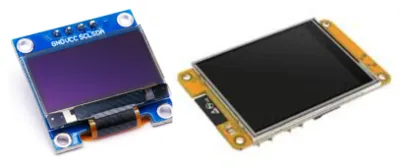
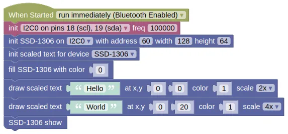

# Scaled Text



The framebuf module built into micropython only supports an 8x8 font, which can be rather small.
While it's possible to use another extension (eg. **X-GLCD Font**) to load and use larger fonts, you'll need a font file for every font size, and the extension will consume additional memory.

The Scaled Text extension allows you to draw larger fonts by scaling the built-in 8x8 font.
You can scale it to any size, without requiring any added font files.
The drawback is that the text will look blocky at larger sizes.

The scaled text extension can work with the SSD-1306, ILI9341, or ST7789 displays.

## Wiring

In the below example, we are using the SSD1306, but other types of displays can also be used.


## Code

This code will draw text on screen at two different sizes.

### Blocks



### Python

```python
import machine
import ssd1306
import scaled_text

i2c0 = machine.I2C(0, freq=100000)
ssd1306_i2c = ssd1306.SSD1306_I2C(128, 64, i2c0, 60)
ssd1306_i2c.init_display()
text_scaler = scaled_text.ScaledText(ssd1306_i2c, fb_type=scaled_text.SSD1306)
ssd1306_i2c.fill(0)
text_scaler.text('Hello', 0, 0, 1, scale=2)
text_scaler.text('World', 0, 20, 1, scale=4)
ssd1306_i2c.show()
```

### Results

You should see "Hello" printed in 2x sized font, and "World" in 4x sized font.

# `class ScaledText` - draw text with scaled version of the built-in font

!!!!!
## Constructors

### scaled_text.ScaledText(fb, fb_type=SSD1306)

Creates an ScaledText object.

The arguments are:

* `fb` An object representing the screen device.

* `fb_type` The type of screen device, which can be one of the following:

    * `scaled_text.SSD1306` For SSD1306 and SH1106.

    * `scaled_text.ILI9341` For ILI9341 display (used in the ESP32 CYD).

    * `scaled_text.ST7789` For ST7789 display.

Returns an `ScaledText` object.

## Methods

### ScaledText.text(s, x, y, c=1, scale=2, background=None):

Draws the specified text.

Depending on your display device, you may need to perform a `show()` after drawing the text.

The arguments are:

* `s` A string representing the text to draw.

* `x` / `y` An integer representing the x and y position to draw the text.

* `c` An integer representing the color to draw.

* `scale` An integer representing how much to scale the font (ie. `2` will double the font size).

* `background` An integer representing the background color. If None, the background will not be filled.

Returns None.
!!!!!